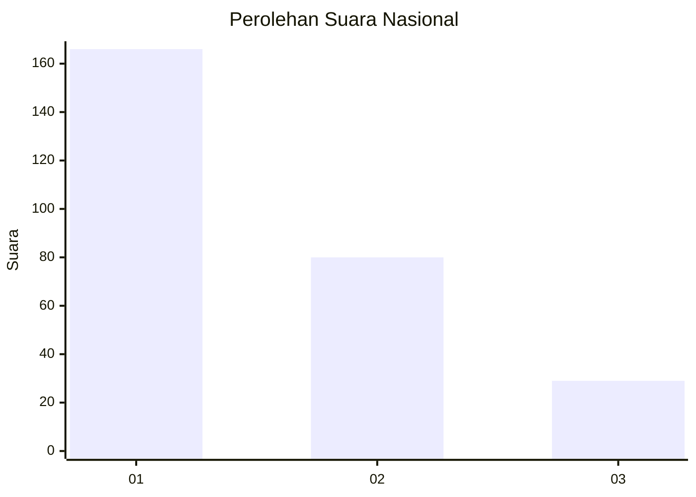
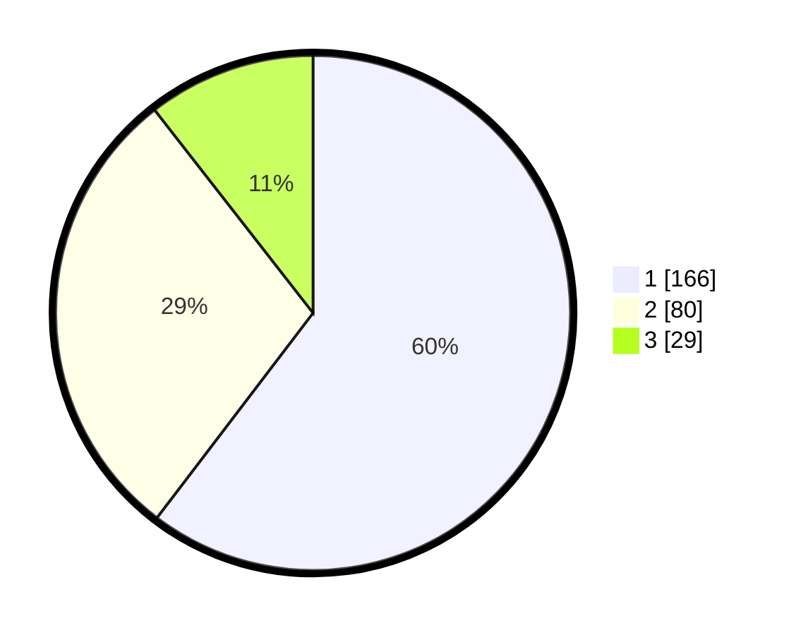

# Hasil

## Grafik

## Tabel

| No.    | Nama Paslon    | Suara | Suara (raw) | Persentase |
|:------ |:-------------- | -----:| -----------:| ----------:|
| 100025 | ANIES MUHAIMIN | 166   | [166][p-1]  | 60,36      |
| 100026 | PRABOWO GIBRAN | 80    | [80][p-2]   | 29,09      |
| 100027 | GANJAR MAHFUD  | 29    | [29][p-3]   | 10,55      |

[p-1]: https://github.com/gigit-pemilu/pemilu-2024/blob/main/pilpres/hitung-suara/sub/31-dki-jakarta/sub/73-jakarta-barat/sub/07-pal-merah/sub/1003-kota-bambu-utara/sub/050-tps/sub/paslon-1.txt
[p-2]: https://github.com/gigit-pemilu/pemilu-2024/blob/main/pilpres/hitung-suara/sub/31-dki-jakarta/sub/73-jakarta-barat/sub/07-pal-merah/sub/1003-kota-bambu-utara/sub/050-tps/sub/paslon-2.txt
[p-3]: https://github.com/gigit-pemilu/pemilu-2024/blob/main/pilpres/hitung-suara/sub/31-dki-jakarta/sub/73-jakarta-barat/sub/07-pal-merah/sub/1003-kota-bambu-utara/sub/050-tps/sub/paslon-3.txt

## Foto C Plano

https://sirekap-obj-formc.kpu.go.id/72c0/pemilu/ppwp/31/73/07/10/03/3173071003050-20240214-234446--4692588a-67a6-45e1-8b68-14889190eb0c.jpg

https://sirekap-obj-formc.kpu.go.id/72c0/pemilu/ppwp/31/73/07/10/03/3173071003050-20240214-234558--61fca774-9574-480f-8988-c42b86294271.jpg

https://sirekap-obj-formc.kpu.go.id/72c0/pemilu/ppwp/31/73/07/10/03/3173071003050-20240214-234628--4351fcb8-f48b-4485-ac99-792d7b696ddb.jpg

## Metadata

| Key        | Value               |
| ---------- | ------------------- |
| Time Stamp | 2024-02-16 21:01:00 |

