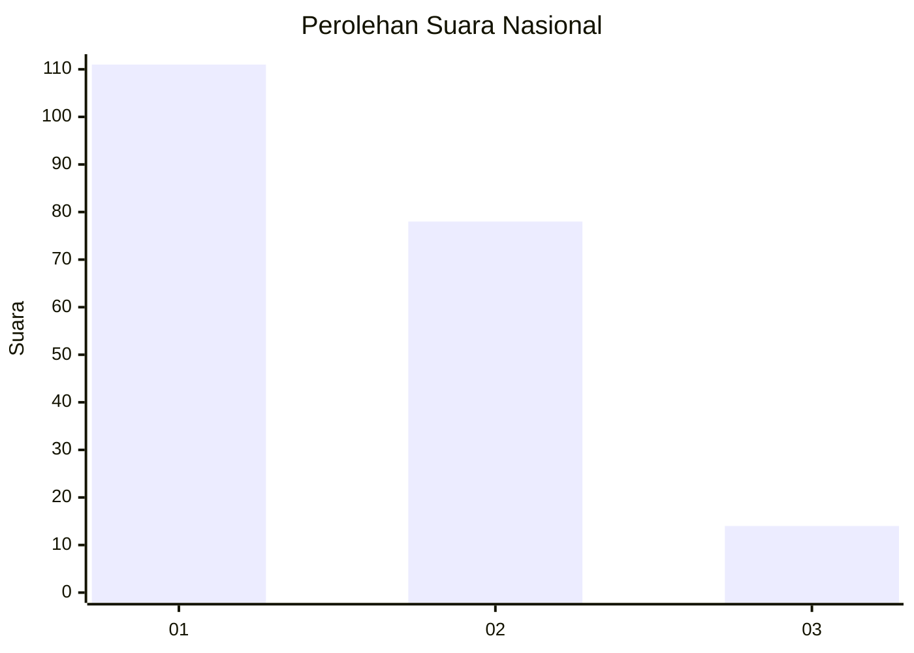
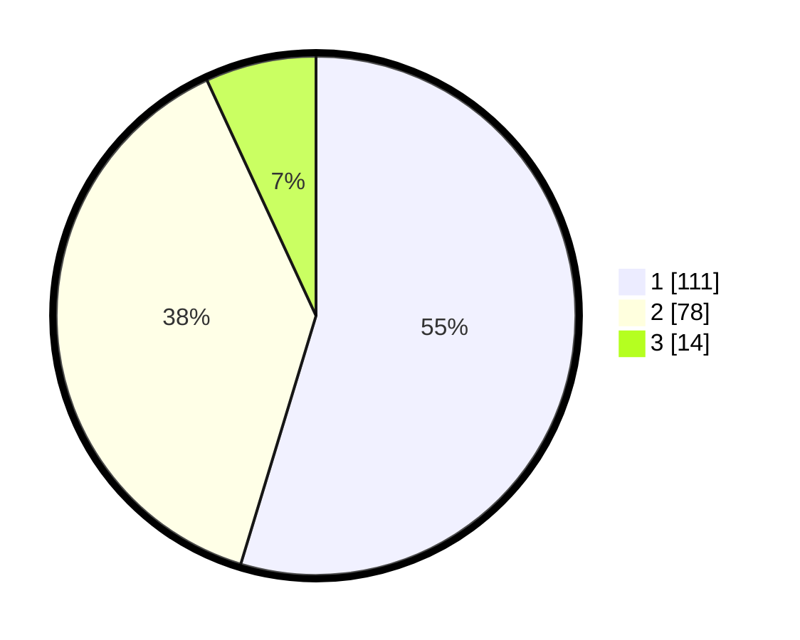

# Hasil

## Grafik

## Tabel

| No.    | Nama Paslon    | Suara | Suara (raw) | Persentase |
|:------ |:-------------- | -----:| -----------:| ----------:|
| 100025 | ANIES MUHAIMIN | 111   | [111][p-1]  | 54,68      |
| 100026 | PRABOWO GIBRAN | 78    | [78][p-2]   | 38,42      |
| 100027 | GANJAR MAHFUD  | 14    | [14][p-3]   | 6,90       |

[p-1]: https://github.com/gigit-pemilu/pemilu-2024/blob/main/pilpres/hitung-suara/sub/31-dki-jakarta/sub/73-jakarta-barat/sub/07-pal-merah/sub/1003-kota-bambu-utara/sub/052-tps/sub/paslon-1.txt
[p-2]: https://github.com/gigit-pemilu/pemilu-2024/blob/main/pilpres/hitung-suara/sub/31-dki-jakarta/sub/73-jakarta-barat/sub/07-pal-merah/sub/1003-kota-bambu-utara/sub/052-tps/sub/paslon-2.txt
[p-3]: https://github.com/gigit-pemilu/pemilu-2024/blob/main/pilpres/hitung-suara/sub/31-dki-jakarta/sub/73-jakarta-barat/sub/07-pal-merah/sub/1003-kota-bambu-utara/sub/052-tps/sub/paslon-3.txt

## Foto C Plano

https://sirekap-obj-formc.kpu.go.id/af0b/pemilu/ppwp/31/73/07/10/03/3173071003052-20240214-155707--9592bcfc-0ef2-4fc9-962e-ef3f1b778b69.jpg

https://sirekap-obj-formc.kpu.go.id/af0b/pemilu/ppwp/31/73/07/10/03/3173071003052-20240214-224147--afe16b7e-825c-4d39-837c-f71e78b69036.jpg

https://sirekap-obj-formc.kpu.go.id/af0b/pemilu/ppwp/31/73/07/10/03/3173071003052-20240214-220546--2879298e-6c4c-458c-9edb-1c2b045fdb9e.jpg

## Metadata

| Key        | Value               |
| ---------- | ------------------- |
| Time Stamp | 2024-02-19 16:00:00 |

