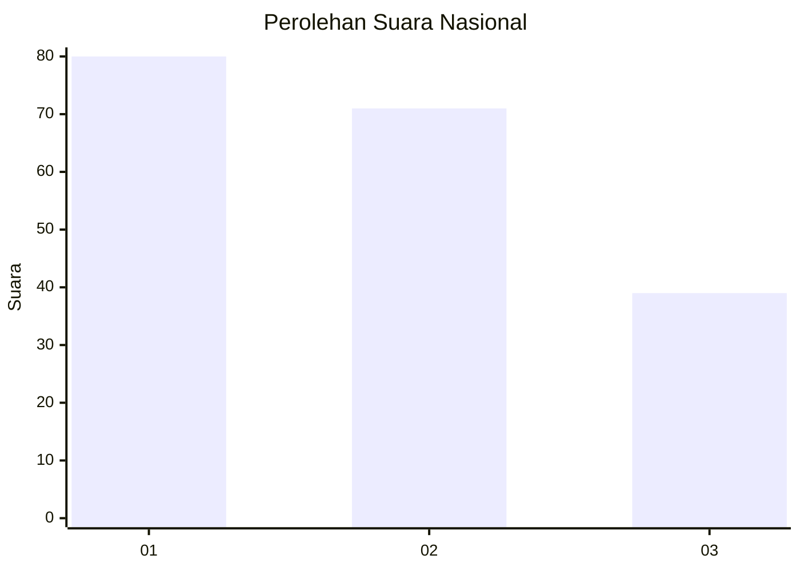
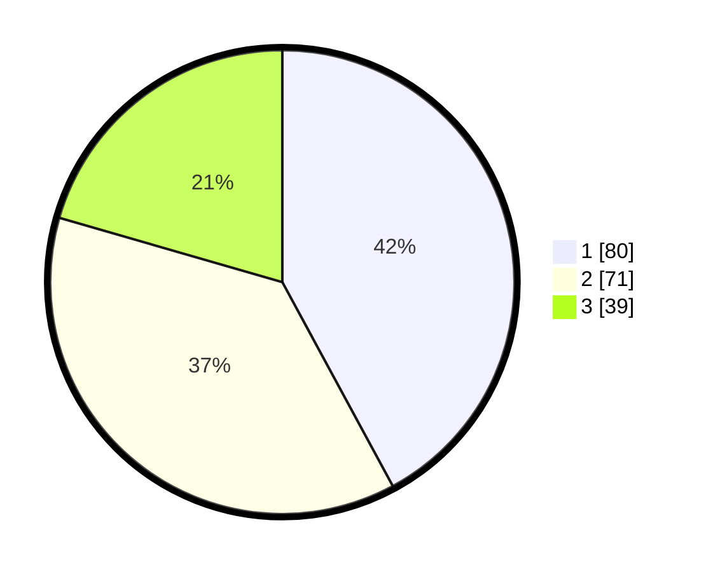

# Hasil

## Grafik

## Tabel

| No.    | Nama Paslon    | Suara | Suara (raw) | Persentase |
|:------ |:-------------- | -----:| -----------:| ----------:|
| 100025 | ANIES MUHAIMIN | 80    | [80][p-1]   | 42,11      |
| 100026 | PRABOWO GIBRAN | 71    | [71][p-2]   | 37,37      |
| 100027 | GANJAR MAHFUD  | 39    | [39][p-3]   | 20,53      |

[p-1]: https://github.com/gigit-pemilu/pemilu-2024/blob/main/pilpres/hitung-suara/sub/31-dki-jakarta/sub/73-jakarta-barat/sub/07-pal-merah/sub/1003-kota-bambu-utara/sub/054-tps/sub/paslon-1.txt
[p-2]: https://github.com/gigit-pemilu/pemilu-2024/blob/main/pilpres/hitung-suara/sub/31-dki-jakarta/sub/73-jakarta-barat/sub/07-pal-merah/sub/1003-kota-bambu-utara/sub/054-tps/sub/paslon-2.txt
[p-3]: https://github.com/gigit-pemilu/pemilu-2024/blob/main/pilpres/hitung-suara/sub/31-dki-jakarta/sub/73-jakarta-barat/sub/07-pal-merah/sub/1003-kota-bambu-utara/sub/054-tps/sub/paslon-3.txt

## Foto C Plano

https://sirekap-obj-formc.kpu.go.id/c116/pemilu/ppwp/31/73/07/10/03/3173071003054-20240214-233110--4acaada9-1139-41e0-b5c6-800cf2750f87.jpg

https://sirekap-obj-formc.kpu.go.id/c116/pemilu/ppwp/31/73/07/10/03/3173071003054-20240214-233535--37a97fa0-7575-4126-a479-ebe461e25485.jpg

https://sirekap-obj-formc.kpu.go.id/c116/pemilu/ppwp/31/73/07/10/03/3173071003054-20240214-234258--878cc1b7-7782-4bfd-bef7-f0249e0dd7b2.jpg

## Metadata

| Key        | Value               |
| ---------- | ------------------- |
| Time Stamp | 2024-02-19 16:00:00 |

