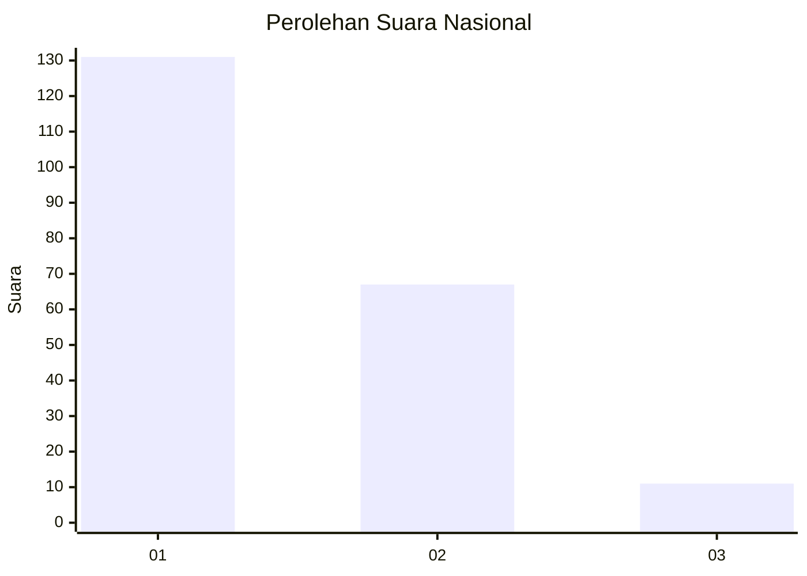
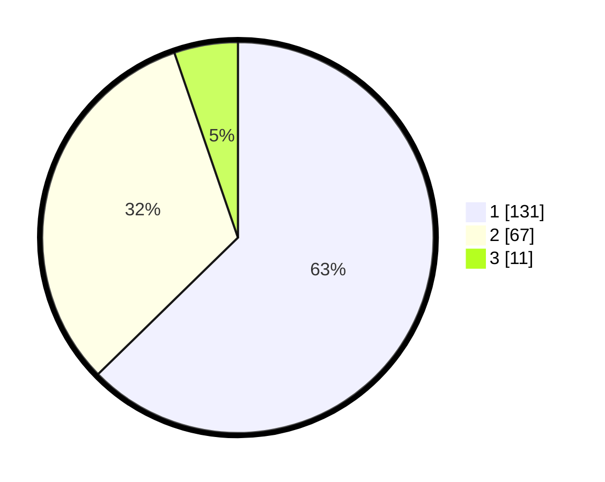

# Hasil

## Grafik

## Tabel

| No.    | Nama Paslon    | Suara | Suara (raw) | Persentase |
|:------ |:-------------- | -----:| -----------:| ----------:|
| 100025 | ANIES MUHAIMIN | 131   | [131][p-1]  | 62,68      |
| 100026 | PRABOWO GIBRAN | 67    | [67][p-2]   | 32,06      |
| 100027 | GANJAR MAHFUD  | 11    | [11][p-3]   | 5,26       |

[p-1]: https://github.com/gigit-pemilu/pemilu-2024/blob/main/pilpres/hitung-suara/sub/31-dki-jakarta/sub/73-jakarta-barat/sub/07-pal-merah/sub/1003-kota-bambu-utara/sub/059-tps/sub/paslon-1.txt
[p-2]: https://github.com/gigit-pemilu/pemilu-2024/blob/main/pilpres/hitung-suara/sub/31-dki-jakarta/sub/73-jakarta-barat/sub/07-pal-merah/sub/1003-kota-bambu-utara/sub/059-tps/sub/paslon-2.txt
[p-3]: https://github.com/gigit-pemilu/pemilu-2024/blob/main/pilpres/hitung-suara/sub/31-dki-jakarta/sub/73-jakarta-barat/sub/07-pal-merah/sub/1003-kota-bambu-utara/sub/059-tps/sub/paslon-3.txt

## Foto C Plano

https://sirekap-obj-formc.kpu.go.id/0007/pemilu/ppwp/31/73/07/10/03/3173071003059-20240215-010611--e40df9a9-c7ac-4327-8567-0820b3bb79a6.jpg

https://sirekap-obj-formc.kpu.go.id/0007/pemilu/ppwp/31/73/07/10/03/3173071003059-20240215-010713--a8aecc5a-3887-4365-90fc-dff2d2a21c40.jpg

https://sirekap-obj-formc.kpu.go.id/0007/pemilu/ppwp/31/73/07/10/03/3173071003059-20240215-010826--8071fff2-f478-4014-a0be-71132ebfc5a5.jpg

## Metadata

| Key        | Value               |
| ---------- | ------------------- |
| Time Stamp | 2024-02-16 16:25:10 |

