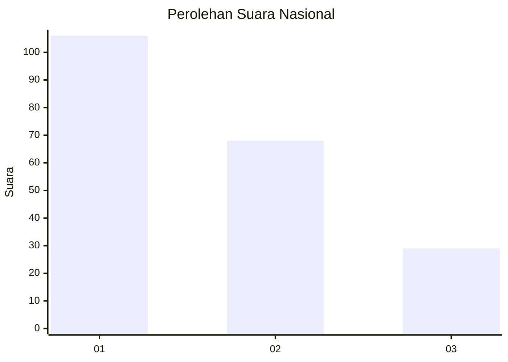
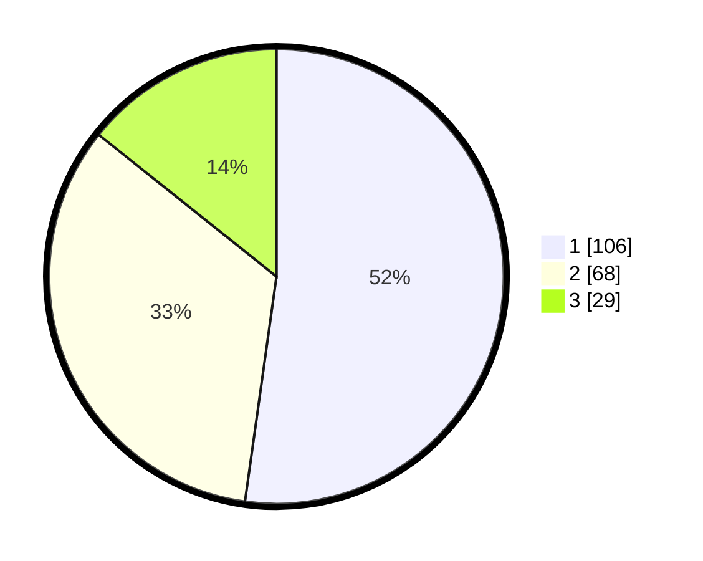

# Hasil

## Grafik

## Tabel

| No.    | Nama Paslon    | Suara | Suara (raw) | Persentase |
|:------ |:-------------- | -----:| -----------:| ----------:|
| 100025 | ANIES MUHAIMIN | 106   | [106][p-1]  | 52,22      |
| 100026 | PRABOWO GIBRAN | 68    | [68][p-2]   | 33,50      |
| 100027 | GANJAR MAHFUD  | 29    | [29][p-3]   | 14,29      |

[p-1]: https://github.com/gigit-pemilu/pemilu-2024/blob/main/pilpres/hitung-suara/sub/31-dki-jakarta/sub/73-jakarta-barat/sub/07-pal-merah/sub/1003-kota-bambu-utara/sub/064-tps/sub/paslon-1.txt
[p-2]: https://github.com/gigit-pemilu/pemilu-2024/blob/main/pilpres/hitung-suara/sub/31-dki-jakarta/sub/73-jakarta-barat/sub/07-pal-merah/sub/1003-kota-bambu-utara/sub/064-tps/sub/paslon-2.txt
[p-3]: https://github.com/gigit-pemilu/pemilu-2024/blob/main/pilpres/hitung-suara/sub/31-dki-jakarta/sub/73-jakarta-barat/sub/07-pal-merah/sub/1003-kota-bambu-utara/sub/064-tps/sub/paslon-3.txt

## Foto C Plano

https://sirekap-obj-formc.kpu.go.id/0c89/pemilu/ppwp/31/73/07/10/03/3173071003064-20240215-000730--28d156b3-23e4-4433-adb8-1882fedc500e.jpg

https://sirekap-obj-formc.kpu.go.id/0c89/pemilu/ppwp/31/73/07/10/03/3173071003064-20240215-000903--c2fbf16b-4b6a-4fef-8577-1919f6ba3168.jpg

https://sirekap-obj-formc.kpu.go.id/0c89/pemilu/ppwp/31/73/07/10/03/3173071003064-20240215-022726--2520688b-1c9b-4f7c-a21c-b4a91599a1a4.jpg

## Metadata

| Key        | Value               |
| ---------- | ------------------- |
| Time Stamp | 2024-02-16 21:01:00 |

