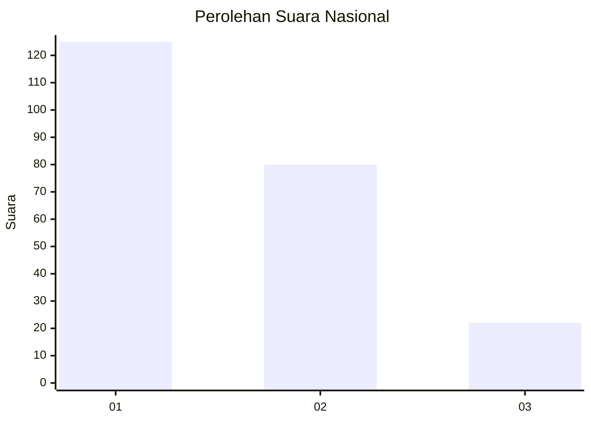
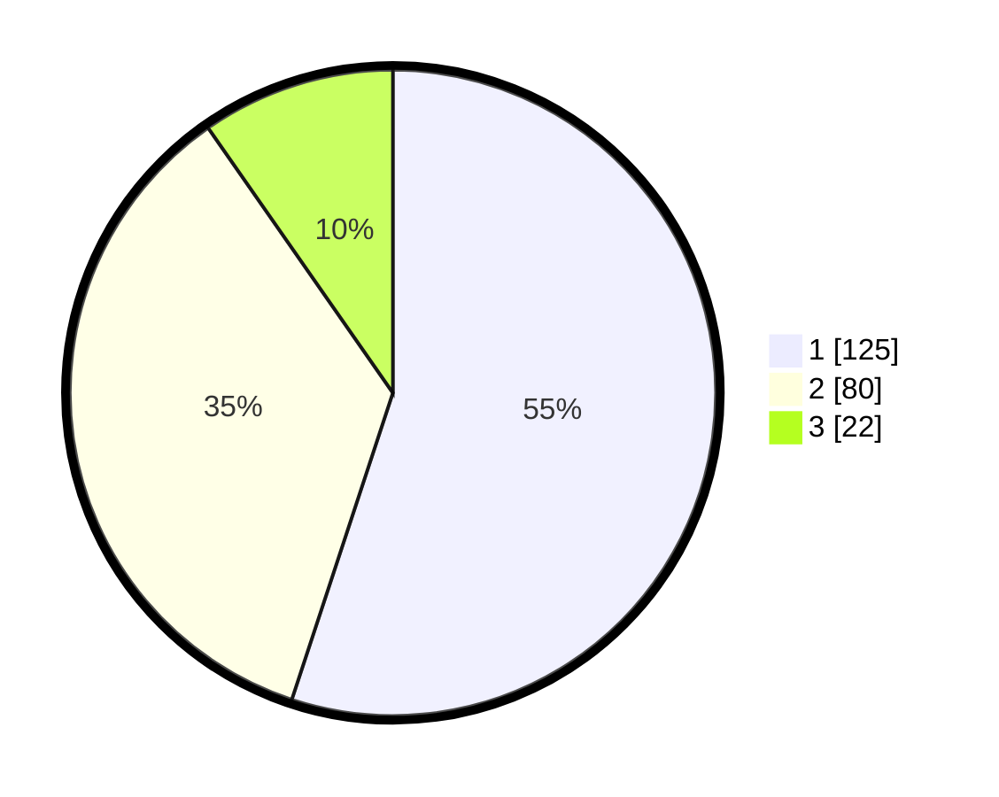

# Hasil

## Grafik

## Tabel

| No.    | Nama Paslon    | Suara | Suara (raw) | Persentase |
|:------ |:-------------- | -----:| -----------:| ----------:|
| 100025 | ANIES MUHAIMIN | 125   | [125][p-1]  | 55,07      |
| 100026 | PRABOWO GIBRAN | 80    | [80][p-2]   | 35,24      |
| 100027 | GANJAR MAHFUD  | 22    | [22][p-3]   | 9,69       |

[p-1]: https://github.com/gigit-pemilu/pemilu-2024/blob/main/pilpres/hitung-suara/sub/31-dki-jakarta/sub/73-jakarta-barat/sub/07-pal-merah/sub/1003-kota-bambu-utara/sub/066-tps/sub/paslon-1.txt
[p-2]: https://github.com/gigit-pemilu/pemilu-2024/blob/main/pilpres/hitung-suara/sub/31-dki-jakarta/sub/73-jakarta-barat/sub/07-pal-merah/sub/1003-kota-bambu-utara/sub/066-tps/sub/paslon-2.txt
[p-3]: https://github.com/gigit-pemilu/pemilu-2024/blob/main/pilpres/hitung-suara/sub/31-dki-jakarta/sub/73-jakarta-barat/sub/07-pal-merah/sub/1003-kota-bambu-utara/sub/066-tps/sub/paslon-3.txt

## Foto C Plano

https://sirekap-obj-formc.kpu.go.id/5c84/pemilu/ppwp/31/73/07/10/03/3173071003066-20240214-215808--520f2b0a-1aa7-4379-99fe-4085675eec6f.jpg

https://sirekap-obj-formc.kpu.go.id/5c84/pemilu/ppwp/31/73/07/10/03/3173071003066-20240214-215319--a73b0124-4514-4e9c-9a54-7b290be0f4ec.jpg

https://sirekap-obj-formc.kpu.go.id/5c84/pemilu/ppwp/31/73/07/10/03/3173071003066-20240214-215556--9263e202-1198-4996-b499-e560623d0b6b.jpg

## Metadata

| Key        | Value               |
| ---------- | ------------------- |
| Time Stamp | 2024-02-16 21:01:00 |

