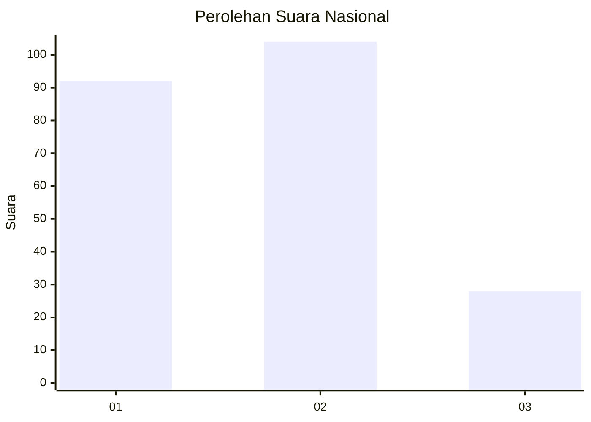
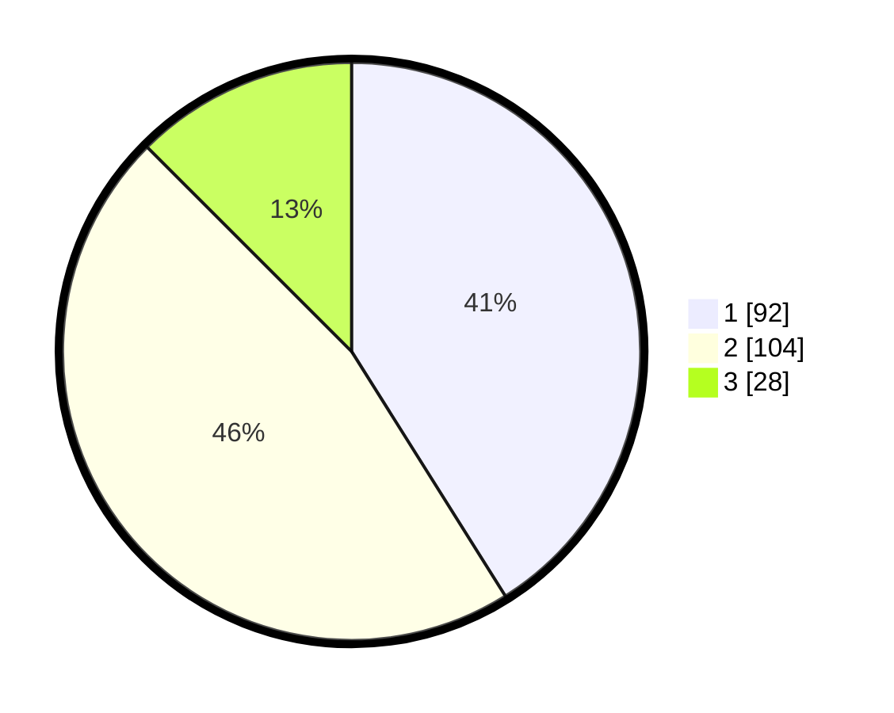

# Hasil

## Grafik

## Tabel

| No.    | Nama Paslon    | Suara | Suara (raw) | Persentase |
|:------ |:-------------- | -----:| -----------:| ----------:|
| 100025 | ANIES MUHAIMIN | 92    | [92][p-1]   | 41,07      |
| 100026 | PRABOWO GIBRAN | 104   | [104][p-2]  | 46,43      |
| 100027 | GANJAR MAHFUD  | 28    | [28][p-3]   | 12,50      |

[p-1]: https://github.com/gigit-pemilu/pemilu-2024/blob/main/pilpres/hitung-suara/sub/31-dki-jakarta/sub/73-jakarta-barat/sub/07-pal-merah/sub/1003-kota-bambu-utara/sub/071-tps/sub/paslon-1.txt
[p-2]: https://github.com/gigit-pemilu/pemilu-2024/blob/main/pilpres/hitung-suara/sub/31-dki-jakarta/sub/73-jakarta-barat/sub/07-pal-merah/sub/1003-kota-bambu-utara/sub/071-tps/sub/paslon-2.txt
[p-3]: https://github.com/gigit-pemilu/pemilu-2024/blob/main/pilpres/hitung-suara/sub/31-dki-jakarta/sub/73-jakarta-barat/sub/07-pal-merah/sub/1003-kota-bambu-utara/sub/071-tps/sub/paslon-3.txt

## Foto C Plano

https://sirekap-obj-formc.kpu.go.id/685a/pemilu/ppwp/31/73/07/10/03/3173071003071-20240214-224845--63131929-a3eb-4c9b-bdf4-d19cde917e21.jpg

https://sirekap-obj-formc.kpu.go.id/685a/pemilu/ppwp/31/73/07/10/03/3173071003071-20240214-231200--a191717b-1244-4d44-a37e-9cd204e43f23.jpg

https://sirekap-obj-formc.kpu.go.id/685a/pemilu/ppwp/31/73/07/10/03/3173071003071-20240214-231349--86829a5b-0296-43cd-b8bf-5e7b76773294.jpg

## Metadata

| Key        | Value               |
| ---------- | ------------------- |
| Time Stamp | 2024-02-16 21:01:00 |

