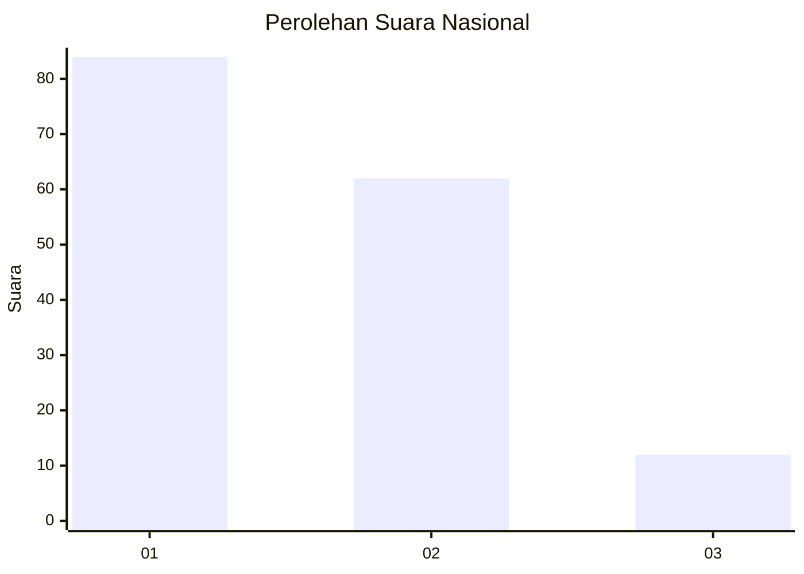
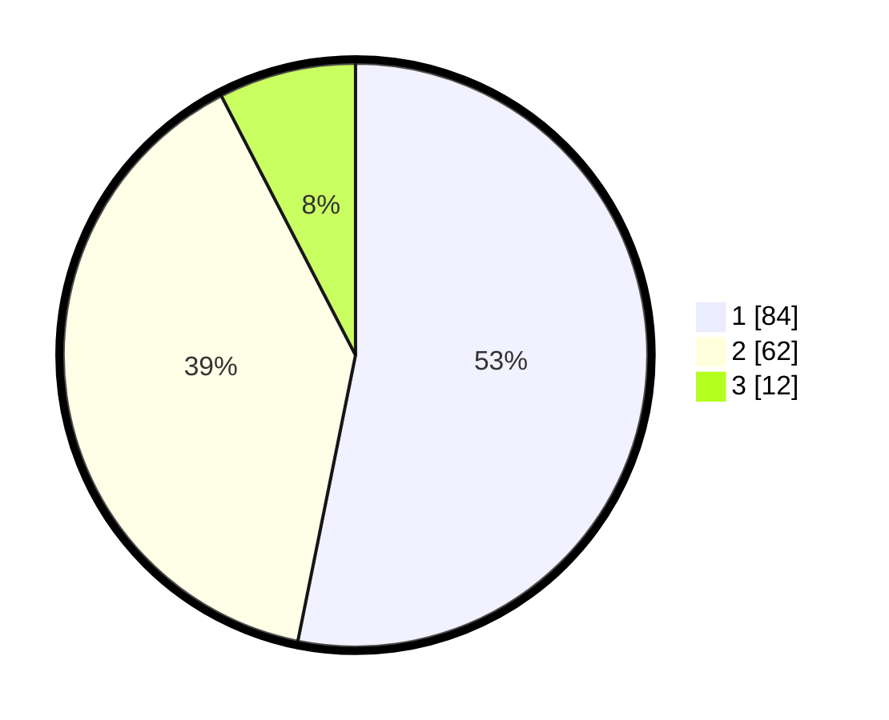

# Hasil

## Grafik

## Tabel

| No.    | Nama Paslon    | Suara | Suara (raw) | Persentase |
|:------ |:-------------- | -----:| -----------:| ----------:|
| 100025 | ANIES MUHAIMIN | 84    | [84][p-1]   | 53,16      |
| 100026 | PRABOWO GIBRAN | 62    | [62][p-2]   | 39,24      |
| 100027 | GANJAR MAHFUD  | 12    | [12][p-3]   | 7,59       |

[p-1]: https://github.com/gigit-pemilu/pemilu-2024/blob/main/pilpres/hitung-suara/sub/31-dki-jakarta/sub/73-jakarta-barat/sub/07-pal-merah/sub/1003-kota-bambu-utara/sub/086-tps/sub/paslon-1.txt
[p-2]: https://github.com/gigit-pemilu/pemilu-2024/blob/main/pilpres/hitung-suara/sub/31-dki-jakarta/sub/73-jakarta-barat/sub/07-pal-merah/sub/1003-kota-bambu-utara/sub/086-tps/sub/paslon-2.txt
[p-3]: https://github.com/gigit-pemilu/pemilu-2024/blob/main/pilpres/hitung-suara/sub/31-dki-jakarta/sub/73-jakarta-barat/sub/07-pal-merah/sub/1003-kota-bambu-utara/sub/086-tps/sub/paslon-3.txt

## Foto C Plano

https://sirekap-obj-formc.kpu.go.id/5301/pemilu/ppwp/31/73/07/10/03/3173071003086-20240214-205056--1fe1cd20-9c1d-444d-9f7c-41f5e1fdb348.jpg

https://sirekap-obj-formc.kpu.go.id/5301/pemilu/ppwp/31/73/07/10/03/3173071003086-20240214-205106--04ac444a-a024-4e8f-a3f8-308722ee026c.jpg

https://sirekap-obj-formc.kpu.go.id/5301/pemilu/ppwp/31/73/07/10/03/3173071003086-20240214-205120--17bce0b8-b367-457e-b3e3-f568d94a5bd5.jpg

## Metadata

| Key        | Value               |
| ---------- | ------------------- |
| Time Stamp | 2024-02-21 18:00:00 |

