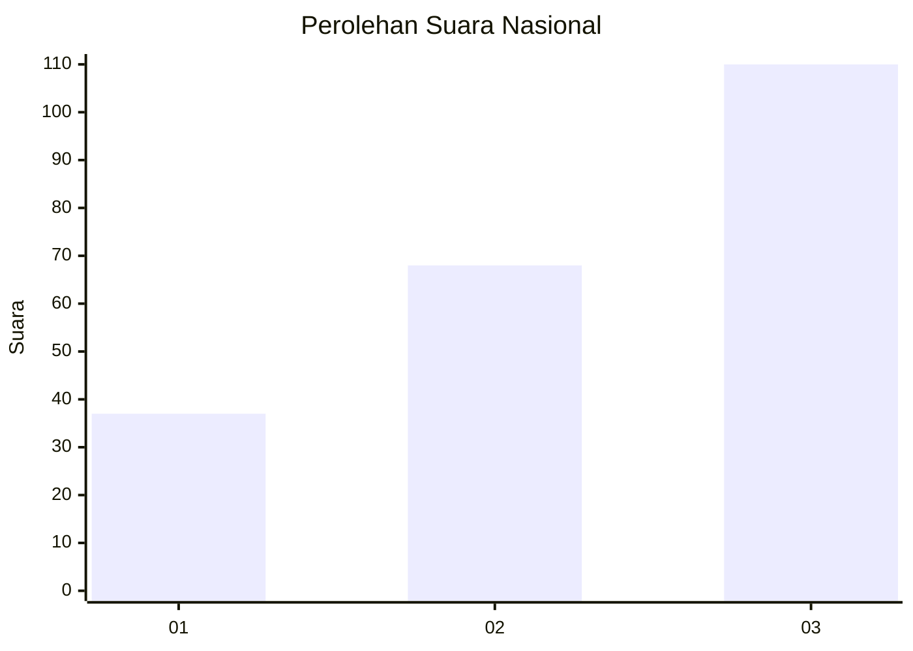
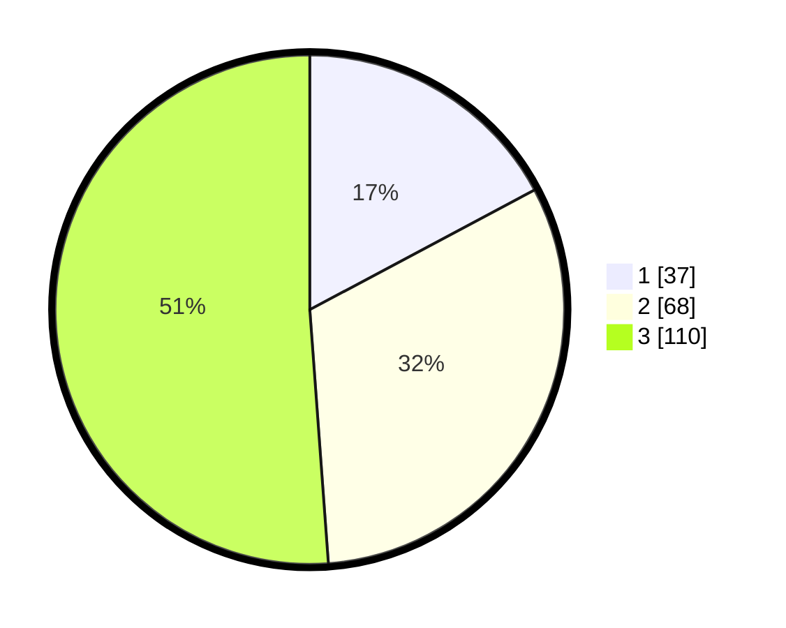

# Hasil

## Grafik

## Tabel

| No.    | Nama Paslon    | Suara | Suara (raw) | Persentase |
|:------ |:-------------- | -----:| -----------:| ----------:|
| 100025 | ANIES MUHAIMIN | 37    | [37][p-1]   | 17,21      |
| 100026 | PRABOWO GIBRAN | 68    | [68][p-2]   | 31,63      |
| 100027 | GANJAR MAHFUD  | 110   | [110][p-3]  | 51,16      |

[p-1]: https://github.com/gigit-pemilu/pemilu-2024/blob/main/pilpres/hitung-suara/sub/31-dki-jakarta/sub/73-jakarta-barat/sub/07-pal-merah/sub/1004-jatipulo/sub/003-tps/sub/paslon-1.txt
[p-2]: https://github.com/gigit-pemilu/pemilu-2024/blob/main/pilpres/hitung-suara/sub/31-dki-jakarta/sub/73-jakarta-barat/sub/07-pal-merah/sub/1004-jatipulo/sub/003-tps/sub/paslon-2.txt
[p-3]: https://github.com/gigit-pemilu/pemilu-2024/blob/main/pilpres/hitung-suara/sub/31-dki-jakarta/sub/73-jakarta-barat/sub/07-pal-merah/sub/1004-jatipulo/sub/003-tps/sub/paslon-3.txt

## Foto C Plano

https://sirekap-obj-formc.kpu.go.id/2f27/pemilu/ppwp/31/73/07/10/04/3173071004003-20240214-215715--cd22ef1e-d95c-438d-a727-370f2b8f6b75.jpg

https://sirekap-obj-formc.kpu.go.id/2f27/pemilu/ppwp/31/73/07/10/04/3173071004003-20240214-215801--3294c440-0693-4a7c-802b-c82862717e7d.jpg

https://sirekap-obj-formc.kpu.go.id/2f27/pemilu/ppwp/31/73/07/10/04/3173071004003-20240214-215911--9c78561f-1c12-476f-9c56-81c7089394c5.jpg

## Metadata

| Key        | Value               |
| ---------- | ------------------- |
| Time Stamp | 2024-02-16 16:25:10 |

