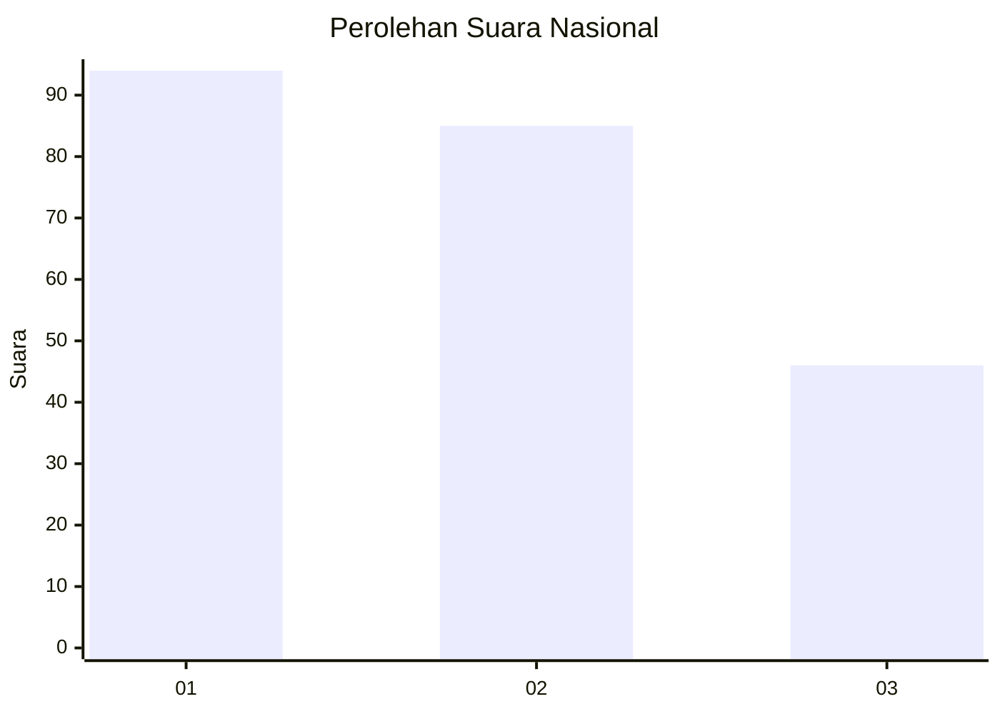
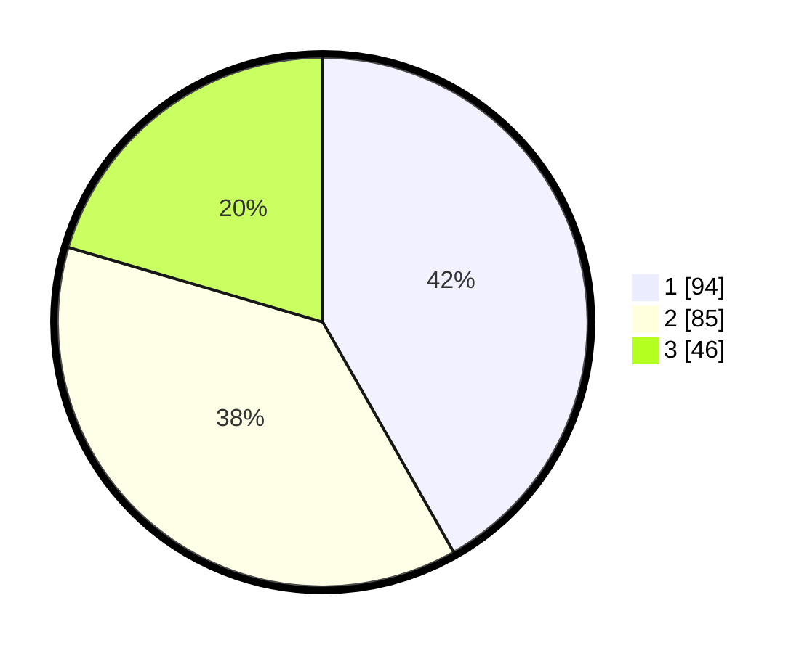

# Hasil

## Grafik

## Tabel

| No.    | Nama Paslon    | Suara | Suara (raw) | Persentase |
|:------ |:-------------- | -----:| -----------:| ----------:|
| 100025 | ANIES MUHAIMIN | 94    | [94][p-1]   | 41,78      |
| 100026 | PRABOWO GIBRAN | 85    | [85][p-2]   | 37,78      |
| 100027 | GANJAR MAHFUD  | 46    | [46][p-3]   | 20,44      |

[p-1]: https://github.com/gigit-pemilu/pemilu-2024/blob/main/pilpres/hitung-suara/sub/31-dki-jakarta/sub/73-jakarta-barat/sub/07-pal-merah/sub/1004-jatipulo/sub/014-tps/sub/paslon-1.txt
[p-2]: https://github.com/gigit-pemilu/pemilu-2024/blob/main/pilpres/hitung-suara/sub/31-dki-jakarta/sub/73-jakarta-barat/sub/07-pal-merah/sub/1004-jatipulo/sub/014-tps/sub/paslon-2.txt
[p-3]: https://github.com/gigit-pemilu/pemilu-2024/blob/main/pilpres/hitung-suara/sub/31-dki-jakarta/sub/73-jakarta-barat/sub/07-pal-merah/sub/1004-jatipulo/sub/014-tps/sub/paslon-3.txt

## Foto C Plano

https://sirekap-obj-formc.kpu.go.id/f8cf/pemilu/ppwp/31/73/07/10/04/3173071004014-20240214-231939--f49f4285-f7b6-4dbf-8cd2-672fd31ffebb.jpg

https://sirekap-obj-formc.kpu.go.id/f8cf/pemilu/ppwp/31/73/07/10/04/3173071004014-20240214-232745--e316d0ee-2c58-474f-947a-02d948172558.jpg

https://sirekap-obj-formc.kpu.go.id/f8cf/pemilu/ppwp/31/73/07/10/04/3173071004014-20240214-232859--cbc6f3da-eadf-447d-a8b8-696760cc8a03.jpg

## Metadata

| Key        | Value               |
| ---------- | ------------------- |
| Time Stamp | 2024-02-16 21:01:00 |

