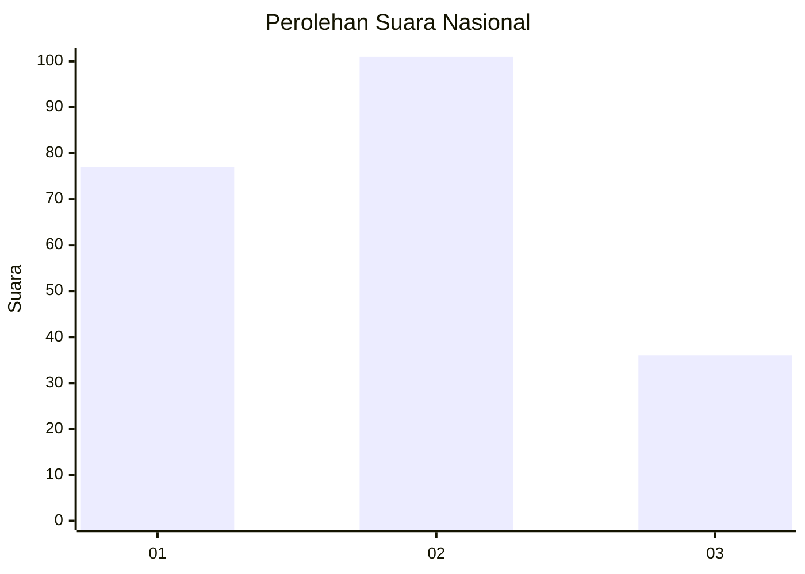
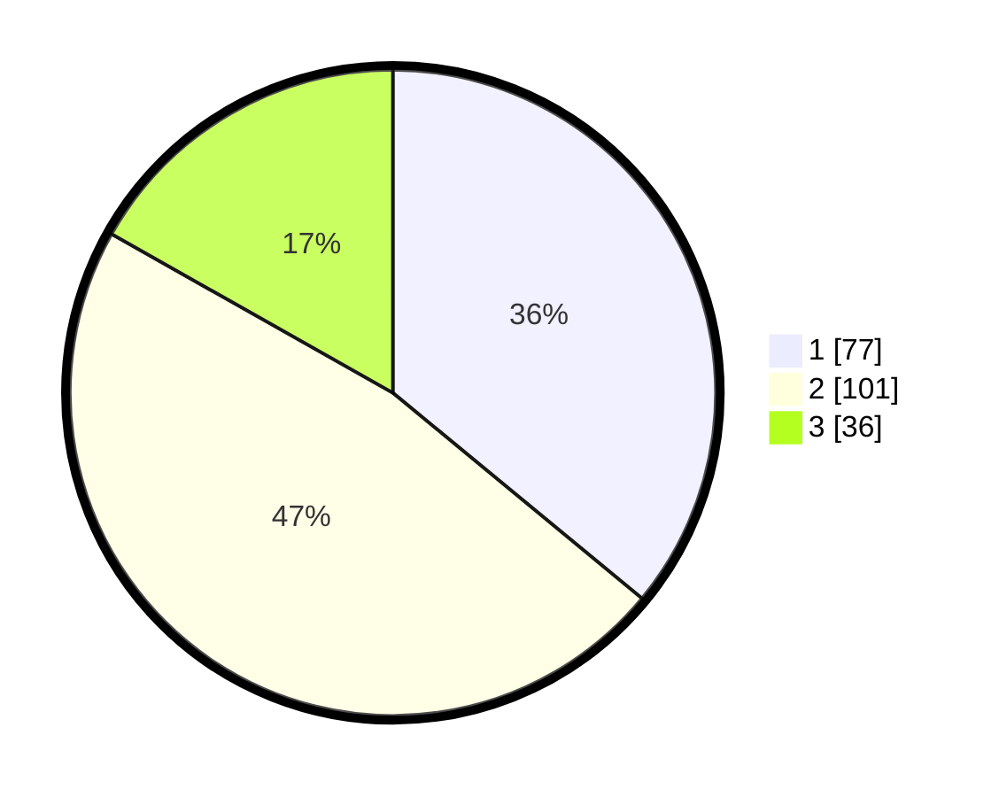

# Hasil

## Grafik

## Tabel

| No.    | Nama Paslon    | Suara | Suara (raw) | Persentase |
|:------ |:-------------- | -----:| -----------:| ----------:|
| 100025 | ANIES MUHAIMIN | 77    | [77][p-1]   | 35,98      |
| 100026 | PRABOWO GIBRAN | 101   | [101][p-2]  | 47,20      |
| 100027 | GANJAR MAHFUD  | 36    | [36][p-3]   | 16,82      |

[p-1]: https://github.com/gigit-pemilu/pemilu-2024/blob/main/pilpres/hitung-suara/sub/31-dki-jakarta/sub/73-jakarta-barat/sub/07-pal-merah/sub/1004-jatipulo/sub/039-tps/sub/paslon-1.txt
[p-2]: https://github.com/gigit-pemilu/pemilu-2024/blob/main/pilpres/hitung-suara/sub/31-dki-jakarta/sub/73-jakarta-barat/sub/07-pal-merah/sub/1004-jatipulo/sub/039-tps/sub/paslon-2.txt
[p-3]: https://github.com/gigit-pemilu/pemilu-2024/blob/main/pilpres/hitung-suara/sub/31-dki-jakarta/sub/73-jakarta-barat/sub/07-pal-merah/sub/1004-jatipulo/sub/039-tps/sub/paslon-3.txt

## Foto C Plano

https://sirekap-obj-formc.kpu.go.id/6f62/pemilu/ppwp/31/73/07/10/04/3173071004039-20240214-213349--e1d4d6c1-773c-4f95-897f-94e2c493ebb0.jpg

https://sirekap-obj-formc.kpu.go.id/6f62/pemilu/ppwp/31/73/07/10/04/3173071004039-20240214-214010--4f5578b1-6aee-451b-99eb-621de519eed1.jpg

https://sirekap-obj-formc.kpu.go.id/6f62/pemilu/ppwp/31/73/07/10/04/3173071004039-20240214-214323--7ebbd0d6-de1f-4bb9-b43e-60bd4aa69091.jpg

## Metadata

| Key        | Value               |
| ---------- | ------------------- |
| Time Stamp | 2024-02-16 21:01:00 |

