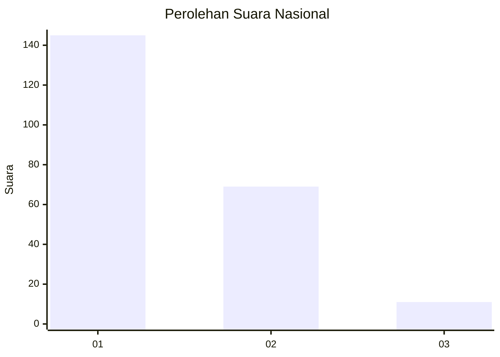
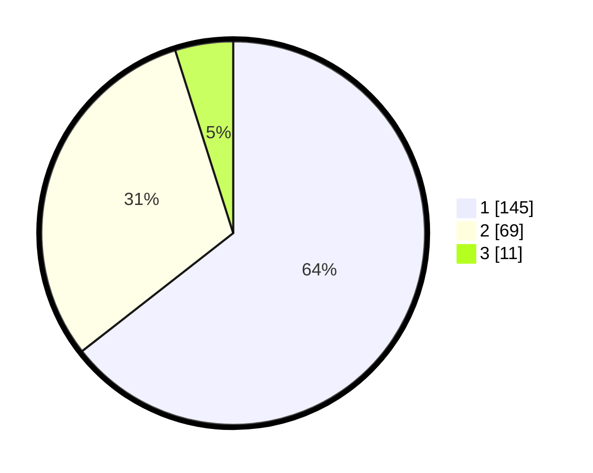

# Hasil

## Grafik

## Tabel

| No. | Nama Paslon    | Suara | Suara (raw) | Persentase |
|:--- |:-------------- | -----:| -----------:| ----------:|
| 1   | ANIES MUHAIMIN | 145   | [145][p-1]  | 64,44      |
| 2   | PRABOWO GIBRAN | 69    | [69][p-2]   | 30,67      |
| 3   | GANJAR MAHFUD  | 11    | [11][p-3]   | 4,89       |

[p-1]: https://github.com/gigit-pemilu/pemilu-2024/blob/main/pilpres/hitung-suara/sub/31-dki-jakarta/sub/73-jakarta-barat/sub/07-pal-merah/sub/1004-jatipulo/sub/042-tps/sub/paslon-1.txt
[p-2]: https://github.com/gigit-pemilu/pemilu-2024/blob/main/pilpres/hitung-suara/sub/31-dki-jakarta/sub/73-jakarta-barat/sub/07-pal-merah/sub/1004-jatipulo/sub/042-tps/sub/paslon-2.txt
[p-3]: https://github.com/gigit-pemilu/pemilu-2024/blob/main/pilpres/hitung-suara/sub/31-dki-jakarta/sub/73-jakarta-barat/sub/07-pal-merah/sub/1004-jatipulo/sub/042-tps/sub/paslon-3.txt

## Foto C Plano

https://sirekap-obj-formc.kpu.go.id/87ee/pemilu/ppwp/31/73/07/10/04/3173071004042-20240214-215531--660c0a61-af81-4e5a-99e7-8fa32d52bff0.jpg

https://sirekap-obj-formc.kpu.go.id/87ee/pemilu/ppwp/31/73/07/10/04/3173071004042-20240214-215605--06ea8820-3219-41a0-b315-ac9077bd7fbb.jpg

https://sirekap-obj-formc.kpu.go.id/87ee/pemilu/ppwp/31/73/07/10/04/3173071004042-20240214-215730--5435c871-d2c7-4bc9-84b0-d8fefc2804a3.jpg

## Metadata

| Key        | Value               |
| ---------- | ------------------- |
| Time Stamp | 2024-02-19 14:00:00 |

