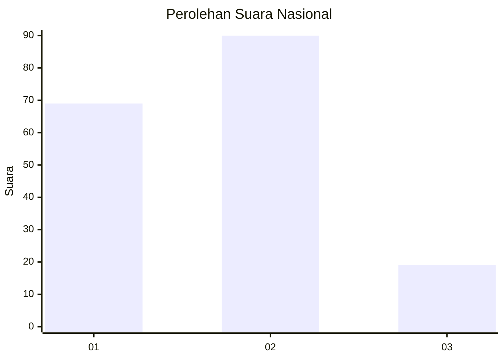
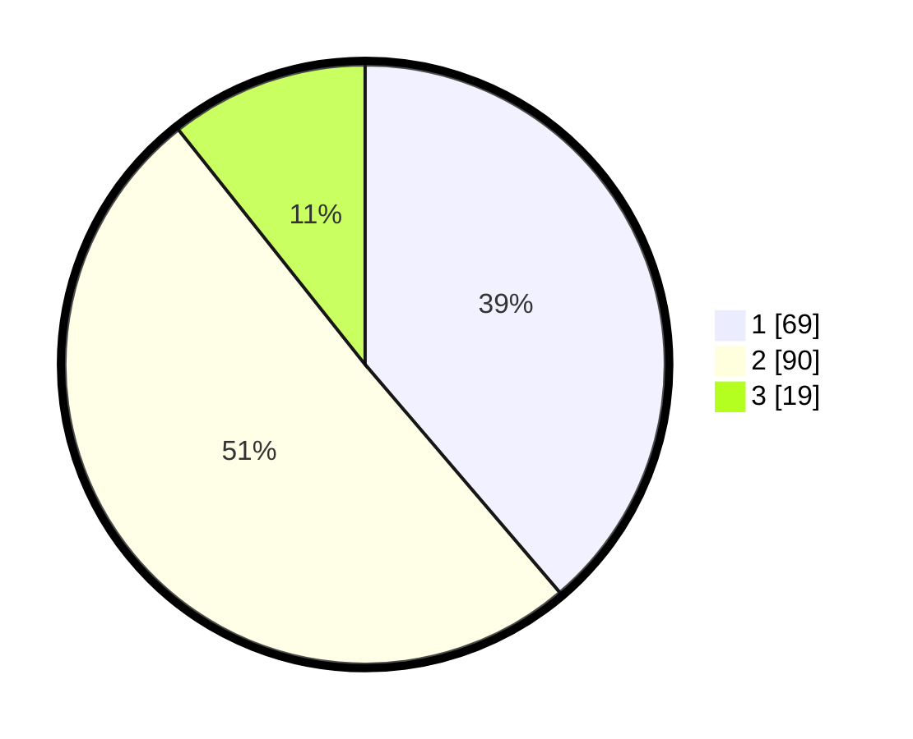

# Hasil

## Grafik

## Tabel

| No.    | Nama Paslon    | Suara | Suara (raw) | Persentase |
|:------ |:-------------- | -----:| -----------:| ----------:|
| 100025 | ANIES MUHAIMIN | 69    | [69][p-1]   | 38,76      |
| 100026 | PRABOWO GIBRAN | 90    | [90][p-2]   | 50,56      |
| 100027 | GANJAR MAHFUD  | 19    | [19][p-3]   | 10,67      |

[p-1]: https://github.com/gigit-pemilu/pemilu-2024/blob/main/pilpres/hitung-suara/sub/31-dki-jakarta/sub/73-jakarta-barat/sub/07-pal-merah/sub/1004-jatipulo/sub/046-tps/sub/paslon-1.txt
[p-2]: https://github.com/gigit-pemilu/pemilu-2024/blob/main/pilpres/hitung-suara/sub/31-dki-jakarta/sub/73-jakarta-barat/sub/07-pal-merah/sub/1004-jatipulo/sub/046-tps/sub/paslon-2.txt
[p-3]: https://github.com/gigit-pemilu/pemilu-2024/blob/main/pilpres/hitung-suara/sub/31-dki-jakarta/sub/73-jakarta-barat/sub/07-pal-merah/sub/1004-jatipulo/sub/046-tps/sub/paslon-3.txt

## Foto C Plano

https://sirekap-obj-formc.kpu.go.id/3cdb/pemilu/ppwp/31/73/07/10/04/3173071004046-20240214-234332--be60d075-fe08-4039-82c2-f41002ce07f7.jpg

https://sirekap-obj-formc.kpu.go.id/3cdb/pemilu/ppwp/31/73/07/10/04/3173071004046-20240214-234336--f8c13c72-602f-4e22-b4b7-b7f1e383704d.jpg

https://sirekap-obj-formc.kpu.go.id/3cdb/pemilu/ppwp/31/73/07/10/04/3173071004046-20240214-234341--75cd0aa8-2846-4cbb-90ff-c4dabd112021.jpg

## Metadata

| Key        | Value               |
| ---------- | ------------------- |
| Time Stamp | 2024-02-16 21:01:00 |

