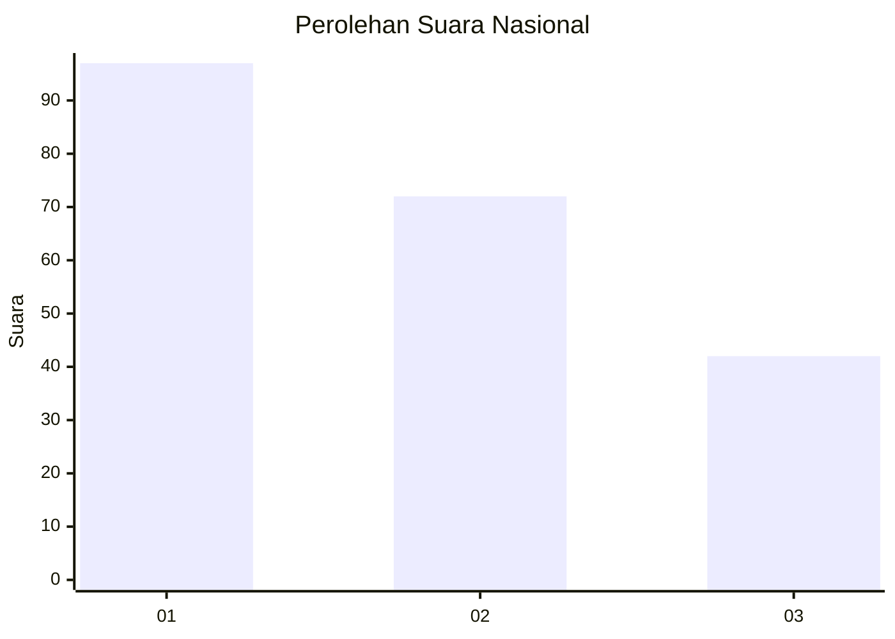
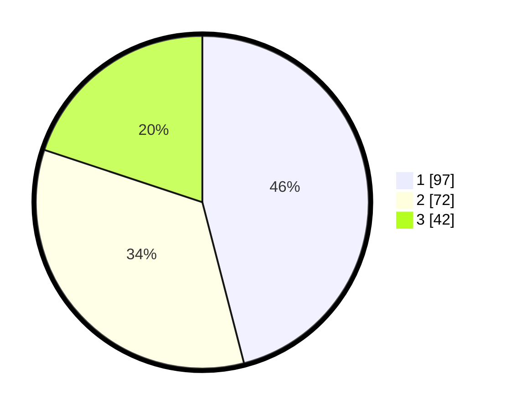

# Hasil

## Grafik

## Tabel

| No.    | Nama Paslon    | Suara | Suara (raw) | Persentase |
|:------ |:-------------- | -----:| -----------:| ----------:|
| 100025 | ANIES MUHAIMIN | 97    | [97][p-1]   | 45,97      |
| 100026 | PRABOWO GIBRAN | 72    | [72][p-2]   | 34,12      |
| 100027 | GANJAR MAHFUD  | 42    | [42][p-3]   | 19,91      |

[p-1]: https://github.com/gigit-pemilu/pemilu-2024/blob/main/pilpres/hitung-suara/sub/31-dki-jakarta/sub/73-jakarta-barat/sub/07-pal-merah/sub/1004-jatipulo/sub/050-tps/sub/paslon-1.txt
[p-2]: https://github.com/gigit-pemilu/pemilu-2024/blob/main/pilpres/hitung-suara/sub/31-dki-jakarta/sub/73-jakarta-barat/sub/07-pal-merah/sub/1004-jatipulo/sub/050-tps/sub/paslon-2.txt
[p-3]: https://github.com/gigit-pemilu/pemilu-2024/blob/main/pilpres/hitung-suara/sub/31-dki-jakarta/sub/73-jakarta-barat/sub/07-pal-merah/sub/1004-jatipulo/sub/050-tps/sub/paslon-3.txt

## Foto C Plano

https://sirekap-obj-formc.kpu.go.id/fcd9/pemilu/ppwp/31/73/07/10/04/3173071004050-20240215-005925--84c3a34e-66d0-4ed0-a9f6-39f8e64a8243.jpg

https://sirekap-obj-formc.kpu.go.id/fcd9/pemilu/ppwp/31/73/07/10/04/3173071004050-20240215-010028--2cd0cca0-0858-45d5-a8d5-0b201e94acdc.jpg

https://sirekap-obj-formc.kpu.go.id/fcd9/pemilu/ppwp/31/73/07/10/04/3173071004050-20240215-010121--4b61a3b0-a0cf-4d66-90c9-a6f7c2b701a4.jpg

## Metadata

| Key        | Value               |
| ---------- | ------------------- |
| Time Stamp | 2024-02-19 14:00:00 |

