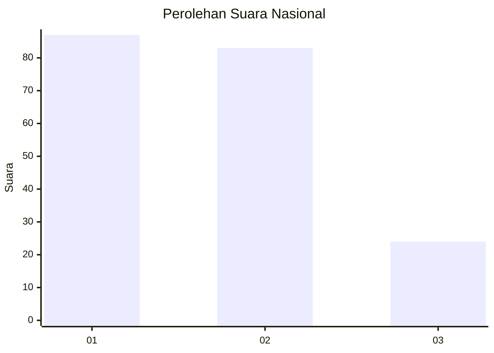
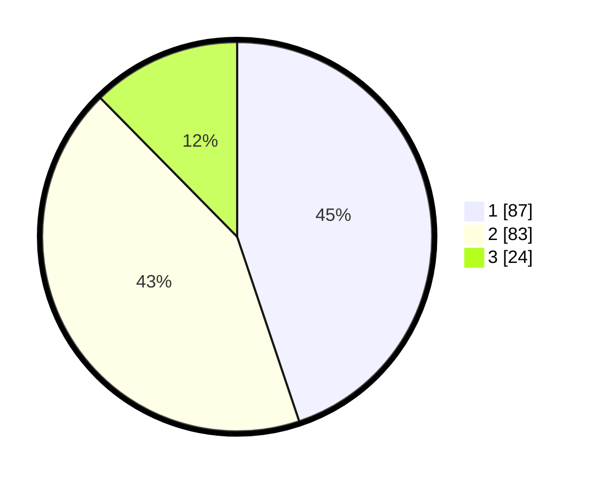

# Hasil

## Grafik

## Tabel

| No.    | Nama Paslon    | Suara | Suara (raw) | Persentase |
|:------ |:-------------- | -----:| -----------:| ----------:|
| 100025 | ANIES MUHAIMIN | 87    | [87][p-1]   | 44,85      |
| 100026 | PRABOWO GIBRAN | 83    | [83][p-2]   | 42,78      |
| 100027 | GANJAR MAHFUD  | 24    | [24][p-3]   | 12,37      |

[p-1]: https://github.com/gigit-pemilu/pemilu-2024/blob/main/pilpres/hitung-suara/sub/31-dki-jakarta/sub/73-jakarta-barat/sub/07-pal-merah/sub/1004-jatipulo/sub/057-tps/sub/paslon-1.txt
[p-2]: https://github.com/gigit-pemilu/pemilu-2024/blob/main/pilpres/hitung-suara/sub/31-dki-jakarta/sub/73-jakarta-barat/sub/07-pal-merah/sub/1004-jatipulo/sub/057-tps/sub/paslon-2.txt
[p-3]: https://github.com/gigit-pemilu/pemilu-2024/blob/main/pilpres/hitung-suara/sub/31-dki-jakarta/sub/73-jakarta-barat/sub/07-pal-merah/sub/1004-jatipulo/sub/057-tps/sub/paslon-3.txt

## Foto C Plano

https://sirekap-obj-formc.kpu.go.id/8d62/pemilu/ppwp/31/73/07/10/04/3173071004057-20240215-022801--4a1b6c29-9fa4-4cd8-809c-a1c44e6b2c3d.jpg

https://sirekap-obj-formc.kpu.go.id/8d62/pemilu/ppwp/31/73/07/10/04/3173071004057-20240215-023355--4a3ca083-3906-4d65-888a-29994d79e928.jpg

https://sirekap-obj-formc.kpu.go.id/8d62/pemilu/ppwp/31/73/07/10/04/3173071004057-20240215-023016--bfe39114-7d74-4b9b-a7ed-c6c69f2f8133.jpg

## Metadata

| Key        | Value               |
| ---------- | ------------------- |
| Time Stamp | 2024-02-19 14:00:00 |

