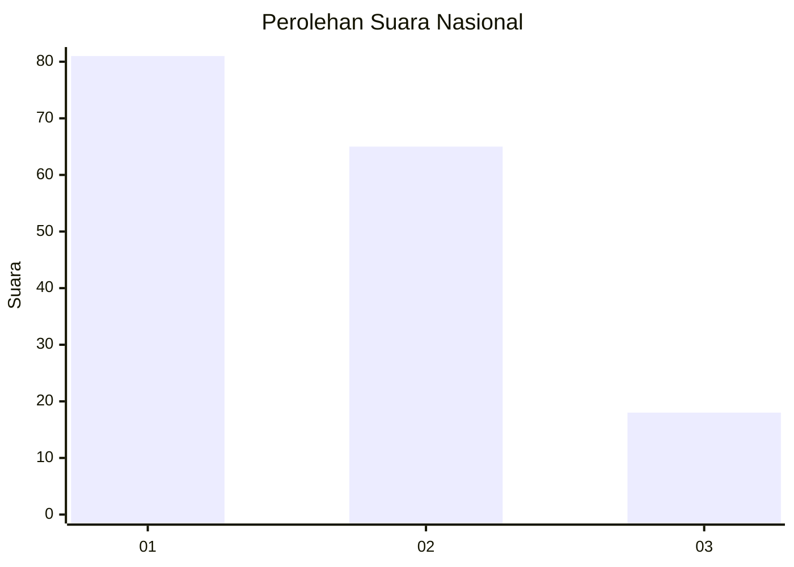
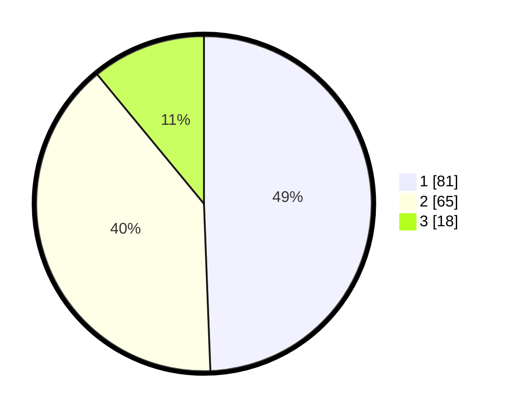

# Hasil

## Grafik

## Tabel

| No.    | Nama Paslon    | Suara | Suara (raw) | Persentase |
|:------ |:-------------- | -----:| -----------:| ----------:|
| 100025 | ANIES MUHAIMIN | 81    | [81][p-1]   | 49,39      |
| 100026 | PRABOWO GIBRAN | 65    | [65][p-2]   | 39,63      |
| 100027 | GANJAR MAHFUD  | 18    | [18][p-3]   | 10,98      |

[p-1]: https://github.com/gigit-pemilu/pemilu-2024/blob/main/pilpres/hitung-suara/sub/31-dki-jakarta/sub/73-jakarta-barat/sub/07-pal-merah/sub/1004-jatipulo/sub/075-tps/sub/paslon-1.txt
[p-2]: https://github.com/gigit-pemilu/pemilu-2024/blob/main/pilpres/hitung-suara/sub/31-dki-jakarta/sub/73-jakarta-barat/sub/07-pal-merah/sub/1004-jatipulo/sub/075-tps/sub/paslon-2.txt
[p-3]: https://github.com/gigit-pemilu/pemilu-2024/blob/main/pilpres/hitung-suara/sub/31-dki-jakarta/sub/73-jakarta-barat/sub/07-pal-merah/sub/1004-jatipulo/sub/075-tps/sub/paslon-3.txt

## Foto C Plano

https://sirekap-obj-formc.kpu.go.id/ebbb/pemilu/ppwp/31/73/07/10/04/3173071004075-20240214-230028--f33c0f87-3280-4827-89b4-5d7cd038758d.jpg

https://sirekap-obj-formc.kpu.go.id/ebbb/pemilu/ppwp/31/73/07/10/04/3173071004075-20240214-225904--065e03b1-1e9b-4fa2-9518-058047264710.jpg

https://sirekap-obj-formc.kpu.go.id/ebbb/pemilu/ppwp/31/73/07/10/04/3173071004075-20240214-225823--2379d00e-3b65-4cb6-9206-1bf4e73fadd0.jpg

## Metadata

| Key        | Value               |
| ---------- | ------------------- |
| Time Stamp | 2024-02-16 01:30:27 |

