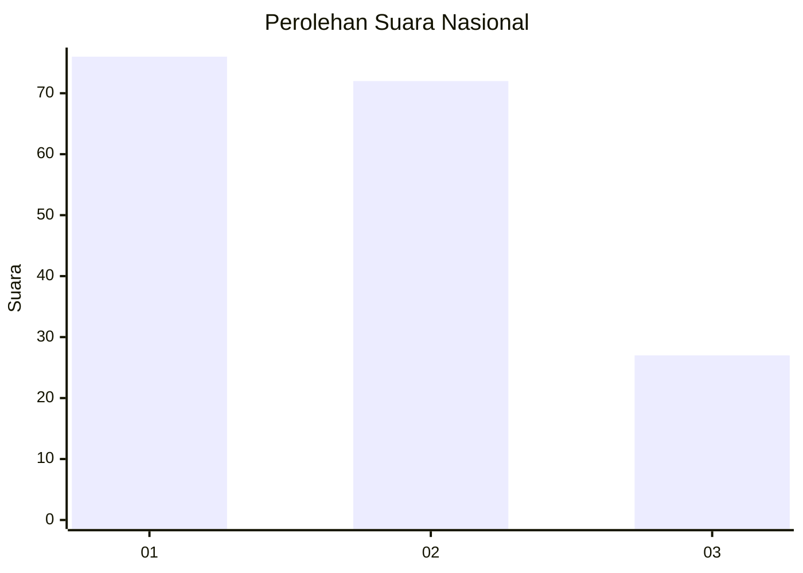
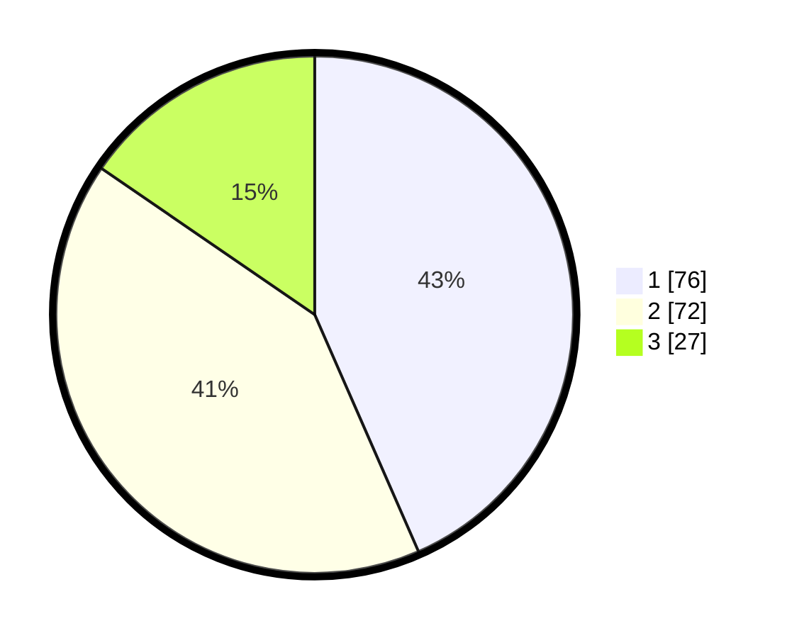

# Hasil

## Grafik

## Tabel

| No.    | Nama Paslon    | Suara | Suara (raw) | Persentase |
|:------ |:-------------- | -----:| -----------:| ----------:|
| 100025 | ANIES MUHAIMIN | 76    | [76][p-1]   | 43,43      |
| 100026 | PRABOWO GIBRAN | 72    | [72][p-2]   | 41,14      |
| 100027 | GANJAR MAHFUD  | 27    | [27][p-3]   | 15,43      |

[p-1]: https://github.com/gigit-pemilu/pemilu-2024/blob/main/pilpres/hitung-suara/sub/31-dki-jakarta/sub/73-jakarta-barat/sub/07-pal-merah/sub/1004-jatipulo/sub/088-tps/sub/paslon-1.txt
[p-2]: https://github.com/gigit-pemilu/pemilu-2024/blob/main/pilpres/hitung-suara/sub/31-dki-jakarta/sub/73-jakarta-barat/sub/07-pal-merah/sub/1004-jatipulo/sub/088-tps/sub/paslon-2.txt
[p-3]: https://github.com/gigit-pemilu/pemilu-2024/blob/main/pilpres/hitung-suara/sub/31-dki-jakarta/sub/73-jakarta-barat/sub/07-pal-merah/sub/1004-jatipulo/sub/088-tps/sub/paslon-3.txt

## Foto C Plano

https://sirekap-obj-formc.kpu.go.id/d203/pemilu/ppwp/31/73/07/10/04/3173071004088-20240215-024949--8e21a924-1107-4942-98d2-6b7f19c27247.jpg

https://sirekap-obj-formc.kpu.go.id/d203/pemilu/ppwp/31/73/07/10/04/3173071004088-20240215-025019--e92ad606-eb67-4d44-b931-cae598f25428.jpg

https://sirekap-obj-formc.kpu.go.id/d203/pemilu/ppwp/31/73/07/10/04/3173071004088-20240215-025153--0625d8a0-02d3-4ec2-8d2d-97de5131c633.jpg

## Metadata

| Key        | Value               |
| ---------- | ------------------- |
| Time Stamp | 2024-02-15 15:00:29 |

