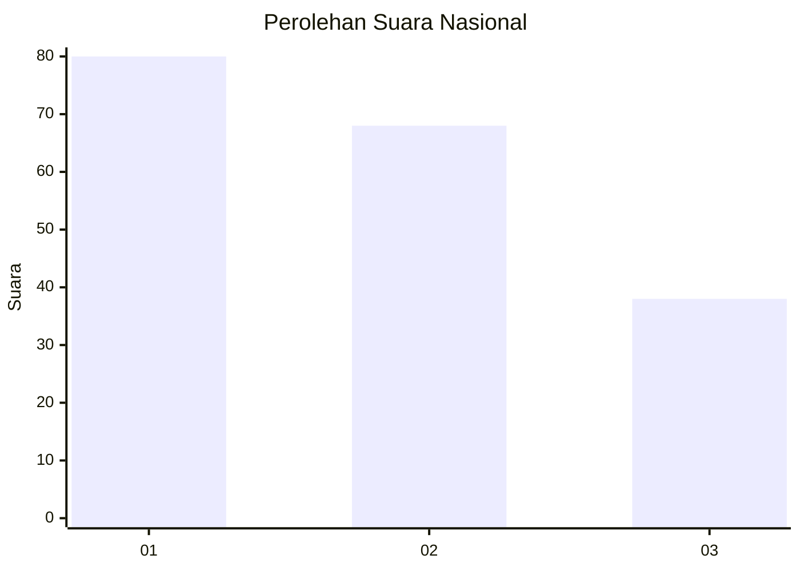
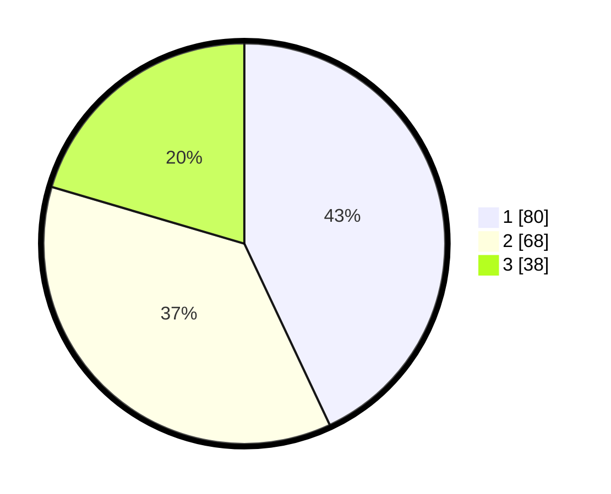

# Hasil

## Grafik

## Tabel

| No.    | Nama Paslon    | Suara | Suara (raw) | Persentase |
|:------ |:-------------- | -----:| -----------:| ----------:|
| 100025 | ANIES MUHAIMIN | 80    | [80][p-1]   | 43,01      |
| 100026 | PRABOWO GIBRAN | 68    | [68][p-2]   | 36,56      |
| 100027 | GANJAR MAHFUD  | 38    | [38][p-3]   | 20,43      |

[p-1]: https://github.com/gigit-pemilu/pemilu-2024/blob/main/pilpres/hitung-suara/sub/31-dki-jakarta/sub/73-jakarta-barat/sub/07-pal-merah/sub/1005-kemanggisan/sub/011-tps/sub/paslon-1.txt
[p-2]: https://github.com/gigit-pemilu/pemilu-2024/blob/main/pilpres/hitung-suara/sub/31-dki-jakarta/sub/73-jakarta-barat/sub/07-pal-merah/sub/1005-kemanggisan/sub/011-tps/sub/paslon-2.txt
[p-3]: https://github.com/gigit-pemilu/pemilu-2024/blob/main/pilpres/hitung-suara/sub/31-dki-jakarta/sub/73-jakarta-barat/sub/07-pal-merah/sub/1005-kemanggisan/sub/011-tps/sub/paslon-3.txt

## Foto C Plano

https://sirekap-obj-formc.kpu.go.id/33ee/pemilu/ppwp/31/73/07/10/05/3173071005011-20240215-004422--5b5e7ba4-c819-4f78-9de5-26c5494f3c13.jpg

https://sirekap-obj-formc.kpu.go.id/33ee/pemilu/ppwp/31/73/07/10/05/3173071005011-20240214-184434--11aef1b2-563f-4772-90de-89237372066f.jpg

https://sirekap-obj-formc.kpu.go.id/33ee/pemilu/ppwp/31/73/07/10/05/3173071005011-20240215-004233--6b98fde5-19d5-419d-83c5-68fe50b91366.jpg

## Metadata

| Key        | Value               |
| ---------- | ------------------- |
| Time Stamp | 2024-02-15 15:00:29 |

