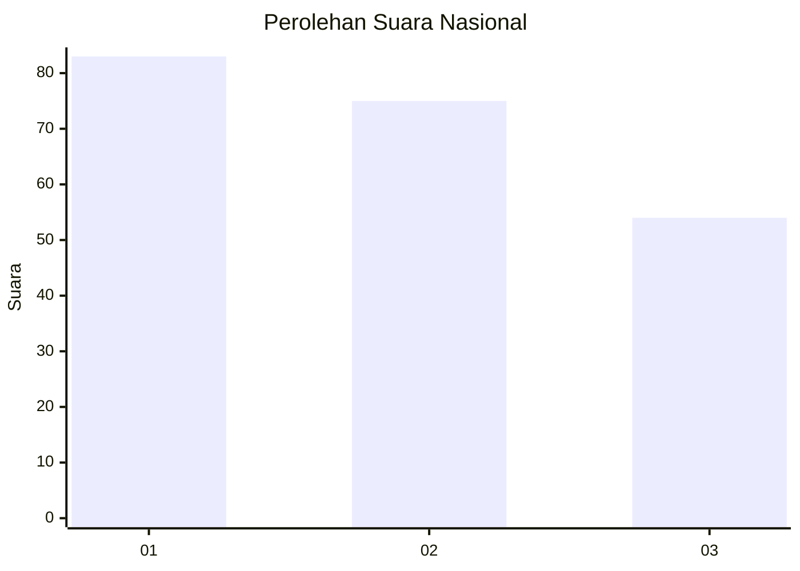
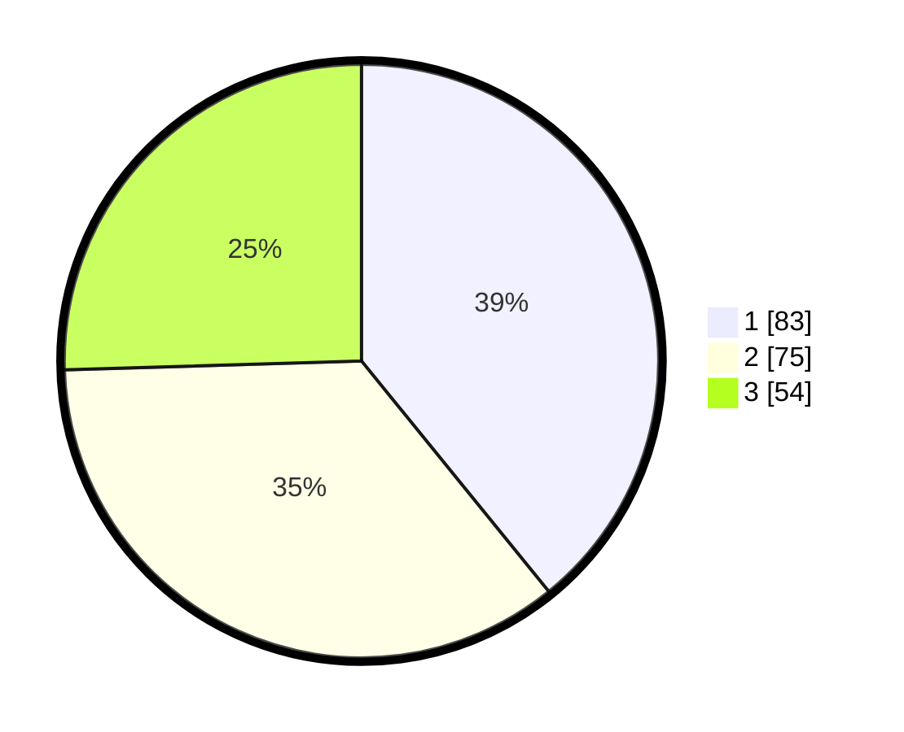

# Hasil

## Grafik

## Tabel

| No.    | Nama Paslon    | Suara | Suara (raw) | Persentase |
|:------ |:-------------- | -----:| -----------:| ----------:|
| 100025 | ANIES MUHAIMIN | 83    | [83][p-1]   | 39,15      |
| 100026 | PRABOWO GIBRAN | 75    | [75][p-2]   | 35,38      |
| 100027 | GANJAR MAHFUD  | 54    | [54][p-3]   | 25,47      |

[p-1]: https://github.com/gigit-pemilu/pemilu-2024/blob/main/pilpres/hitung-suara/sub/31-dki-jakarta/sub/73-jakarta-barat/sub/07-pal-merah/sub/1005-kemanggisan/sub/013-tps/sub/paslon-1.txt
[p-2]: https://github.com/gigit-pemilu/pemilu-2024/blob/main/pilpres/hitung-suara/sub/31-dki-jakarta/sub/73-jakarta-barat/sub/07-pal-merah/sub/1005-kemanggisan/sub/013-tps/sub/paslon-2.txt
[p-3]: https://github.com/gigit-pemilu/pemilu-2024/blob/main/pilpres/hitung-suara/sub/31-dki-jakarta/sub/73-jakarta-barat/sub/07-pal-merah/sub/1005-kemanggisan/sub/013-tps/sub/paslon-3.txt

## Foto C Plano

https://sirekap-obj-formc.kpu.go.id/9e21/pemilu/ppwp/31/73/07/10/05/3173071005013-20240214-204104--e4189b3a-d12b-4dcc-a26b-1aaa2c24124d.jpg

https://sirekap-obj-formc.kpu.go.id/9e21/pemilu/ppwp/31/73/07/10/05/3173071005013-20240214-204150--784d11aa-192b-44c6-9165-85022a72ac92.jpg

https://sirekap-obj-formc.kpu.go.id/9e21/pemilu/ppwp/31/73/07/10/05/3173071005013-20240214-204236--6db9b0de-595d-4382-9378-f60f9b94c73d.jpg

## Metadata

| Key        | Value               |
| ---------- | ------------------- |
| Time Stamp | 2024-02-19 16:00:00 |

