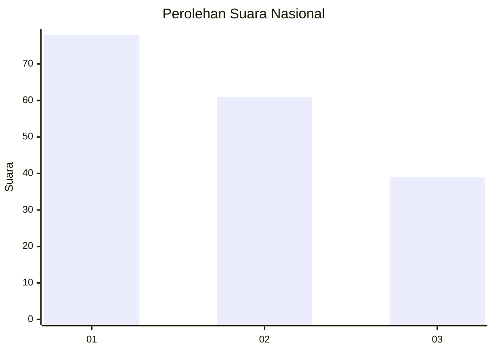
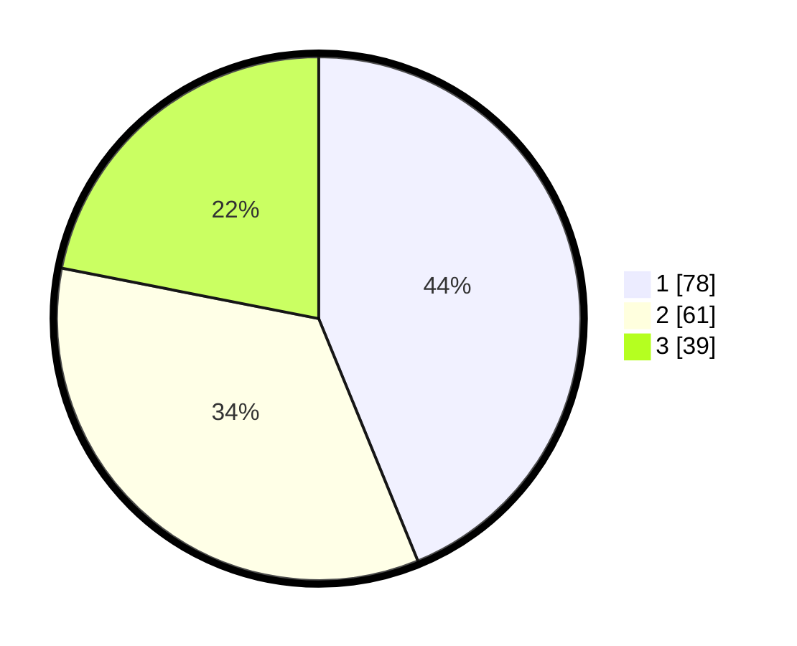

# Hasil

## Grafik

## Tabel

| No.    | Nama Paslon    | Suara | Suara (raw) | Persentase |
|:------ |:-------------- | -----:| -----------:| ----------:|
| 100025 | ANIES MUHAIMIN | 78    | [78][p-1]   | 43,82      |
| 100026 | PRABOWO GIBRAN | 61    | [61][p-2]   | 34,27      |
| 100027 | GANJAR MAHFUD  | 39    | [39][p-3]   | 21,91      |

[p-1]: https://github.com/gigit-pemilu/pemilu-2024/blob/main/pilpres/hitung-suara/sub/31-dki-jakarta/sub/73-jakarta-barat/sub/07-pal-merah/sub/1005-kemanggisan/sub/015-tps/sub/paslon-1.txt
[p-2]: https://github.com/gigit-pemilu/pemilu-2024/blob/main/pilpres/hitung-suara/sub/31-dki-jakarta/sub/73-jakarta-barat/sub/07-pal-merah/sub/1005-kemanggisan/sub/015-tps/sub/paslon-2.txt
[p-3]: https://github.com/gigit-pemilu/pemilu-2024/blob/main/pilpres/hitung-suara/sub/31-dki-jakarta/sub/73-jakarta-barat/sub/07-pal-merah/sub/1005-kemanggisan/sub/015-tps/sub/paslon-3.txt

## Foto C Plano

https://sirekap-obj-formc.kpu.go.id/a001/pemilu/ppwp/31/73/07/10/05/3173071005015-20240214-160102--0236bdf8-3f4e-4b82-a359-8ae3459be115.jpg

https://sirekap-obj-formc.kpu.go.id/a001/pemilu/ppwp/31/73/07/10/05/3173071005015-20240214-192715--a4f38fb1-e252-479b-8f27-ee316b1cec64.jpg

https://sirekap-obj-formc.kpu.go.id/a001/pemilu/ppwp/31/73/07/10/05/3173071005015-20240214-155808--14c384c0-4fcc-454f-bee0-9ffc252132a0.jpg

## Metadata

| Key        | Value               |
| ---------- | ------------------- |
| Time Stamp | 2024-02-19 16:00:00 |

