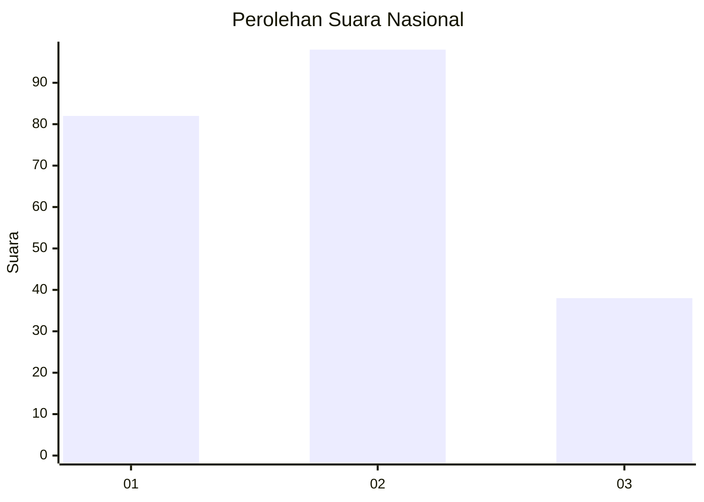
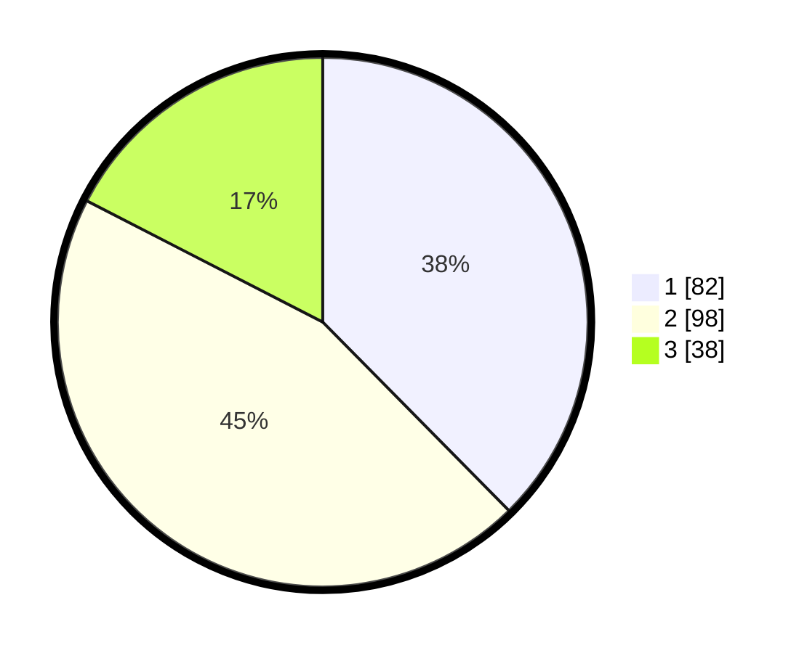

# Hasil

## Grafik

## Tabel

| No.    | Nama Paslon    | Suara | Suara (raw) | Persentase |
|:------ |:-------------- | -----:| -----------:| ----------:|
| 100025 | ANIES MUHAIMIN | 82    | [82][p-1]   | 37,61      |
| 100026 | PRABOWO GIBRAN | 98    | [98][p-2]   | 44,95      |
| 100027 | GANJAR MAHFUD  | 38    | [38][p-3]   | 17,43      |

[p-1]: https://github.com/gigit-pemilu/pemilu-2024/blob/main/pilpres/hitung-suara/sub/31-dki-jakarta/sub/73-jakarta-barat/sub/07-pal-merah/sub/1005-kemanggisan/sub/024-tps/sub/paslon-1.txt
[p-2]: https://github.com/gigit-pemilu/pemilu-2024/blob/main/pilpres/hitung-suara/sub/31-dki-jakarta/sub/73-jakarta-barat/sub/07-pal-merah/sub/1005-kemanggisan/sub/024-tps/sub/paslon-2.txt
[p-3]: https://github.com/gigit-pemilu/pemilu-2024/blob/main/pilpres/hitung-suara/sub/31-dki-jakarta/sub/73-jakarta-barat/sub/07-pal-merah/sub/1005-kemanggisan/sub/024-tps/sub/paslon-3.txt

## Foto C Plano

https://sirekap-obj-formc.kpu.go.id/2b53/pemilu/ppwp/31/73/07/10/05/3173071005024-20240217-133926--5946851d-8caf-46c2-97f4-d1470204de14.jpg

https://sirekap-obj-formc.kpu.go.id/2b53/pemilu/ppwp/31/73/07/10/05/3173071005024-20240214-224505--e8b145da-90a1-43fa-a2e1-ee00934b1b9f.jpg

https://sirekap-obj-formc.kpu.go.id/2b53/pemilu/ppwp/31/73/07/10/05/3173071005024-20240215-030927--63e34824-ba42-4e0b-b912-2395bfe48ed1.jpg

## Metadata

| Key        | Value               |
| ---------- | ------------------- |
| Time Stamp | 2024-02-17 13:42:09 |

