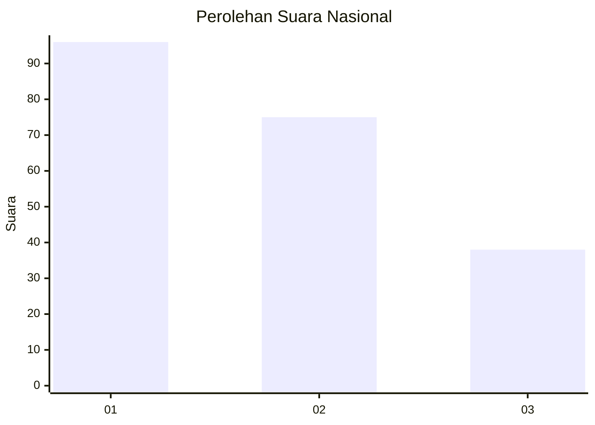
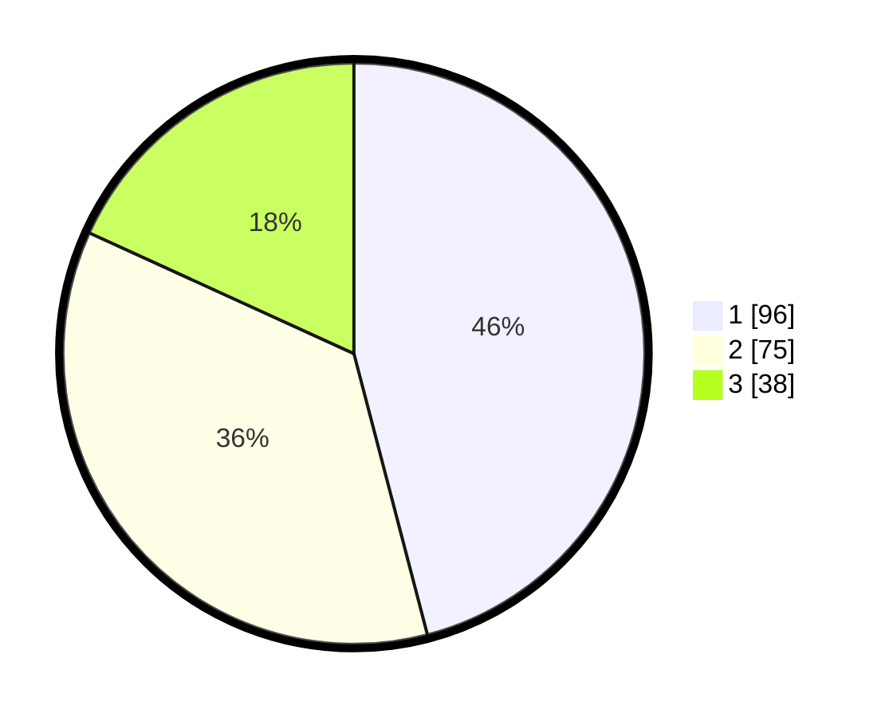

# Hasil

## Grafik

## Tabel

| No.    | Nama Paslon    | Suara | Suara (raw) | Persentase |
|:------ |:-------------- | -----:| -----------:| ----------:|
| 100025 | ANIES MUHAIMIN | 96    | [96][p-1]   | 45,93      |
| 100026 | PRABOWO GIBRAN | 75    | [75][p-2]   | 35,89      |
| 100027 | GANJAR MAHFUD  | 38    | [38][p-3]   | 18,18      |

[p-1]: https://github.com/gigit-pemilu/pemilu-2024/blob/main/pilpres/hitung-suara/sub/31-dki-jakarta/sub/73-jakarta-barat/sub/07-pal-merah/sub/1005-kemanggisan/sub/033-tps/sub/paslon-1.txt
[p-2]: https://github.com/gigit-pemilu/pemilu-2024/blob/main/pilpres/hitung-suara/sub/31-dki-jakarta/sub/73-jakarta-barat/sub/07-pal-merah/sub/1005-kemanggisan/sub/033-tps/sub/paslon-2.txt
[p-3]: https://github.com/gigit-pemilu/pemilu-2024/blob/main/pilpres/hitung-suara/sub/31-dki-jakarta/sub/73-jakarta-barat/sub/07-pal-merah/sub/1005-kemanggisan/sub/033-tps/sub/paslon-3.txt

## Foto C Plano

https://sirekap-obj-formc.kpu.go.id/3c1d/pemilu/ppwp/31/73/07/10/05/3173071005033-20240215-214637--30b55fce-0423-4c3d-a708-a06a0559e0d1.jpg

https://sirekap-obj-formc.kpu.go.id/3c1d/pemilu/ppwp/31/73/07/10/05/3173071005033-20240215-214649--ee7b9f26-2d5f-4eb9-8b34-1394cd77e4f8.jpg

https://sirekap-obj-formc.kpu.go.id/3c1d/pemilu/ppwp/31/73/07/10/05/3173071005033-20240215-214701--3a697226-4a2a-445a-9488-afe60100ccb4.jpg

## Metadata

| Key        | Value               |
| ---------- | ------------------- |
| Time Stamp | 2024-02-16 22:01:00 |

