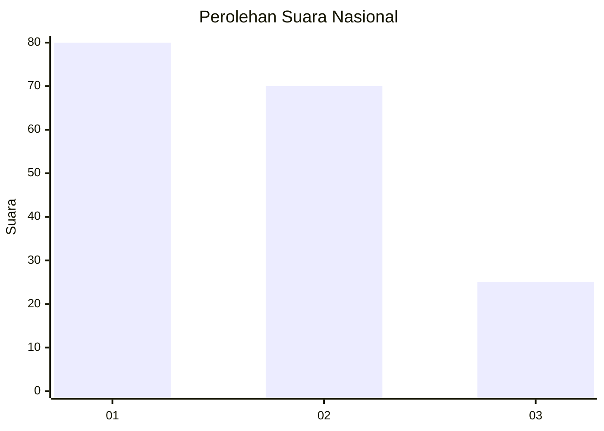
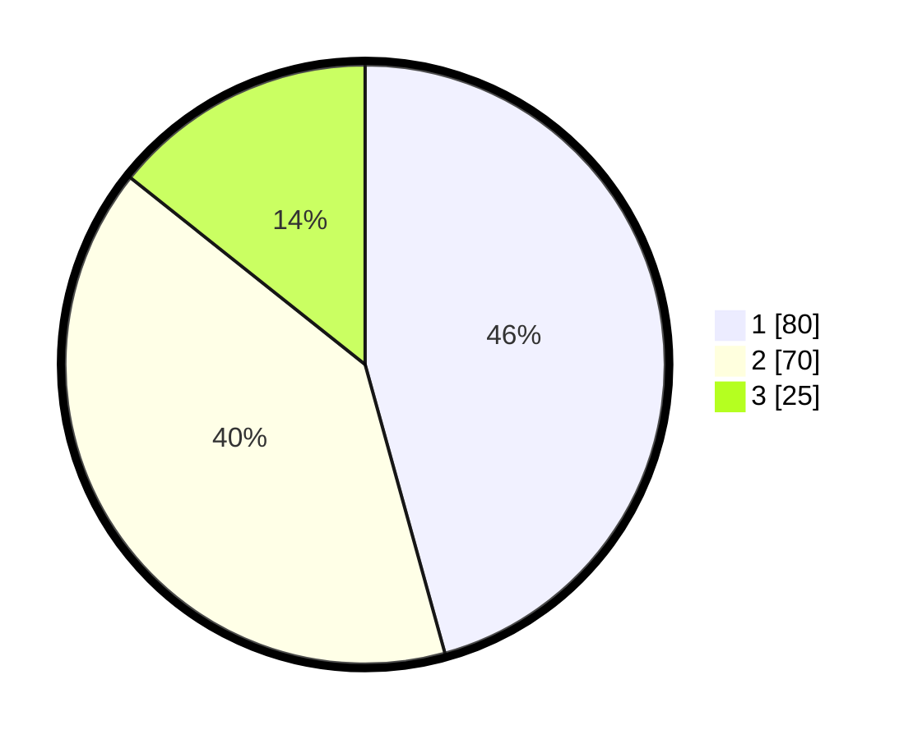

# Hasil

## Grafik

## Tabel

| No.    | Nama Paslon    | Suara | Suara (raw) | Persentase |
|:------ |:-------------- | -----:| -----------:| ----------:|
| 100025 | ANIES MUHAIMIN | 80    | [80][p-1]   | 45,71      |
| 100026 | PRABOWO GIBRAN | 70    | [70][p-2]   | 40,00      |
| 100027 | GANJAR MAHFUD  | 25    | [25][p-3]   | 14,29      |

[p-1]: https://github.com/gigit-pemilu/pemilu-2024/blob/main/pilpres/hitung-suara/sub/31-dki-jakarta/sub/73-jakarta-barat/sub/07-pal-merah/sub/1005-kemanggisan/sub/036-tps/sub/paslon-1.txt
[p-2]: https://github.com/gigit-pemilu/pemilu-2024/blob/main/pilpres/hitung-suara/sub/31-dki-jakarta/sub/73-jakarta-barat/sub/07-pal-merah/sub/1005-kemanggisan/sub/036-tps/sub/paslon-2.txt
[p-3]: https://github.com/gigit-pemilu/pemilu-2024/blob/main/pilpres/hitung-suara/sub/31-dki-jakarta/sub/73-jakarta-barat/sub/07-pal-merah/sub/1005-kemanggisan/sub/036-tps/sub/paslon-3.txt

## Foto C Plano

https://sirekap-obj-formc.kpu.go.id/e524/pemilu/ppwp/31/73/07/10/05/3173071005036-20240214-155147--16a84b95-3bfe-4786-a6e8-2d46bd37515f.jpg

https://sirekap-obj-formc.kpu.go.id/e524/pemilu/ppwp/31/73/07/10/05/3173071005036-20240214-155151--b1c41ca8-8901-4ca5-a1d2-2c8a0b9935cd.jpg

https://sirekap-obj-formc.kpu.go.id/e524/pemilu/ppwp/31/73/07/10/05/3173071005036-20240214-155155--1aa5e6f2-3390-4340-b1d3-685ad2917bae.jpg

## Metadata

| Key        | Value               |
| ---------- | ------------------- |
| Time Stamp | 2024-02-19 16:00:00 |

