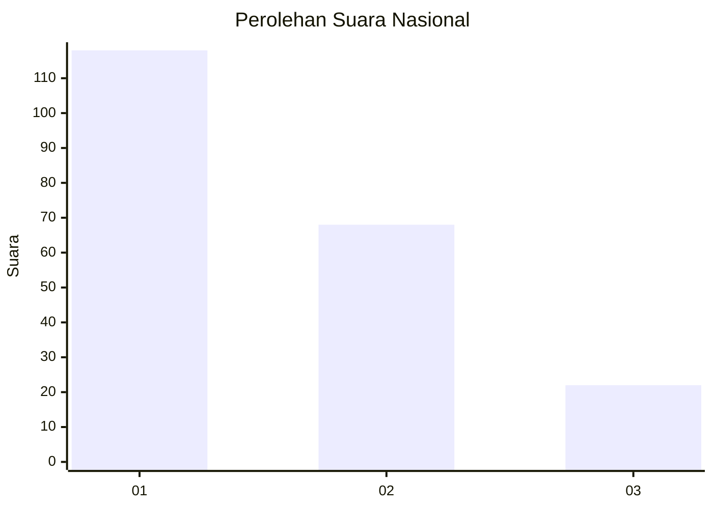
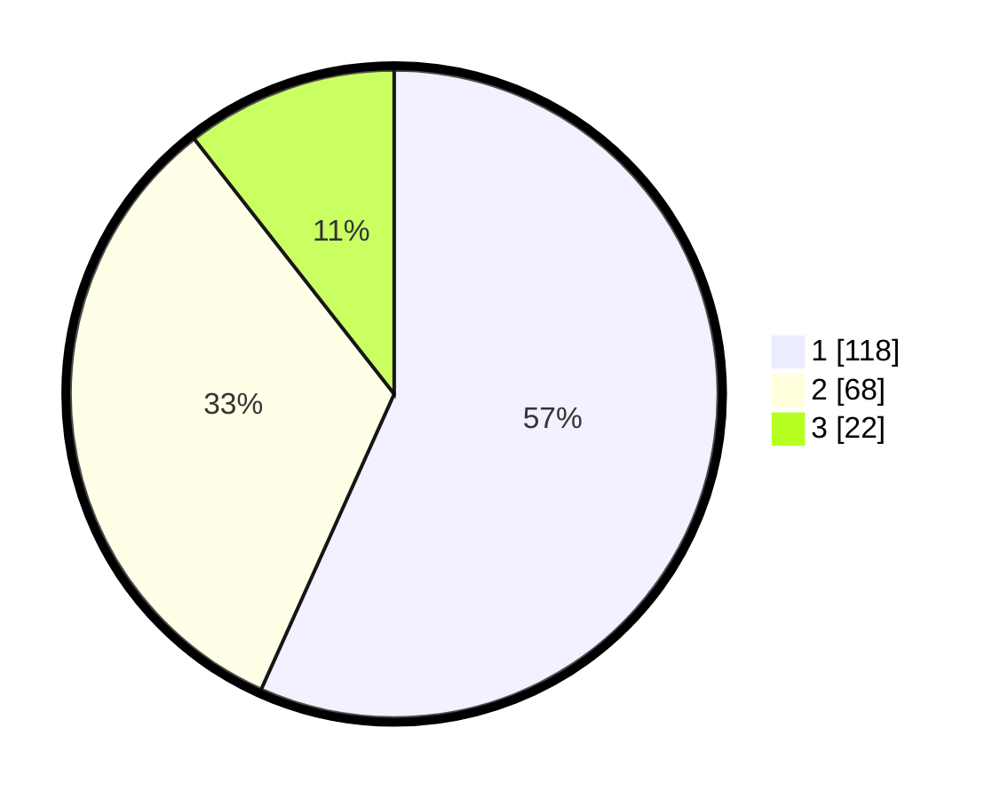

# Hasil

## Grafik

## Tabel

| No.    | Nama Paslon    | Suara | Suara (raw) | Persentase |
|:------ |:-------------- | -----:| -----------:| ----------:|
| 100025 | ANIES MUHAIMIN | 118   | [118][p-1]  | 56,73      |
| 100026 | PRABOWO GIBRAN | 68    | [68][p-2]   | 32,69      |
| 100027 | GANJAR MAHFUD  | 22    | [22][p-3]   | 10,58      |

[p-1]: https://github.com/gigit-pemilu/pemilu-2024/blob/main/pilpres/hitung-suara/sub/31-dki-jakarta/sub/73-jakarta-barat/sub/07-pal-merah/sub/1005-kemanggisan/sub/050-tps/sub/paslon-1.txt
[p-2]: https://github.com/gigit-pemilu/pemilu-2024/blob/main/pilpres/hitung-suara/sub/31-dki-jakarta/sub/73-jakarta-barat/sub/07-pal-merah/sub/1005-kemanggisan/sub/050-tps/sub/paslon-2.txt
[p-3]: https://github.com/gigit-pemilu/pemilu-2024/blob/main/pilpres/hitung-suara/sub/31-dki-jakarta/sub/73-jakarta-barat/sub/07-pal-merah/sub/1005-kemanggisan/sub/050-tps/sub/paslon-3.txt

## Foto C Plano

https://sirekap-obj-formc.kpu.go.id/f32c/pemilu/ppwp/31/73/07/10/05/3173071005050-20240214-232811--c0379fb8-f711-4174-ae15-40b103324274.jpg

https://sirekap-obj-formc.kpu.go.id/f32c/pemilu/ppwp/31/73/07/10/05/3173071005050-20240214-233330--a77383a9-d315-4995-9534-1c7c3163c1fa.jpg

https://sirekap-obj-formc.kpu.go.id/f32c/pemilu/ppwp/31/73/07/10/05/3173071005050-20240214-233651--3961c031-c45c-4b39-9a2b-8c20cecd4f7b.jpg

## Metadata

| Key        | Value               |
| ---------- | ------------------- |
| Time Stamp | 2024-02-19 16:00:00 |

