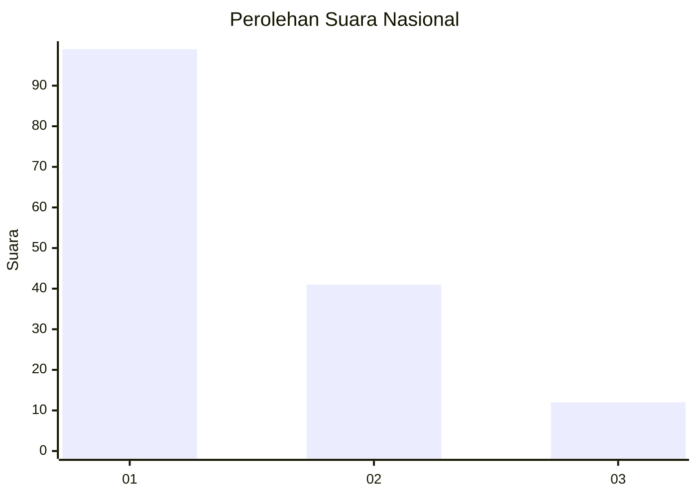
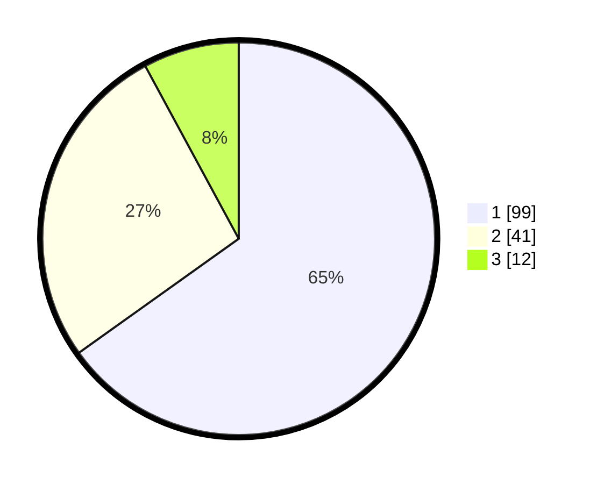

# Hasil

## Grafik

## Tabel

| No. | Nama Paslon    | Suara | Suara (raw) | Persentase |
|:--- |:-------------- | -----:| -----------:| ----------:|
| 1   | ANIES MUHAIMIN | 99    | [99][p-1]   | 65,13      |
| 2   | PRABOWO GIBRAN | 41    | [41][p-2]   | 26,97      |
| 3   | GANJAR MAHFUD  | 12    | [12][p-3]   | 7,89       |

[p-1]: https://github.com/gigit-pemilu/pemilu-2024/blob/main/pilpres/hitung-suara/sub/31-dki-jakarta/sub/73-jakarta-barat/sub/07-pal-merah/sub/1005-kemanggisan/sub/051-tps/sub/paslon-1.txt
[p-2]: https://github.com/gigit-pemilu/pemilu-2024/blob/main/pilpres/hitung-suara/sub/31-dki-jakarta/sub/73-jakarta-barat/sub/07-pal-merah/sub/1005-kemanggisan/sub/051-tps/sub/paslon-2.txt
[p-3]: https://github.com/gigit-pemilu/pemilu-2024/blob/main/pilpres/hitung-suara/sub/31-dki-jakarta/sub/73-jakarta-barat/sub/07-pal-merah/sub/1005-kemanggisan/sub/051-tps/sub/paslon-3.txt

## Foto C Plano

https://sirekap-obj-formc.kpu.go.id/9e60/pemilu/ppwp/31/73/07/10/05/3173071005051-20240214-212119--5eb6f07a-1a0c-4240-a9f0-a7a61395cc21.jpg

https://sirekap-obj-formc.kpu.go.id/9e60/pemilu/ppwp/31/73/07/10/05/3173071005051-20240214-212316--388264e1-6dd6-4352-bf7b-c917b4cbecae.jpg

https://sirekap-obj-formc.kpu.go.id/9e60/pemilu/ppwp/31/73/07/10/05/3173071005051-20240214-212605--e9622f0b-933a-4f52-aeea-57a56b3685d2.jpg

## Metadata

| Key        | Value               |
| ---------- | ------------------- |
| Time Stamp | 2024-02-16 22:01:00 |

