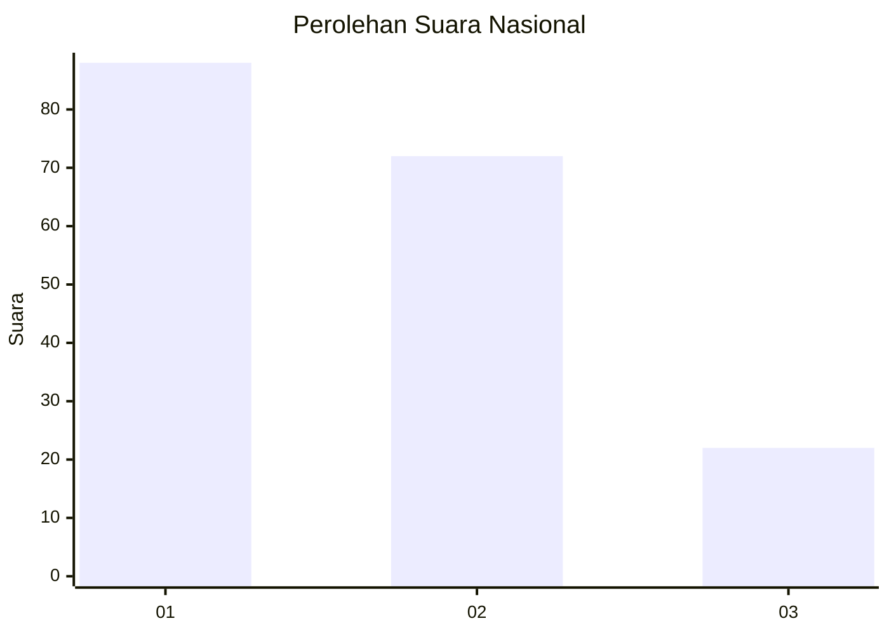
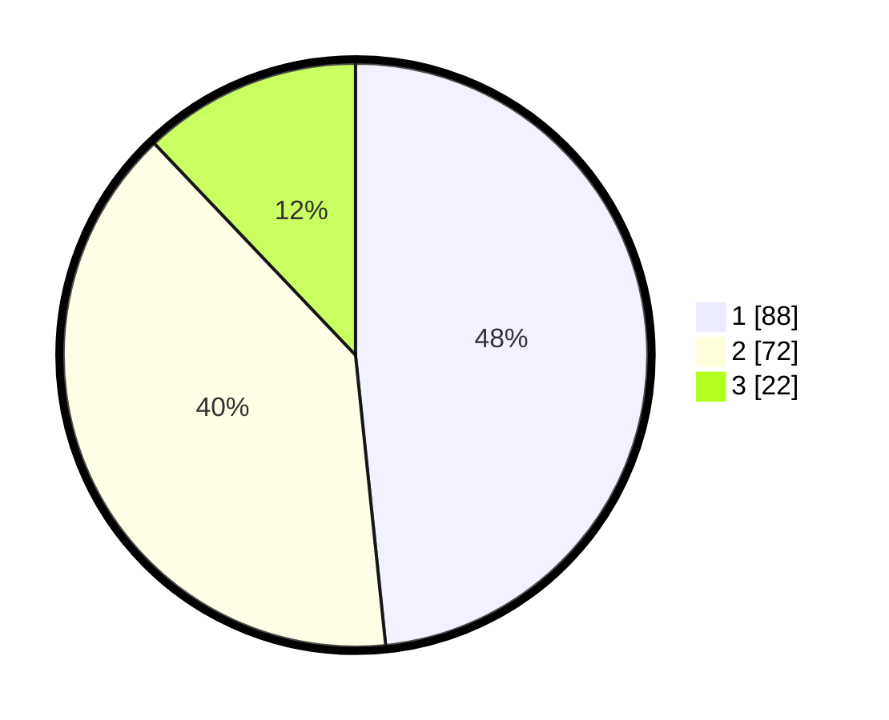

# Hasil

## Grafik

## Tabel

| No.    | Nama Paslon    | Suara | Suara (raw) | Persentase |
|:------ |:-------------- | -----:| -----------:| ----------:|
| 100025 | ANIES MUHAIMIN | 88    | [88][p-1]   | 48,35      |
| 100026 | PRABOWO GIBRAN | 72    | [72][p-2]   | 39,56      |
| 100027 | GANJAR MAHFUD  | 22    | [22][p-3]   | 12,09      |

[p-1]: https://github.com/gigit-pemilu/pemilu-2024/blob/main/pilpres/hitung-suara/sub/31-dki-jakarta/sub/73-jakarta-barat/sub/07-pal-merah/sub/1005-kemanggisan/sub/052-tps/sub/paslon-1.txt
[p-2]: https://github.com/gigit-pemilu/pemilu-2024/blob/main/pilpres/hitung-suara/sub/31-dki-jakarta/sub/73-jakarta-barat/sub/07-pal-merah/sub/1005-kemanggisan/sub/052-tps/sub/paslon-2.txt
[p-3]: https://github.com/gigit-pemilu/pemilu-2024/blob/main/pilpres/hitung-suara/sub/31-dki-jakarta/sub/73-jakarta-barat/sub/07-pal-merah/sub/1005-kemanggisan/sub/052-tps/sub/paslon-3.txt

## Foto C Plano

https://sirekap-obj-formc.kpu.go.id/cd84/pemilu/ppwp/31/73/07/10/05/3173071005052-20240216-122420--0afcce90-e4e3-4368-9ca5-040b15364821.jpg

https://sirekap-obj-formc.kpu.go.id/cd84/pemilu/ppwp/31/73/07/10/05/3173071005052-20240216-122535--a0df719c-06aa-4e5c-ae91-1449b67341ee.jpg

https://sirekap-obj-formc.kpu.go.id/cd84/pemilu/ppwp/31/73/07/10/05/3173071005052-20240214-203923--e12a9f8e-6b4d-418f-91b1-4df9ffc27f07.jpg

## Metadata

| Key        | Value               |
| ---------- | ------------------- |
| Time Stamp | 2024-02-16 22:01:00 |

