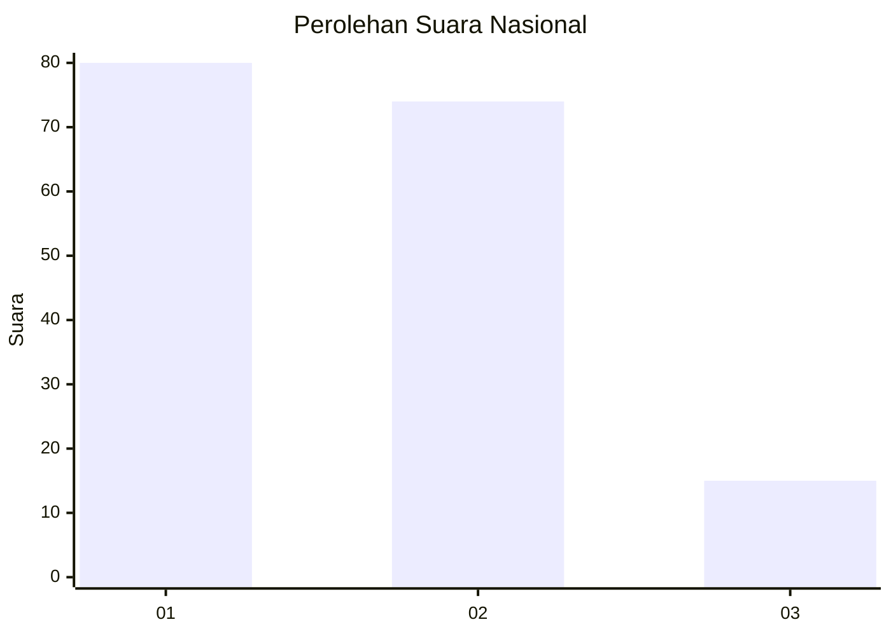
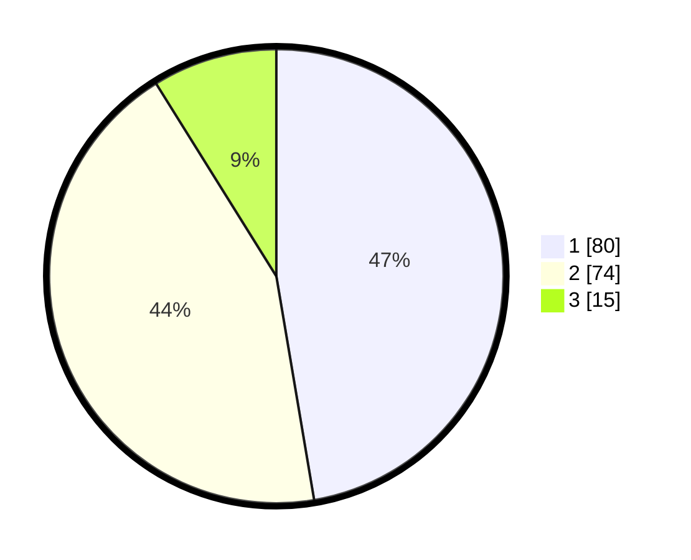

# Hasil

## Grafik

## Tabel

| No.    | Nama Paslon    | Suara | Suara (raw) | Persentase |
|:------ |:-------------- | -----:| -----------:| ----------:|
| 100025 | ANIES MUHAIMIN | 80    | [80][p-1]   | 47,34      |
| 100026 | PRABOWO GIBRAN | 74    | [74][p-2]   | 43,79      |
| 100027 | GANJAR MAHFUD  | 15    | [15][p-3]   | 8,88       |

[p-1]: https://github.com/gigit-pemilu/pemilu-2024/blob/main/pilpres/hitung-suara/sub/31-dki-jakarta/sub/73-jakarta-barat/sub/07-pal-merah/sub/1005-kemanggisan/sub/053-tps/sub/paslon-1.txt
[p-2]: https://github.com/gigit-pemilu/pemilu-2024/blob/main/pilpres/hitung-suara/sub/31-dki-jakarta/sub/73-jakarta-barat/sub/07-pal-merah/sub/1005-kemanggisan/sub/053-tps/sub/paslon-2.txt
[p-3]: https://github.com/gigit-pemilu/pemilu-2024/blob/main/pilpres/hitung-suara/sub/31-dki-jakarta/sub/73-jakarta-barat/sub/07-pal-merah/sub/1005-kemanggisan/sub/053-tps/sub/paslon-3.txt

## Foto C Plano

https://sirekap-obj-formc.kpu.go.id/f2ae/pemilu/ppwp/31/73/07/10/05/3173071005053-20240214-215831--571ebf69-c2f4-4912-9dc8-6a9c99a4a405.jpg

https://sirekap-obj-formc.kpu.go.id/f2ae/pemilu/ppwp/31/73/07/10/05/3173071005053-20240214-220141--484f1ab8-3b27-4f6c-a0f2-5b906e9343c3.jpg

https://sirekap-obj-formc.kpu.go.id/f2ae/pemilu/ppwp/31/73/07/10/05/3173071005053-20240214-220223--81625c27-7678-4d50-a377-8ae6ec454f40.jpg

## Metadata

| Key        | Value               |
| ---------- | ------------------- |
| Time Stamp | 2024-02-16 22:01:00 |

