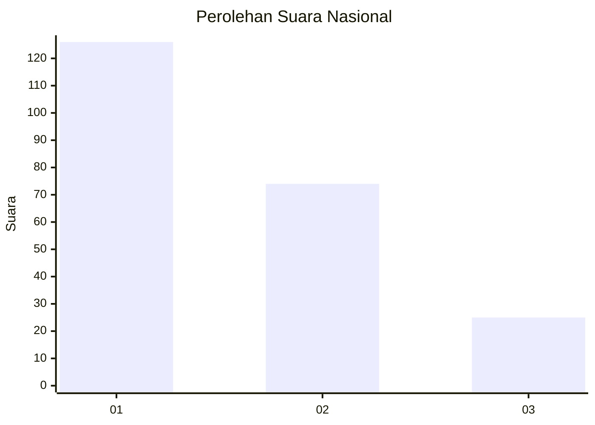
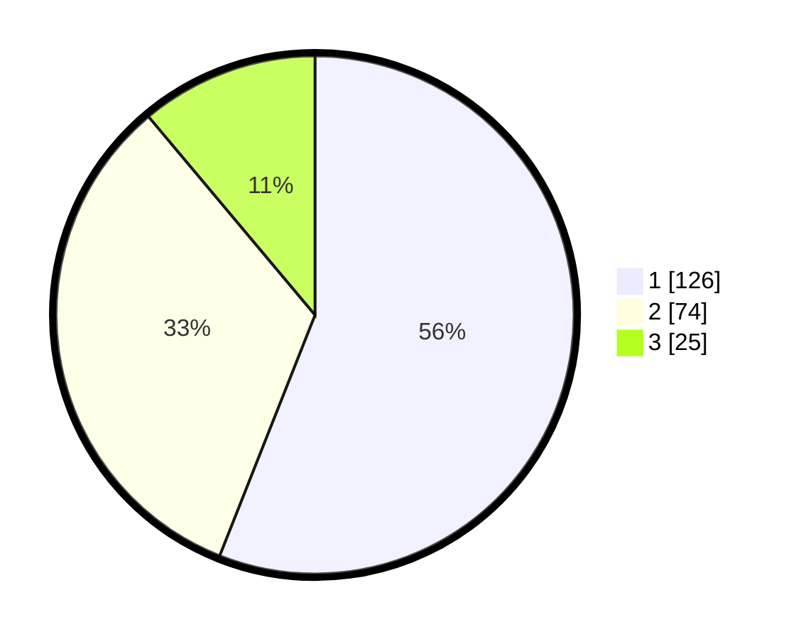

# Hasil

## Grafik

## Tabel

| No.    | Nama Paslon    | Suara | Suara (raw) | Persentase |
|:------ |:-------------- | -----:| -----------:| ----------:|
| 100025 | ANIES MUHAIMIN | 126   | [126][p-1]  | 56,00      |
| 100026 | PRABOWO GIBRAN | 74    | [74][p-2]   | 32,89      |
| 100027 | GANJAR MAHFUD  | 25    | [25][p-3]   | 11,11      |

[p-1]: https://github.com/gigit-pemilu/pemilu-2024/blob/main/pilpres/hitung-suara/sub/31-dki-jakarta/sub/73-jakarta-barat/sub/07-pal-merah/sub/1005-kemanggisan/sub/055-tps/sub/paslon-1.txt
[p-2]: https://github.com/gigit-pemilu/pemilu-2024/blob/main/pilpres/hitung-suara/sub/31-dki-jakarta/sub/73-jakarta-barat/sub/07-pal-merah/sub/1005-kemanggisan/sub/055-tps/sub/paslon-2.txt
[p-3]: https://github.com/gigit-pemilu/pemilu-2024/blob/main/pilpres/hitung-suara/sub/31-dki-jakarta/sub/73-jakarta-barat/sub/07-pal-merah/sub/1005-kemanggisan/sub/055-tps/sub/paslon-3.txt

## Foto C Plano

https://sirekap-obj-formc.kpu.go.id/cfe9/pemilu/ppwp/31/73/07/10/05/3173071005055-20240215-031231--0dc84e6c-48a3-470f-b631-cc5affd14680.jpg

https://sirekap-obj-formc.kpu.go.id/cfe9/pemilu/ppwp/31/73/07/10/05/3173071005055-20240215-031526--1d652cae-74cb-46c2-92bd-1070d69daf56.jpg

https://sirekap-obj-formc.kpu.go.id/cfe9/pemilu/ppwp/31/73/07/10/05/3173071005055-20240215-031618--c5cab1cf-de8b-43b3-a9e9-94d617de5a77.jpg

## Metadata

| Key        | Value               |
| ---------- | ------------------- |
| Time Stamp | 2024-02-19 16:00:00 |

