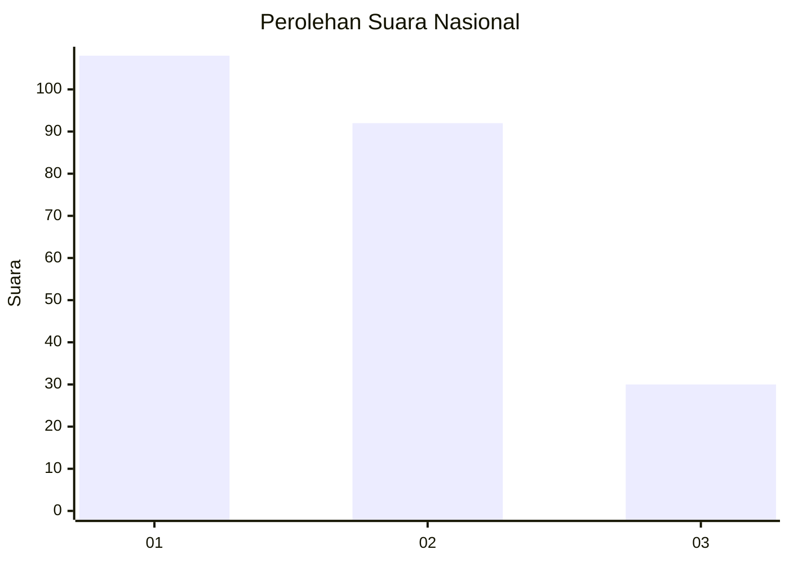
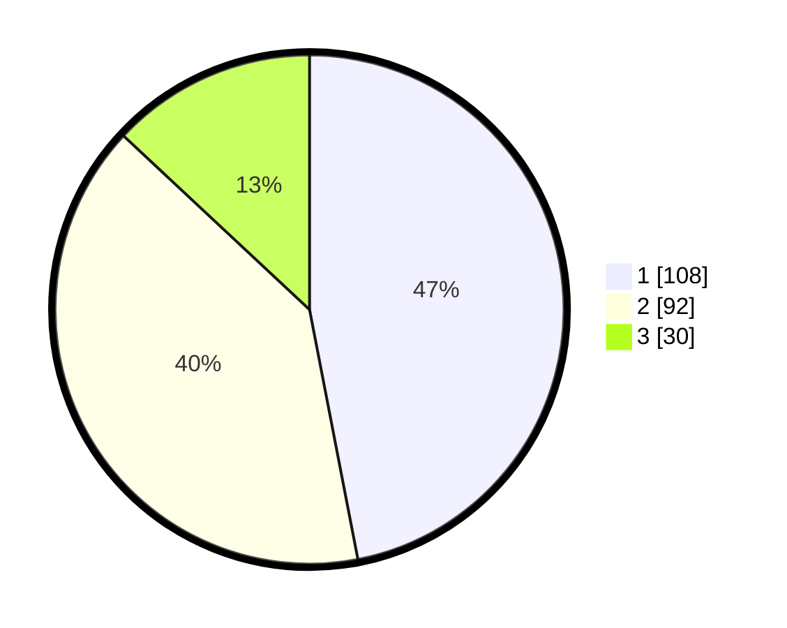

# Hasil

## Grafik

## Tabel

| No.    | Nama Paslon    | Suara | Suara (raw) | Persentase |
|:------ |:-------------- | -----:| -----------:| ----------:|
| 100025 | ANIES MUHAIMIN | 108   | [108][p-1]  | 46,96      |
| 100026 | PRABOWO GIBRAN | 92    | [92][p-2]   | 40,00      |
| 100027 | GANJAR MAHFUD  | 30    | [30][p-3]   | 13,04      |

[p-1]: https://github.com/gigit-pemilu/pemilu-2024/blob/main/pilpres/hitung-suara/sub/31-dki-jakarta/sub/73-jakarta-barat/sub/07-pal-merah/sub/1005-kemanggisan/sub/056-tps/sub/paslon-1.txt
[p-2]: https://github.com/gigit-pemilu/pemilu-2024/blob/main/pilpres/hitung-suara/sub/31-dki-jakarta/sub/73-jakarta-barat/sub/07-pal-merah/sub/1005-kemanggisan/sub/056-tps/sub/paslon-2.txt
[p-3]: https://github.com/gigit-pemilu/pemilu-2024/blob/main/pilpres/hitung-suara/sub/31-dki-jakarta/sub/73-jakarta-barat/sub/07-pal-merah/sub/1005-kemanggisan/sub/056-tps/sub/paslon-3.txt

## Foto C Plano

https://sirekap-obj-formc.kpu.go.id/bcc7/pemilu/ppwp/31/73/07/10/05/3173071005056-20240215-000247--7edec1e0-88d8-4a09-a87c-ace84747af89.jpg

https://sirekap-obj-formc.kpu.go.id/bcc7/pemilu/ppwp/31/73/07/10/05/3173071005056-20240215-000318--909fff3b-04cd-4a06-8d25-e7341d429178.jpg

https://sirekap-obj-formc.kpu.go.id/bcc7/pemilu/ppwp/31/73/07/10/05/3173071005056-20240215-000339--72f0b14b-d04a-467d-9412-8c375ae7a8d5.jpg

## Metadata

| Key        | Value               |
| ---------- | ------------------- |
| Time Stamp | 2024-02-16 22:01:00 |

