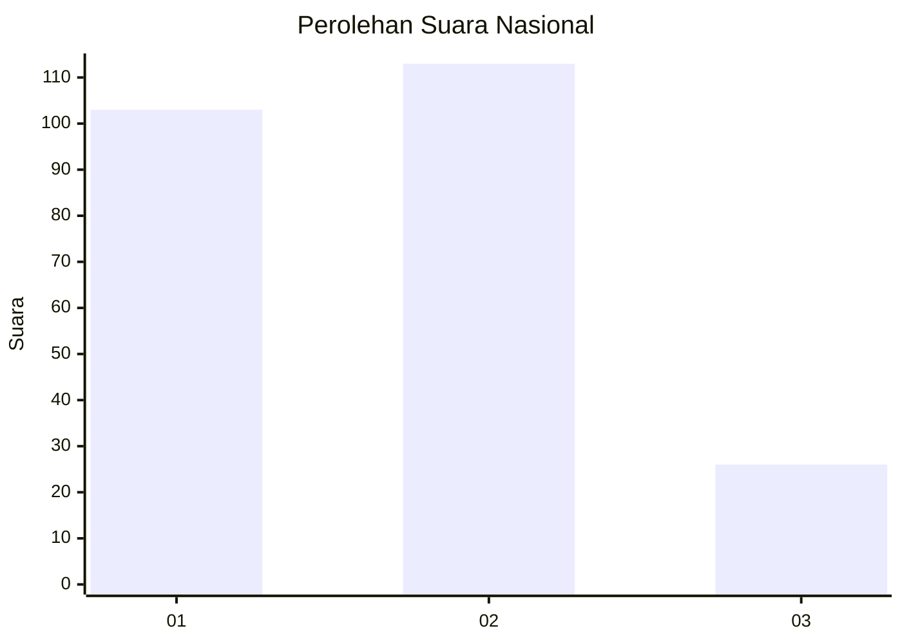
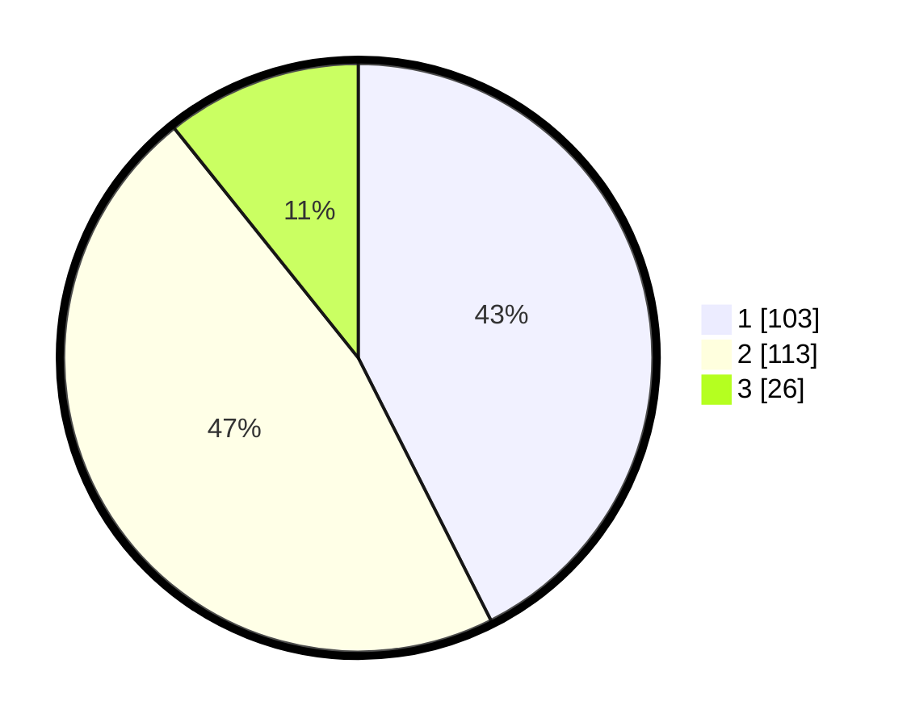

# Hasil

## Grafik

## Tabel

| No.    | Nama Paslon    | Suara | Suara (raw) | Persentase |
|:------ |:-------------- | -----:| -----------:| ----------:|
| 100025 | ANIES MUHAIMIN | 103   | [103][p-1]  | 42,56      |
| 100026 | PRABOWO GIBRAN | 113   | [113][p-2]  | 46,69      |
| 100027 | GANJAR MAHFUD  | 26    | [26][p-3]   | 10,74      |

[p-1]: https://github.com/gigit-pemilu/pemilu-2024/blob/main/pilpres/hitung-suara/sub/31-dki-jakarta/sub/73-jakarta-barat/sub/07-pal-merah/sub/1005-kemanggisan/sub/057-tps/sub/paslon-1.txt
[p-2]: https://github.com/gigit-pemilu/pemilu-2024/blob/main/pilpres/hitung-suara/sub/31-dki-jakarta/sub/73-jakarta-barat/sub/07-pal-merah/sub/1005-kemanggisan/sub/057-tps/sub/paslon-2.txt
[p-3]: https://github.com/gigit-pemilu/pemilu-2024/blob/main/pilpres/hitung-suara/sub/31-dki-jakarta/sub/73-jakarta-barat/sub/07-pal-merah/sub/1005-kemanggisan/sub/057-tps/sub/paslon-3.txt

## Foto C Plano

https://sirekap-obj-formc.kpu.go.id/d71f/pemilu/ppwp/31/73/07/10/05/3173071005057-20240214-235244--cc533353-1c20-41e0-99f1-5b84d571c36c.jpg

https://sirekap-obj-formc.kpu.go.id/d71f/pemilu/ppwp/31/73/07/10/05/3173071005057-20240214-235347--5f05cae0-14ea-450f-b3d0-99d5dcace809.jpg

https://sirekap-obj-formc.kpu.go.id/d71f/pemilu/ppwp/31/73/07/10/05/3173071005057-20240214-235407--a177c010-b021-42b7-82ea-0154af250e44.jpg

## Metadata

| Key        | Value               |
| ---------- | ------------------- |
| Time Stamp | 2024-02-19 16:00:00 |

