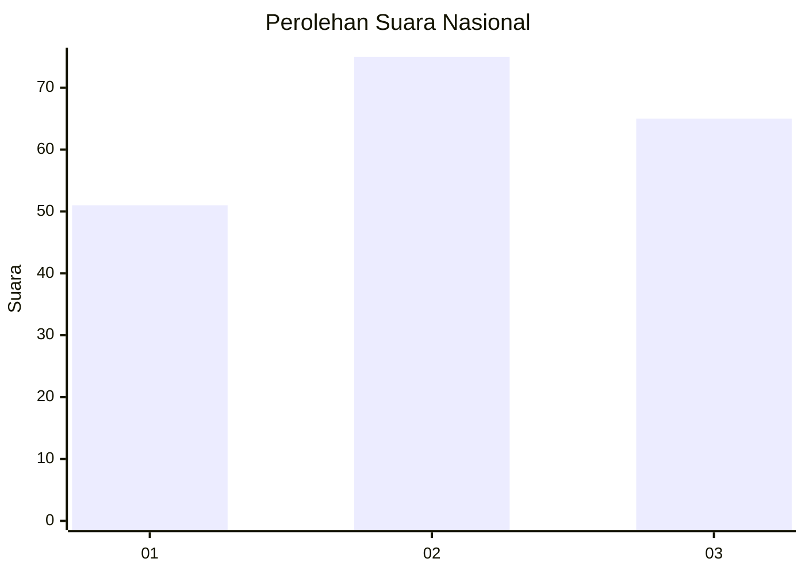
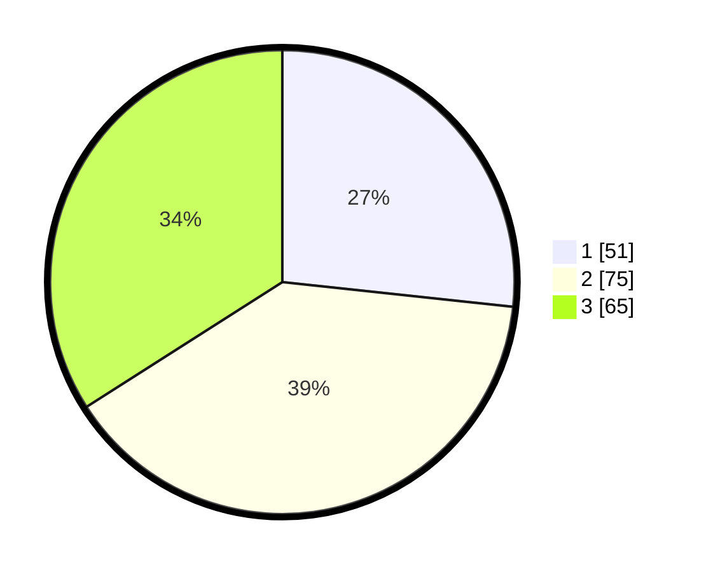

# Hasil

## Grafik

## Tabel

| No.    | Nama Paslon    | Suara | Suara (raw) | Persentase |
|:------ |:-------------- | -----:| -----------:| ----------:|
| 100025 | ANIES MUHAIMIN | 51    | [51][p-1]   | 26,70      |
| 100026 | PRABOWO GIBRAN | 75    | [75][p-2]   | 39,27      |
| 100027 | GANJAR MAHFUD  | 65    | [65][p-3]   | 34,03      |

[p-1]: https://github.com/gigit-pemilu/pemilu-2024/blob/main/pilpres/hitung-suara/sub/31-dki-jakarta/sub/73-jakarta-barat/sub/07-pal-merah/sub/1005-kemanggisan/sub/066-tps/sub/paslon-1.txt
[p-2]: https://github.com/gigit-pemilu/pemilu-2024/blob/main/pilpres/hitung-suara/sub/31-dki-jakarta/sub/73-jakarta-barat/sub/07-pal-merah/sub/1005-kemanggisan/sub/066-tps/sub/paslon-2.txt
[p-3]: https://github.com/gigit-pemilu/pemilu-2024/blob/main/pilpres/hitung-suara/sub/31-dki-jakarta/sub/73-jakarta-barat/sub/07-pal-merah/sub/1005-kemanggisan/sub/066-tps/sub/paslon-3.txt

## Foto C Plano

https://sirekap-obj-formc.kpu.go.id/9994/pemilu/ppwp/31/73/07/10/05/3173071005066-20240215-023653--0fa2d164-4bae-400f-85b4-97eead9873b7.jpg

https://sirekap-obj-formc.kpu.go.id/9994/pemilu/ppwp/31/73/07/10/05/3173071005066-20240215-023751--30745897-f250-48d9-ad2d-8a1358f11907.jpg

https://sirekap-obj-formc.kpu.go.id/9994/pemilu/ppwp/31/73/07/10/05/3173071005066-20240215-023859--33b039fd-1afc-429b-9ee9-c385234b9048.jpg

## Metadata

| Key        | Value               |
| ---------- | ------------------- |
| Time Stamp | 2024-02-19 16:00:00 |

