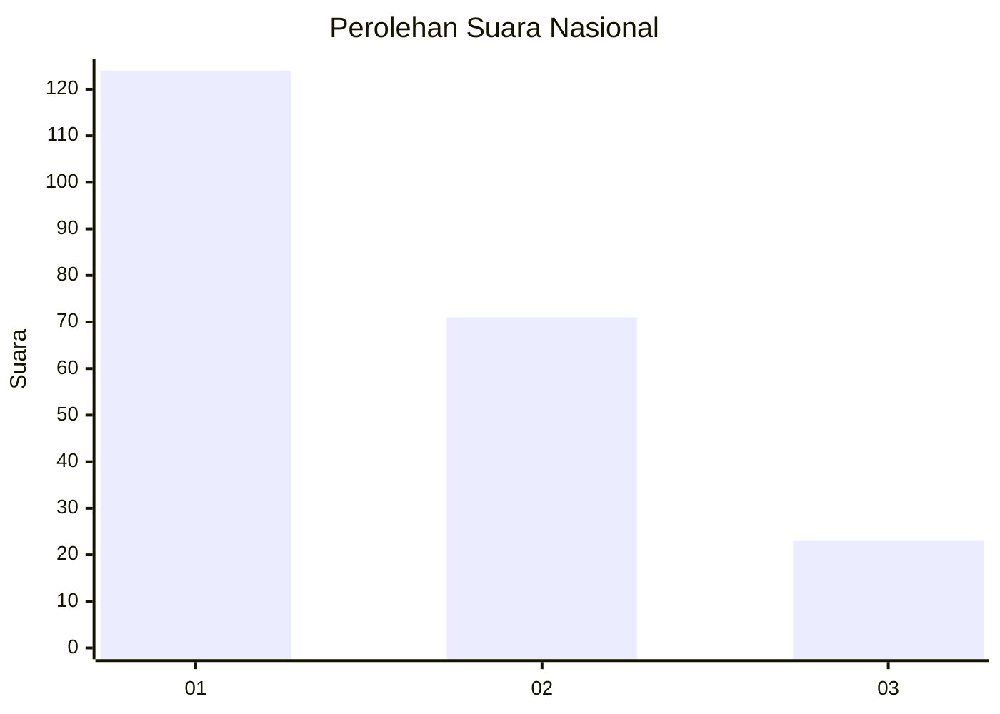
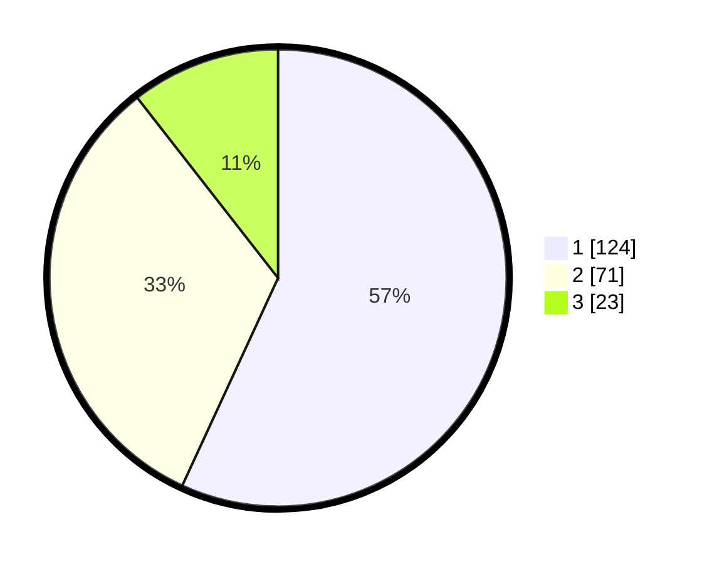

# Hasil

## Grafik

## Tabel

| No.    | Nama Paslon    | Suara | Suara (raw) | Persentase |
|:------ |:-------------- | -----:| -----------:| ----------:|
| 100025 | ANIES MUHAIMIN | 124   | [124][p-1]  | 56,88      |
| 100026 | PRABOWO GIBRAN | 71    | [71][p-2]   | 32,57      |
| 100027 | GANJAR MAHFUD  | 23    | [23][p-3]   | 10,55      |

[p-1]: https://github.com/gigit-pemilu/pemilu-2024/blob/main/pilpres/hitung-suara/sub/31-dki-jakarta/sub/73-jakarta-barat/sub/07-pal-merah/sub/1005-kemanggisan/sub/084-tps/sub/paslon-1.txt
[p-2]: https://github.com/gigit-pemilu/pemilu-2024/blob/main/pilpres/hitung-suara/sub/31-dki-jakarta/sub/73-jakarta-barat/sub/07-pal-merah/sub/1005-kemanggisan/sub/084-tps/sub/paslon-2.txt
[p-3]: https://github.com/gigit-pemilu/pemilu-2024/blob/main/pilpres/hitung-suara/sub/31-dki-jakarta/sub/73-jakarta-barat/sub/07-pal-merah/sub/1005-kemanggisan/sub/084-tps/sub/paslon-3.txt

## Foto C Plano

https://sirekap-obj-formc.kpu.go.id/4f2f/pemilu/ppwp/31/73/07/10/05/3173071005084-20240214-214138--e402fb10-ddfa-494e-8b07-ba9667bc5ca5.jpg

https://sirekap-obj-formc.kpu.go.id/4f2f/pemilu/ppwp/31/73/07/10/05/3173071005084-20240215-005624--cae0fe6d-6b2c-46d7-b15b-f69d85c138b3.jpg

https://sirekap-obj-formc.kpu.go.id/4f2f/pemilu/ppwp/31/73/07/10/05/3173071005084-20240215-005754--a00ab3e0-0eae-4f47-ace3-aff341be8857.jpg

## Metadata

| Key        | Value               |
| ---------- | ------------------- |
| Time Stamp | 2024-02-19 16:00:00 |

