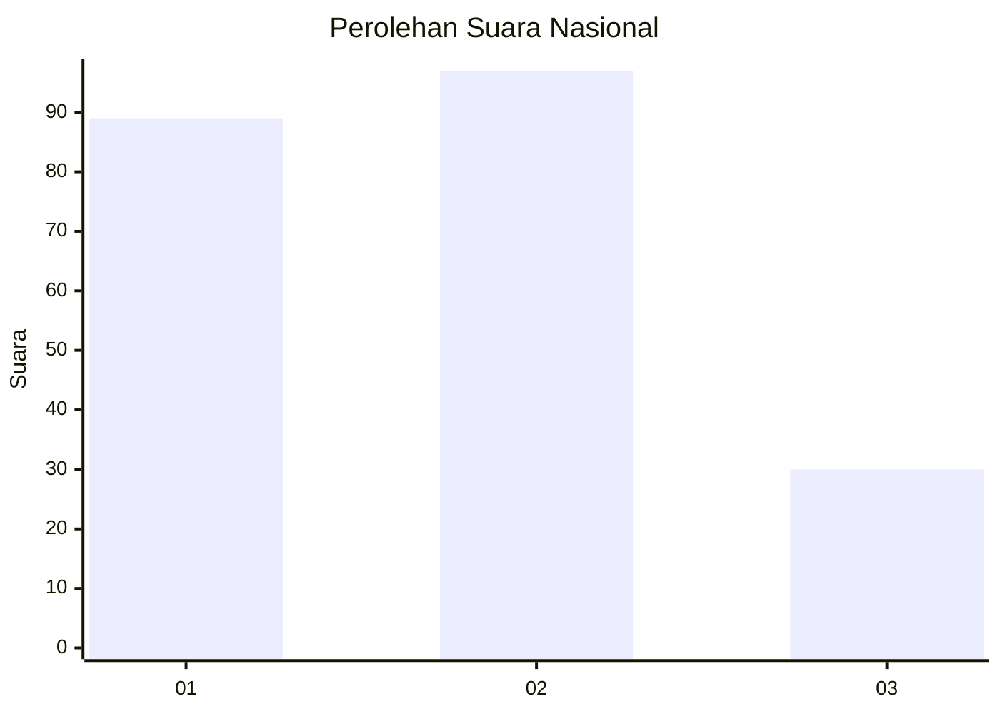
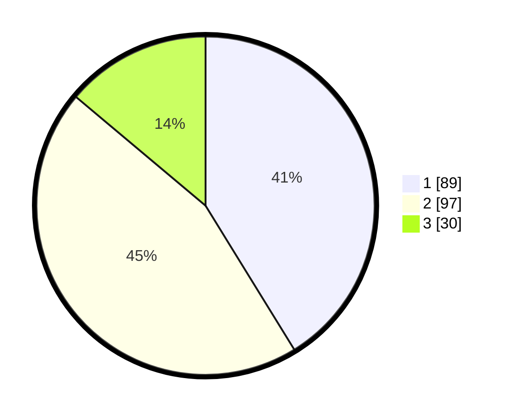

# Hasil

## Grafik

## Tabel

| No.    | Nama Paslon    | Suara | Suara (raw) | Persentase |
|:------ |:-------------- | -----:| -----------:| ----------:|
| 100025 | ANIES MUHAIMIN | 89    | [89][p-1]   | 41,20      |
| 100026 | PRABOWO GIBRAN | 97    | [97][p-2]   | 44,91      |
| 100027 | GANJAR MAHFUD  | 30    | [30][p-3]   | 13,89      |

[p-1]: https://github.com/gigit-pemilu/pemilu-2024/blob/main/pilpres/hitung-suara/sub/31-dki-jakarta/sub/73-jakarta-barat/sub/07-pal-merah/sub/1005-kemanggisan/sub/092-tps/sub/paslon-1.txt
[p-2]: https://github.com/gigit-pemilu/pemilu-2024/blob/main/pilpres/hitung-suara/sub/31-dki-jakarta/sub/73-jakarta-barat/sub/07-pal-merah/sub/1005-kemanggisan/sub/092-tps/sub/paslon-2.txt
[p-3]: https://github.com/gigit-pemilu/pemilu-2024/blob/main/pilpres/hitung-suara/sub/31-dki-jakarta/sub/73-jakarta-barat/sub/07-pal-merah/sub/1005-kemanggisan/sub/092-tps/sub/paslon-3.txt

## Foto C Plano

https://sirekap-obj-formc.kpu.go.id/9af6/pemilu/ppwp/31/73/07/10/05/3173071005092-20240214-231742--14ba5877-34e2-472e-9e56-2026b44f8361.jpg

https://sirekap-obj-formc.kpu.go.id/9af6/pemilu/ppwp/31/73/07/10/05/3173071005092-20240214-231859--c6e0ee61-b697-43b5-86aa-51a9f86b9d80.jpg

https://sirekap-obj-formc.kpu.go.id/9af6/pemilu/ppwp/31/73/07/10/05/3173071005092-20240214-231929--4b0e5ec5-7ed4-4774-99ad-26e5d4d5de9e.jpg

## Metadata

| Key        | Value               |
| ---------- | ------------------- |
| Time Stamp | 2024-02-16 22:01:00 |

