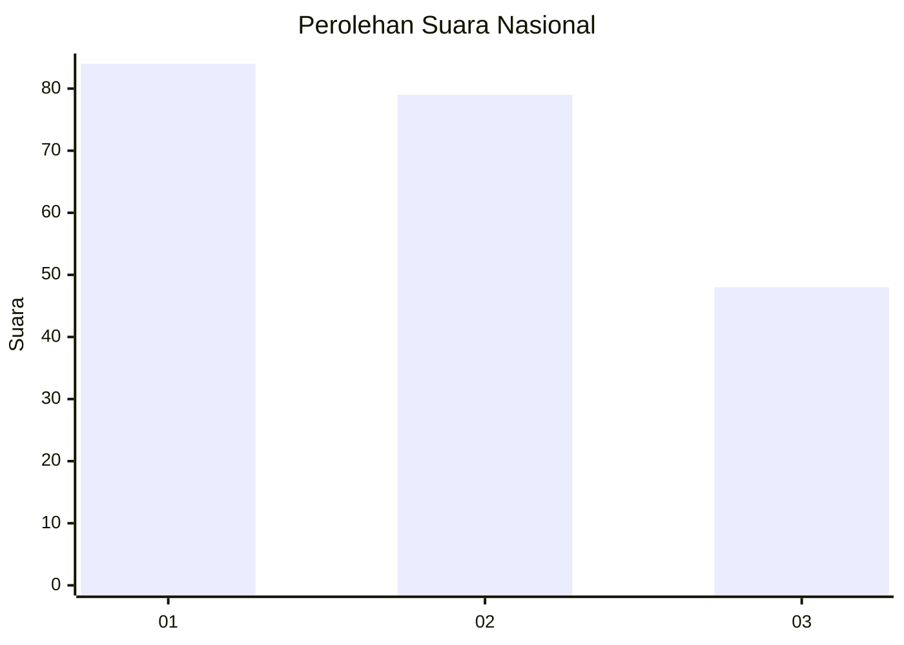
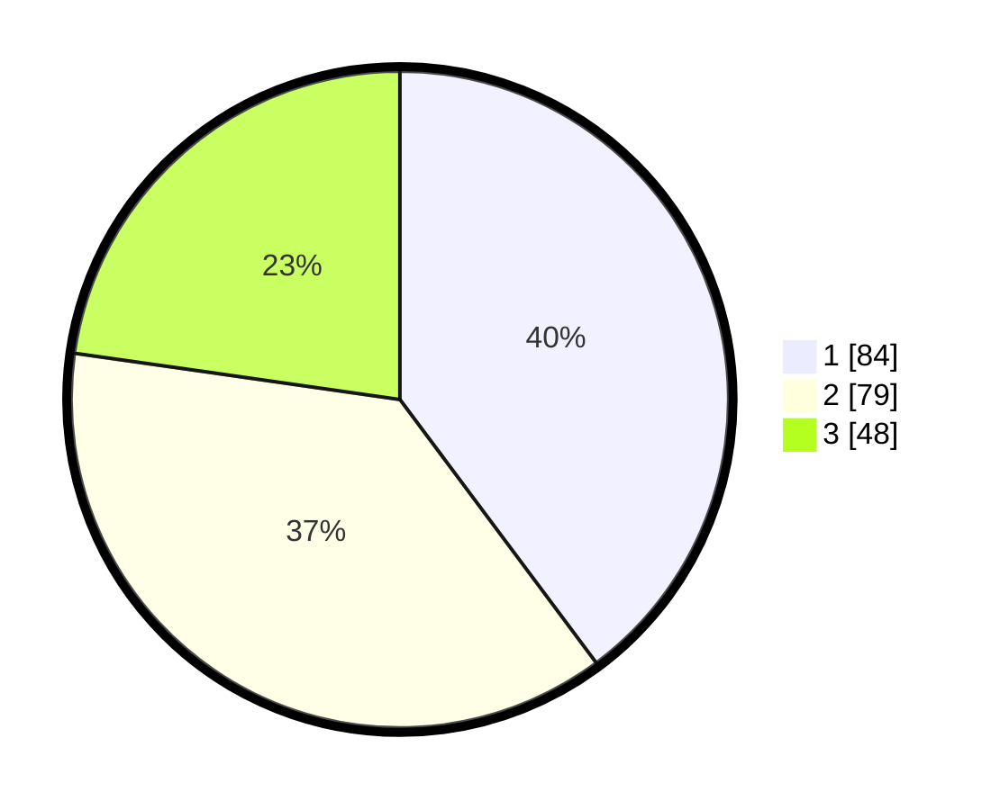

# Hasil

## Grafik

## Tabel

| No.    | Nama Paslon    | Suara | Suara (raw) | Persentase |
|:------ |:-------------- | -----:| -----------:| ----------:|
| 100025 | ANIES MUHAIMIN | 84    | [84][p-1]   | 39,81      |
| 100026 | PRABOWO GIBRAN | 79    | [79][p-2]   | 37,44      |
| 100027 | GANJAR MAHFUD  | 48    | [48][p-3]   | 22,75      |

[p-1]: https://github.com/gigit-pemilu/pemilu-2024/blob/main/pilpres/hitung-suara/sub/31-dki-jakarta/sub/73-jakarta-barat/sub/07-pal-merah/sub/1005-kemanggisan/sub/095-tps/sub/paslon-1.txt
[p-2]: https://github.com/gigit-pemilu/pemilu-2024/blob/main/pilpres/hitung-suara/sub/31-dki-jakarta/sub/73-jakarta-barat/sub/07-pal-merah/sub/1005-kemanggisan/sub/095-tps/sub/paslon-2.txt
[p-3]: https://github.com/gigit-pemilu/pemilu-2024/blob/main/pilpres/hitung-suara/sub/31-dki-jakarta/sub/73-jakarta-barat/sub/07-pal-merah/sub/1005-kemanggisan/sub/095-tps/sub/paslon-3.txt

## Foto C Plano

https://sirekap-obj-formc.kpu.go.id/ffb9/pemilu/ppwp/31/73/07/10/05/3173071005095-20240214-204130--28e6475d-a80c-410e-b3c6-e4e9a8bc4236.jpg

https://sirekap-obj-formc.kpu.go.id/ffb9/pemilu/ppwp/31/73/07/10/05/3173071005095-20240214-204146--e2c8ed42-b6bf-4300-9f87-a67d0133579c.jpg

https://sirekap-obj-formc.kpu.go.id/ffb9/pemilu/ppwp/31/73/07/10/05/3173071005095-20240214-204153--41aff1d5-13e2-4cdd-986c-3d5aa3ac7c04.jpg

## Metadata

| Key        | Value               |
| ---------- | ------------------- |
| Time Stamp | 2024-02-19 16:00:00 |

