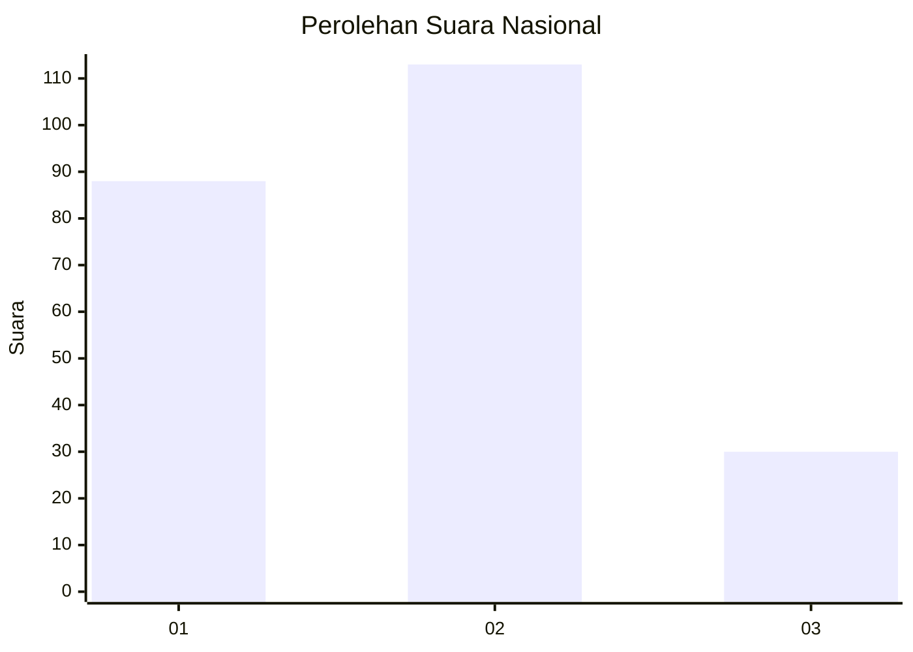
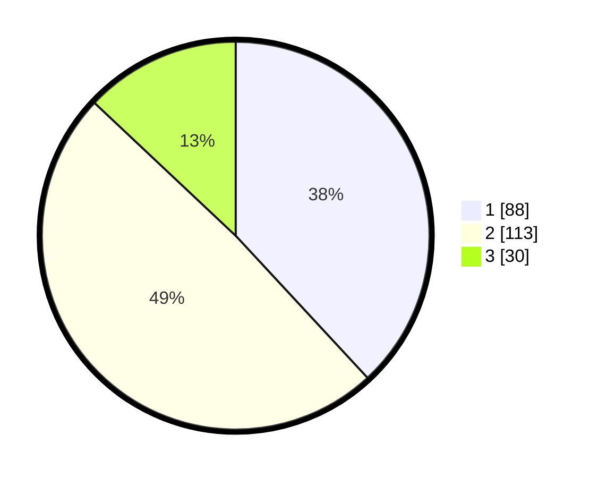

# Hasil

## Grafik

## Tabel

| No.    | Nama Paslon    | Suara | Suara (raw) | Persentase |
|:------ |:-------------- | -----:| -----------:| ----------:|
| 100025 | ANIES MUHAIMIN | 88    | [88][p-1]   | 38,10      |
| 100026 | PRABOWO GIBRAN | 113   | [113][p-2]  | 48,92      |
| 100027 | GANJAR MAHFUD  | 30    | [30][p-3]   | 12,99      |

[p-1]: https://github.com/gigit-pemilu/pemilu-2024/blob/main/pilpres/hitung-suara/sub/31-dki-jakarta/sub/73-jakarta-barat/sub/07-pal-merah/sub/1005-kemanggisan/sub/098-tps/sub/paslon-1.txt
[p-2]: https://github.com/gigit-pemilu/pemilu-2024/blob/main/pilpres/hitung-suara/sub/31-dki-jakarta/sub/73-jakarta-barat/sub/07-pal-merah/sub/1005-kemanggisan/sub/098-tps/sub/paslon-2.txt
[p-3]: https://github.com/gigit-pemilu/pemilu-2024/blob/main/pilpres/hitung-suara/sub/31-dki-jakarta/sub/73-jakarta-barat/sub/07-pal-merah/sub/1005-kemanggisan/sub/098-tps/sub/paslon-3.txt

## Foto C Plano

https://sirekap-obj-formc.kpu.go.id/4c9e/pemilu/ppwp/31/73/07/10/05/3173071005098-20240214-212934--ece12dab-4f4f-43fc-80d8-c7467b88eed3.jpg

https://sirekap-obj-formc.kpu.go.id/4c9e/pemilu/ppwp/31/73/07/10/05/3173071005098-20240214-213108--4f01c67c-4a4f-44c7-9604-eca95656d67f.jpg

https://sirekap-obj-formc.kpu.go.id/4c9e/pemilu/ppwp/31/73/07/10/05/3173071005098-20240214-213230--a7cf5752-8664-4b50-bc75-5e9d6da151c0.jpg

## Metadata

| Key        | Value               |
| ---------- | ------------------- |
| Time Stamp | 2024-02-16 22:01:00 |

