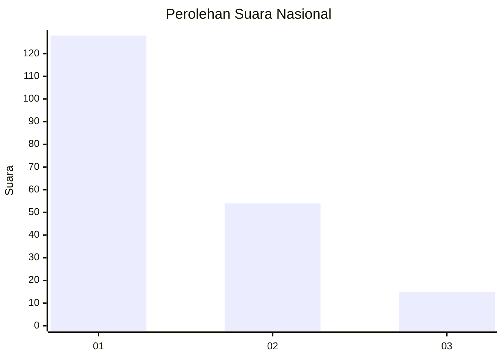
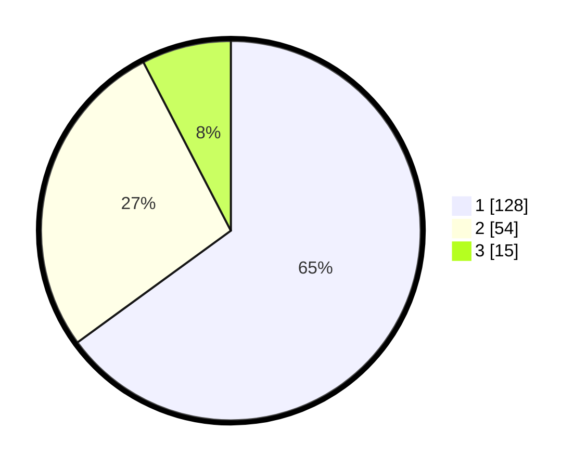

# Hasil

## Grafik

## Tabel

| No.    | Nama Paslon    | Suara | Suara (raw) | Persentase |
|:------ |:-------------- | -----:| -----------:| ----------:|
| 100025 | ANIES MUHAIMIN | 128   | [128][p-1]  | 64,97      |
| 100026 | PRABOWO GIBRAN | 54    | [54][p-2]   | 27,41      |
| 100027 | GANJAR MAHFUD  | 15    | [15][p-3]   | 7,61       |

[p-1]: https://github.com/gigit-pemilu/pemilu-2024/blob/main/pilpres/hitung-suara/sub/31-dki-jakarta/sub/73-jakarta-barat/sub/07-pal-merah/sub/1005-kemanggisan/sub/106-tps/sub/paslon-1.txt
[p-2]: https://github.com/gigit-pemilu/pemilu-2024/blob/main/pilpres/hitung-suara/sub/31-dki-jakarta/sub/73-jakarta-barat/sub/07-pal-merah/sub/1005-kemanggisan/sub/106-tps/sub/paslon-2.txt
[p-3]: https://github.com/gigit-pemilu/pemilu-2024/blob/main/pilpres/hitung-suara/sub/31-dki-jakarta/sub/73-jakarta-barat/sub/07-pal-merah/sub/1005-kemanggisan/sub/106-tps/sub/paslon-3.txt

## Foto C Plano

https://sirekap-obj-formc.kpu.go.id/c9fe/pemilu/ppwp/31/73/07/10/05/3173071005106-20240214-214112--baf5d69a-055d-4f79-9e2d-b0771f3a3530.jpg

https://sirekap-obj-formc.kpu.go.id/c9fe/pemilu/ppwp/31/73/07/10/05/3173071005106-20240214-214134--df39ecb5-1458-4bfd-9fdd-e568ac746d90.jpg

https://sirekap-obj-formc.kpu.go.id/c9fe/pemilu/ppwp/31/73/07/10/05/3173071005106-20240214-214237--ecb14ce5-a67f-4cc0-8a8f-ef3cac570be7.jpg

## Metadata

| Key        | Value               |
| ---------- | ------------------- |
| Time Stamp | 2024-02-17 14:45:18 |

