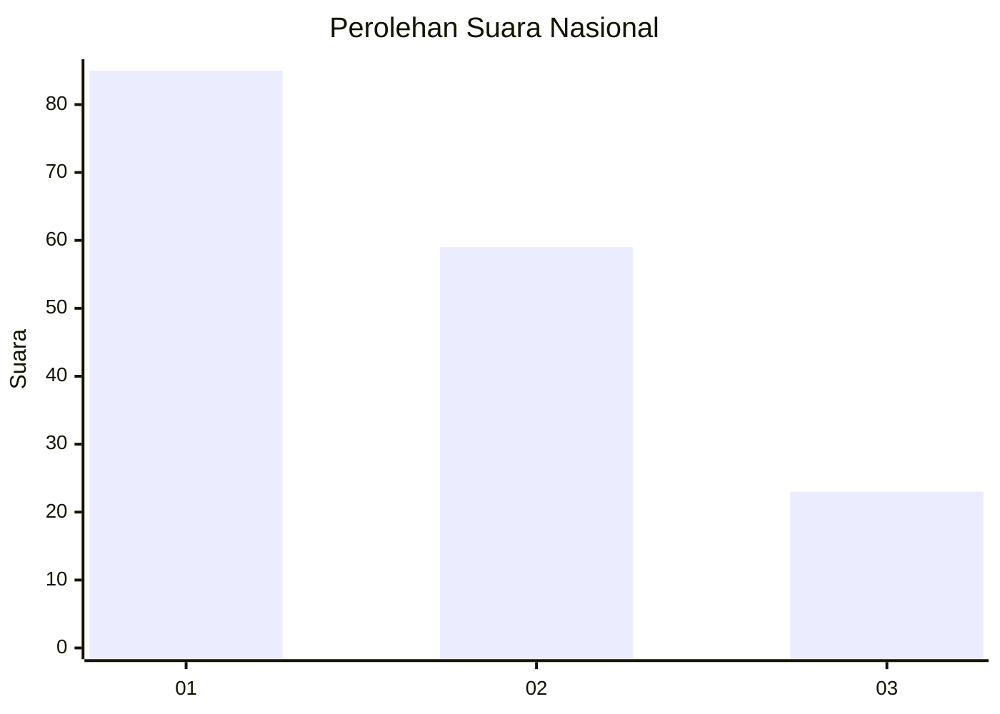
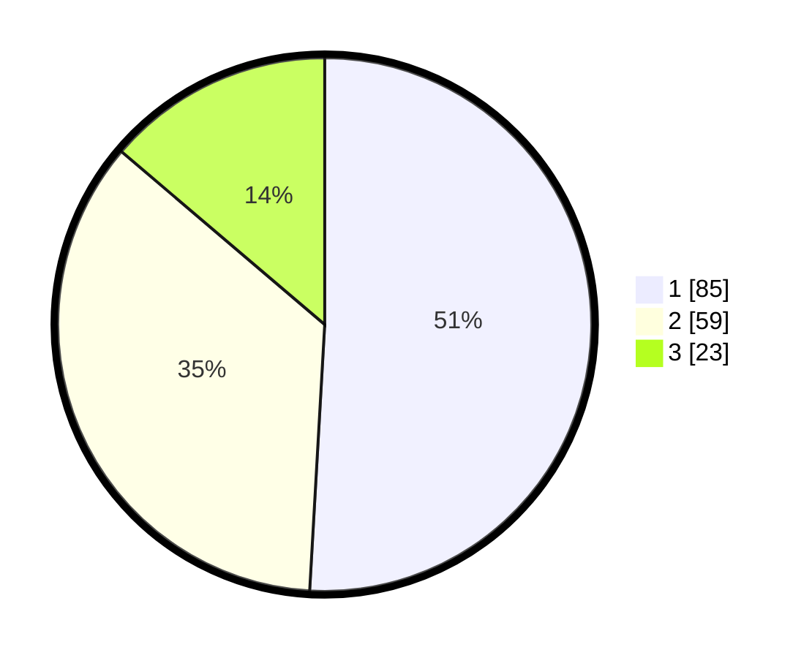

# Hasil

## Grafik

## Tabel

| No.    | Nama Paslon    | Suara | Suara (raw) | Persentase |
|:------ |:-------------- | -----:| -----------:| ----------:|
| 100025 | ANIES MUHAIMIN | 85    | [85][p-1]   | 50,90      |
| 100026 | PRABOWO GIBRAN | 59    | [59][p-2]   | 35,33      |
| 100027 | GANJAR MAHFUD  | 23    | [23][p-3]   | 13,77      |

[p-1]: https://github.com/gigit-pemilu/pemilu-2024/blob/main/pilpres/hitung-suara/sub/31-dki-jakarta/sub/73-jakarta-barat/sub/07-pal-merah/sub/1005-kemanggisan/sub/110-tps/sub/paslon-1.txt
[p-2]: https://github.com/gigit-pemilu/pemilu-2024/blob/main/pilpres/hitung-suara/sub/31-dki-jakarta/sub/73-jakarta-barat/sub/07-pal-merah/sub/1005-kemanggisan/sub/110-tps/sub/paslon-2.txt
[p-3]: https://github.com/gigit-pemilu/pemilu-2024/blob/main/pilpres/hitung-suara/sub/31-dki-jakarta/sub/73-jakarta-barat/sub/07-pal-merah/sub/1005-kemanggisan/sub/110-tps/sub/paslon-3.txt

## Foto C Plano

https://sirekap-obj-formc.kpu.go.id/29ec/pemilu/ppwp/31/73/07/10/05/3173071005110-20240216-074138--29a08dfa-bd5a-48ec-b759-92a27a3ac01c.jpg

https://sirekap-obj-formc.kpu.go.id/29ec/pemilu/ppwp/31/73/07/10/05/3173071005110-20240219-143106--90fbe334-8448-4cb4-9702-3bb5f453a051.jpg

https://sirekap-obj-formc.kpu.go.id/29ec/pemilu/ppwp/31/73/07/10/05/3173071005110-20240219-161644--24f78719-718b-4bc8-a841-7451707381aa.jpg

## Metadata

| Key        | Value               |
| ---------- | ------------------- |
| Time Stamp | 2024-02-19 21:00:00 |

