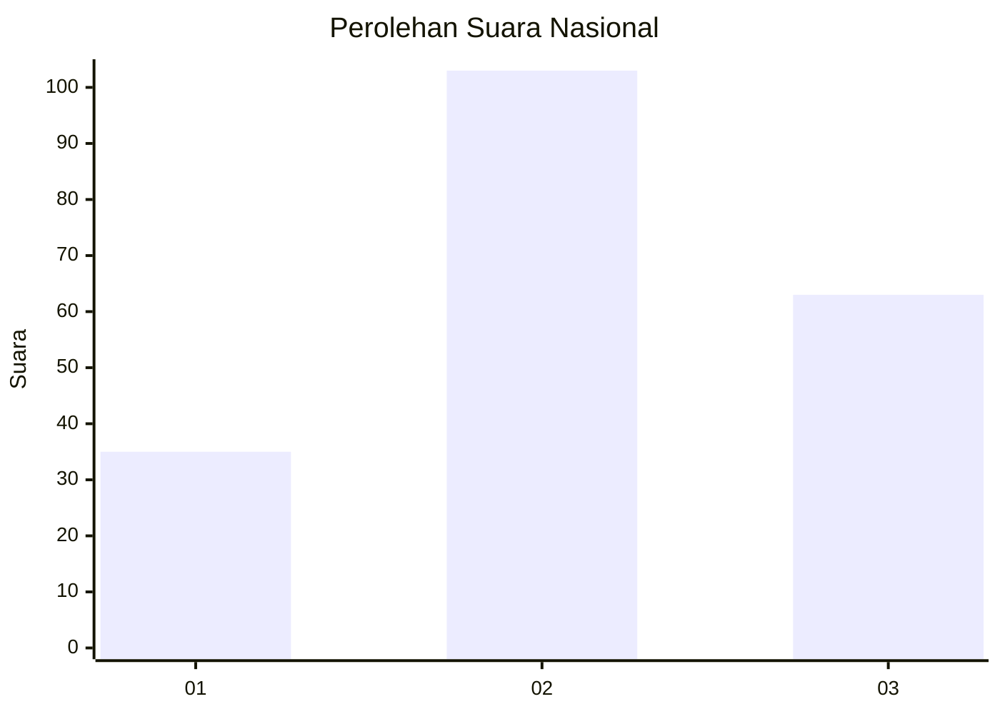
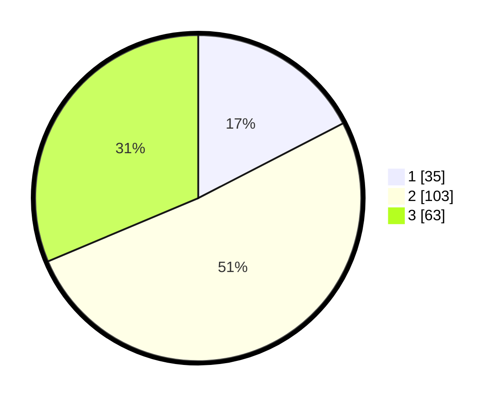

# Hasil

## Grafik

## Tabel

| No.    | Nama Paslon    | Suara | Suara (raw) | Persentase |
|:------ |:-------------- | -----:| -----------:| ----------:|
| 100025 | ANIES MUHAIMIN | 35    | [35][p-1]   | 17,41      |
| 100026 | PRABOWO GIBRAN | 103   | [103][p-2]  | 51,24      |
| 100027 | GANJAR MAHFUD  | 63    | [63][p-3]   | 31,34      |

[p-1]: https://github.com/gigit-pemilu/pemilu-2024/blob/main/pilpres/hitung-suara/sub/31-dki-jakarta/sub/73-jakarta-barat/sub/07-pal-merah/sub/1006-kota-bambu-selatan/sub/011-tps/sub/paslon-1.txt
[p-2]: https://github.com/gigit-pemilu/pemilu-2024/blob/main/pilpres/hitung-suara/sub/31-dki-jakarta/sub/73-jakarta-barat/sub/07-pal-merah/sub/1006-kota-bambu-selatan/sub/011-tps/sub/paslon-2.txt
[p-3]: https://github.com/gigit-pemilu/pemilu-2024/blob/main/pilpres/hitung-suara/sub/31-dki-jakarta/sub/73-jakarta-barat/sub/07-pal-merah/sub/1006-kota-bambu-selatan/sub/011-tps/sub/paslon-3.txt

## Foto C Plano

https://sirekap-obj-formc.kpu.go.id/0199/pemilu/ppwp/31/73/07/10/06/3173071006011-20240214-220811--eb328368-d3b5-453f-8e2b-8d6b5d2c65bb.jpg

https://sirekap-obj-formc.kpu.go.id/0199/pemilu/ppwp/31/73/07/10/06/3173071006011-20240214-221000--81734141-585d-49f1-a23f-4bb342f04b40.jpg

https://sirekap-obj-formc.kpu.go.id/0199/pemilu/ppwp/31/73/07/10/06/3173071006011-20240214-221141--6a9a7f15-3160-4269-a7fd-d78f268f6d42.jpg

## Metadata

| Key        | Value               |
| ---------- | ------------------- |
| Time Stamp | 2024-02-19 16:00:00 |

