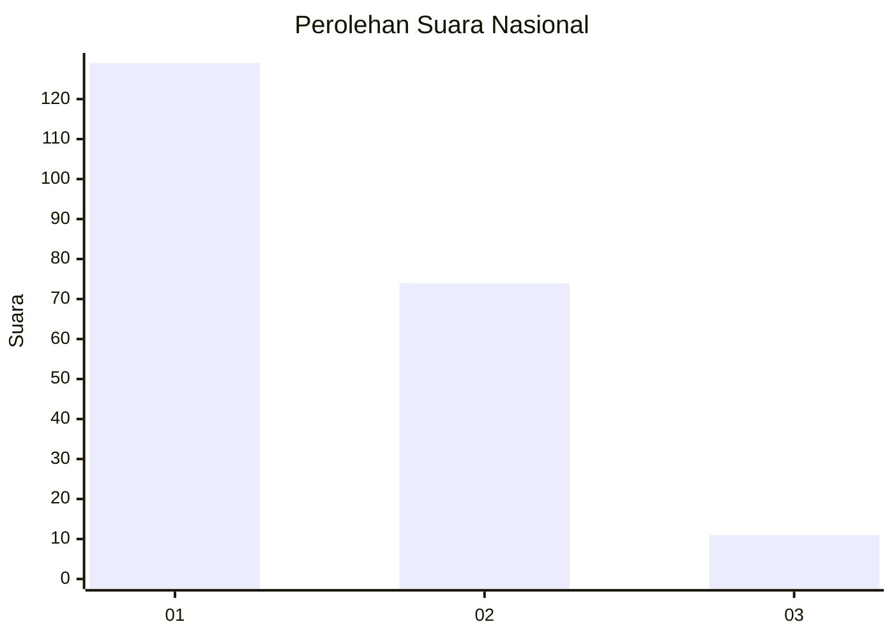
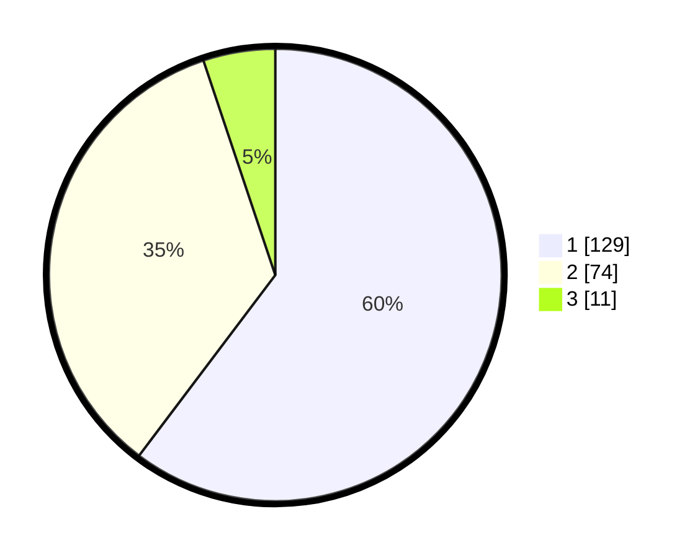

# Hasil

## Grafik

## Tabel

| No.    | Nama Paslon    | Suara | Suara (raw) | Persentase |
|:------ |:-------------- | -----:| -----------:| ----------:|
| 100025 | ANIES MUHAIMIN | 129   | [129][p-1]  | 60,28      |
| 100026 | PRABOWO GIBRAN | 74    | [74][p-2]   | 34,58      |
| 100027 | GANJAR MAHFUD  | 11    | [11][p-3]   | 5,14       |

[p-1]: https://github.com/gigit-pemilu/pemilu-2024/blob/main/pilpres/hitung-suara/sub/31-dki-jakarta/sub/73-jakarta-barat/sub/07-pal-merah/sub/1006-kota-bambu-selatan/sub/014-tps/sub/paslon-1.txt
[p-2]: https://github.com/gigit-pemilu/pemilu-2024/blob/main/pilpres/hitung-suara/sub/31-dki-jakarta/sub/73-jakarta-barat/sub/07-pal-merah/sub/1006-kota-bambu-selatan/sub/014-tps/sub/paslon-2.txt
[p-3]: https://github.com/gigit-pemilu/pemilu-2024/blob/main/pilpres/hitung-suara/sub/31-dki-jakarta/sub/73-jakarta-barat/sub/07-pal-merah/sub/1006-kota-bambu-selatan/sub/014-tps/sub/paslon-3.txt

## Foto C Plano

https://sirekap-obj-formc.kpu.go.id/c133/pemilu/ppwp/31/73/07/10/06/3173071006014-20240214-215723--08a0ca6e-f57e-452d-bdc2-904771a59069.jpg

https://sirekap-obj-formc.kpu.go.id/c133/pemilu/ppwp/31/73/07/10/06/3173071006014-20240214-215815--9b41129b-457c-4200-a523-e2c4131ab82a.jpg

https://sirekap-obj-formc.kpu.go.id/c133/pemilu/ppwp/31/73/07/10/06/3173071006014-20240214-215904--d174e4bf-c74f-43ed-a4cd-47b181fb3d14.jpg

## Metadata

| Key        | Value               |
| ---------- | ------------------- |
| Time Stamp | 2024-02-15 15:00:29 |

