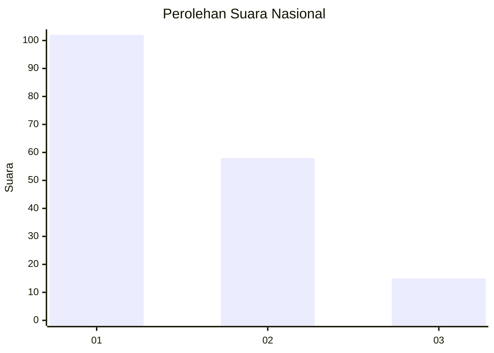
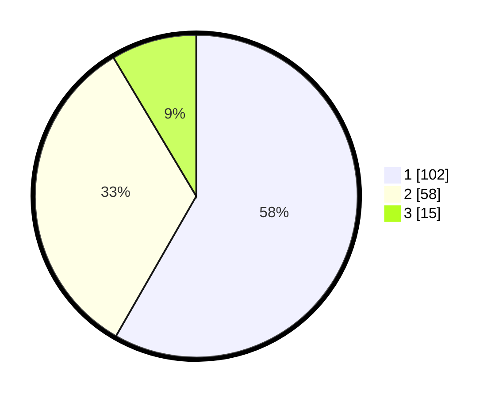

# Hasil

## Grafik

## Tabel

| No.    | Nama Paslon    | Suara | Suara (raw) | Persentase |
|:------ |:-------------- | -----:| -----------:| ----------:|
| 100025 | ANIES MUHAIMIN | 102   | [102][p-1]  | 58,29      |
| 100026 | PRABOWO GIBRAN | 58    | [58][p-2]   | 33,14      |
| 100027 | GANJAR MAHFUD  | 15    | [15][p-3]   | 8,57       |

[p-1]: https://github.com/gigit-pemilu/pemilu-2024/blob/main/pilpres/hitung-suara/sub/31-dki-jakarta/sub/73-jakarta-barat/sub/07-pal-merah/sub/1006-kota-bambu-selatan/sub/029-tps/sub/paslon-1.txt
[p-2]: https://github.com/gigit-pemilu/pemilu-2024/blob/main/pilpres/hitung-suara/sub/31-dki-jakarta/sub/73-jakarta-barat/sub/07-pal-merah/sub/1006-kota-bambu-selatan/sub/029-tps/sub/paslon-2.txt
[p-3]: https://github.com/gigit-pemilu/pemilu-2024/blob/main/pilpres/hitung-suara/sub/31-dki-jakarta/sub/73-jakarta-barat/sub/07-pal-merah/sub/1006-kota-bambu-selatan/sub/029-tps/sub/paslon-3.txt

## Foto C Plano

https://sirekap-obj-formc.kpu.go.id/2d08/pemilu/ppwp/31/73/07/10/06/3173071006029-20240214-230110--1f5f3369-7d47-42e7-b2ea-af2c8c3e5667.jpg

https://sirekap-obj-formc.kpu.go.id/2d08/pemilu/ppwp/31/73/07/10/06/3173071006029-20240214-211600--de908d80-60a1-4e0b-b214-330faef3bb30.jpg

https://sirekap-obj-formc.kpu.go.id/2d08/pemilu/ppwp/31/73/07/10/06/3173071006029-20240214-212538--da8113ba-65c2-443e-b004-5a0a604a6318.jpg

## Metadata

| Key        | Value               |
| ---------- | ------------------- |
| Time Stamp | 2024-02-15 02:10:27 |

