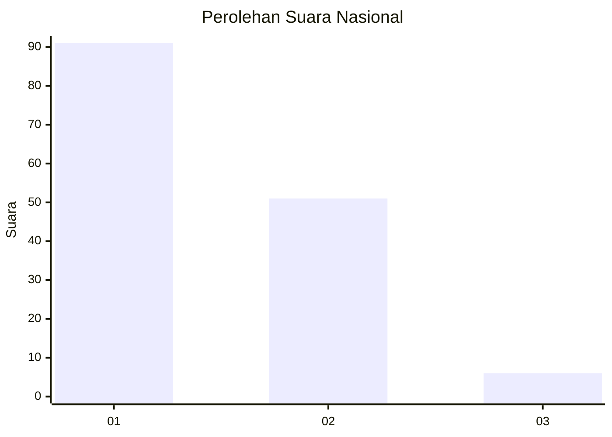
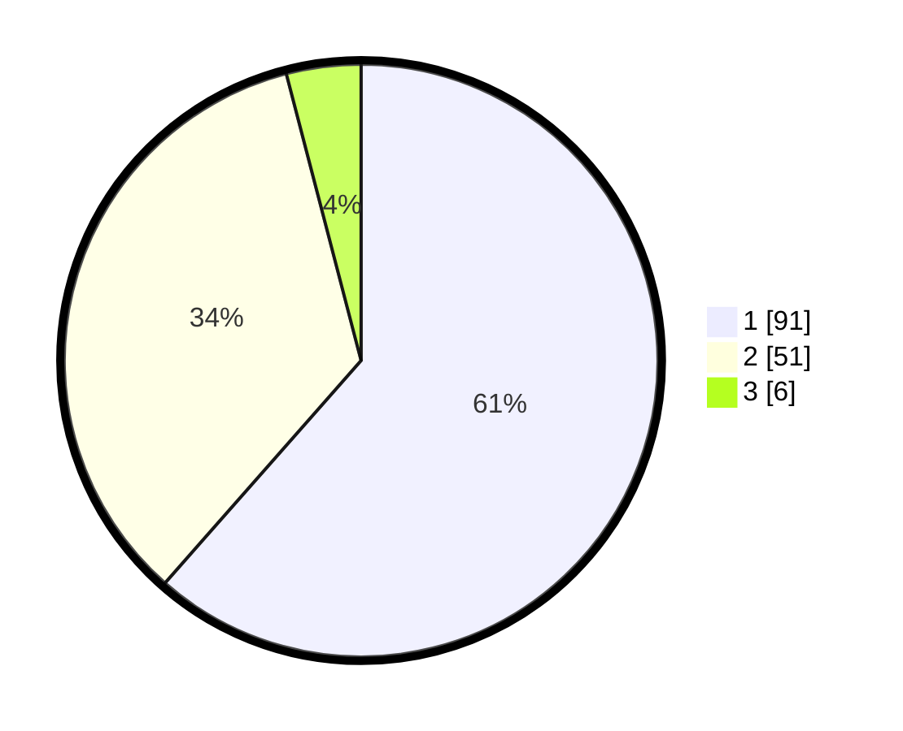

# Hasil

## Grafik

## Tabel

| No.    | Nama Paslon    | Suara | Suara (raw) | Persentase |
|:------ |:-------------- | -----:| -----------:| ----------:|
| 100025 | ANIES MUHAIMIN | 91    | [91][p-1]   | 61,49      |
| 100026 | PRABOWO GIBRAN | 51    | [51][p-2]   | 34,46      |
| 100027 | GANJAR MAHFUD  | 6     | [6][p-3]    | 4,05       |

[p-1]: https://github.com/gigit-pemilu/pemilu-2024/blob/main/pilpres/hitung-suara/sub/31-dki-jakarta/sub/73-jakarta-barat/sub/07-pal-merah/sub/1006-kota-bambu-selatan/sub/037-tps/sub/paslon-1.txt
[p-2]: https://github.com/gigit-pemilu/pemilu-2024/blob/main/pilpres/hitung-suara/sub/31-dki-jakarta/sub/73-jakarta-barat/sub/07-pal-merah/sub/1006-kota-bambu-selatan/sub/037-tps/sub/paslon-2.txt
[p-3]: https://github.com/gigit-pemilu/pemilu-2024/blob/main/pilpres/hitung-suara/sub/31-dki-jakarta/sub/73-jakarta-barat/sub/07-pal-merah/sub/1006-kota-bambu-selatan/sub/037-tps/sub/paslon-3.txt

## Foto C Plano

https://sirekap-obj-formc.kpu.go.id/664b/pemilu/ppwp/31/73/07/10/06/3173071006037-20240214-214916--974da2ee-243a-4e70-b848-06032d141df3.jpg

https://sirekap-obj-formc.kpu.go.id/664b/pemilu/ppwp/31/73/07/10/06/3173071006037-20240214-215111--20fe327f-0480-4f6c-a3ce-4c12fab0fbf8.jpg

https://sirekap-obj-formc.kpu.go.id/664b/pemilu/ppwp/31/73/07/10/06/3173071006037-20240214-215256--2828d433-6b68-4a97-bdd7-e32d0992d847.jpg

## Metadata

| Key        | Value               |
| ---------- | ------------------- |
| Time Stamp | 2024-02-19 16:00:00 |

