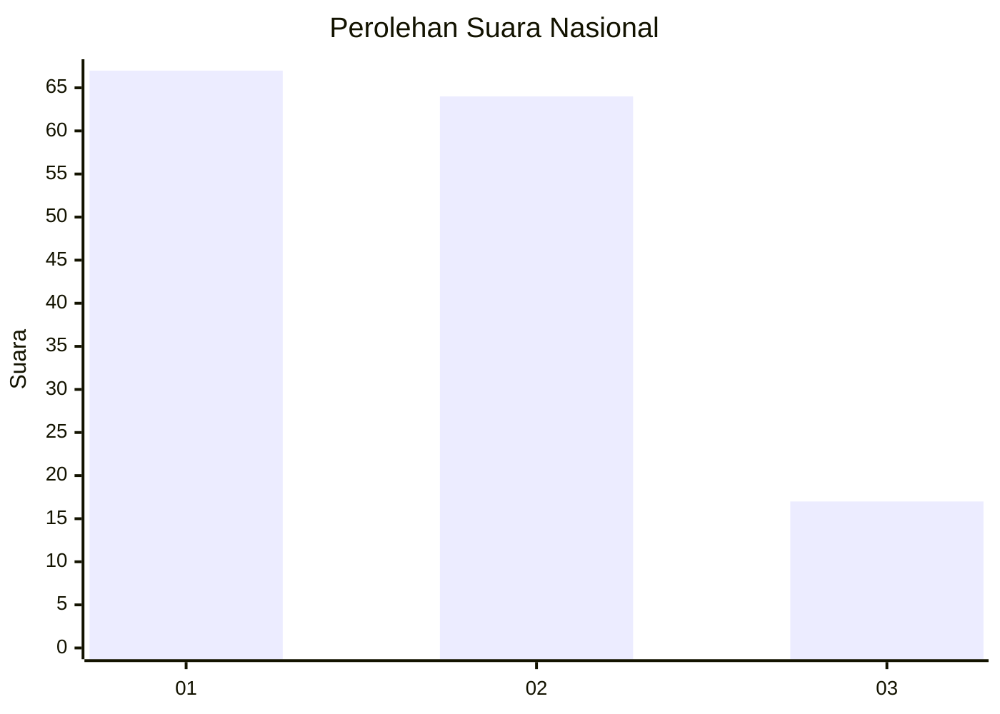
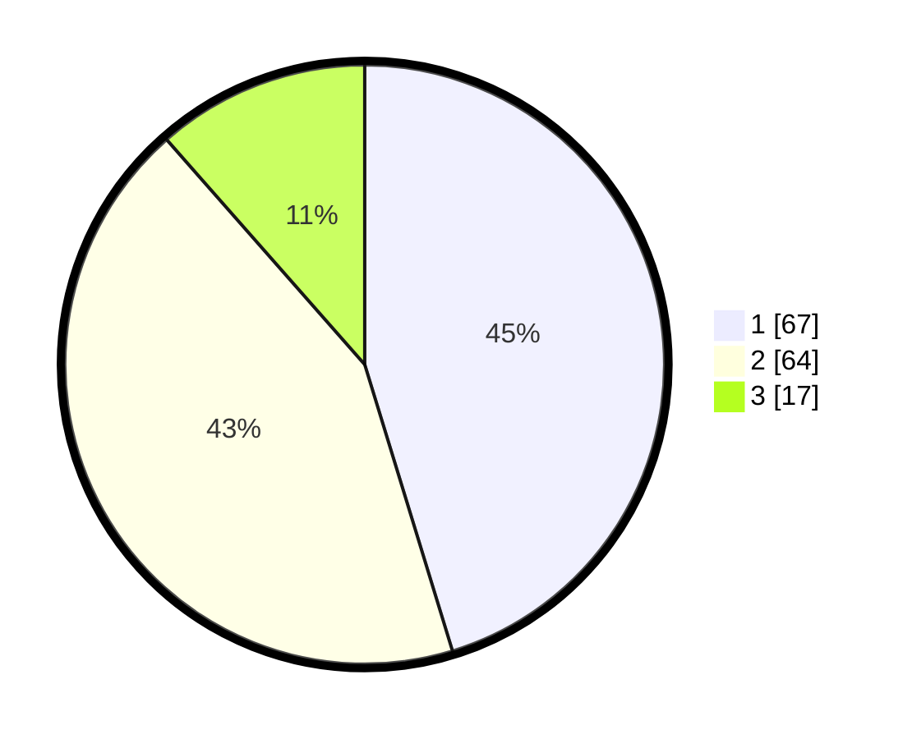

# Hasil

## Grafik

## Tabel

| No.    | Nama Paslon    | Suara | Suara (raw) | Persentase |
|:------ |:-------------- | -----:| -----------:| ----------:|
| 100025 | ANIES MUHAIMIN | 67    | [67][p-1]   | 45,27      |
| 100026 | PRABOWO GIBRAN | 64    | [64][p-2]   | 43,24      |
| 100027 | GANJAR MAHFUD  | 17    | [17][p-3]   | 11,49      |

[p-1]: https://github.com/gigit-pemilu/pemilu-2024/blob/main/pilpres/hitung-suara/sub/31-dki-jakarta/sub/73-jakarta-barat/sub/07-pal-merah/sub/1006-kota-bambu-selatan/sub/038-tps/sub/paslon-1.txt
[p-2]: https://github.com/gigit-pemilu/pemilu-2024/blob/main/pilpres/hitung-suara/sub/31-dki-jakarta/sub/73-jakarta-barat/sub/07-pal-merah/sub/1006-kota-bambu-selatan/sub/038-tps/sub/paslon-2.txt
[p-3]: https://github.com/gigit-pemilu/pemilu-2024/blob/main/pilpres/hitung-suara/sub/31-dki-jakarta/sub/73-jakarta-barat/sub/07-pal-merah/sub/1006-kota-bambu-selatan/sub/038-tps/sub/paslon-3.txt

## Foto C Plano

https://sirekap-obj-formc.kpu.go.id/3693/pemilu/ppwp/31/73/07/10/06/3173071006038-20240214-225210--838a00d5-11d6-47f7-bcb8-459b5b59fd9e.jpg

https://sirekap-obj-formc.kpu.go.id/3693/pemilu/ppwp/31/73/07/10/06/3173071006038-20240214-225410--a3412200-1218-4a55-b353-56db34af815a.jpg

https://sirekap-obj-formc.kpu.go.id/3693/pemilu/ppwp/31/73/07/10/06/3173071006038-20240214-225516--d1b63261-bced-4983-b38b-3a320aaf08cb.jpg

## Metadata

| Key        | Value               |
| ---------- | ------------------- |
| Time Stamp | 2024-02-17 14:45:18 |

