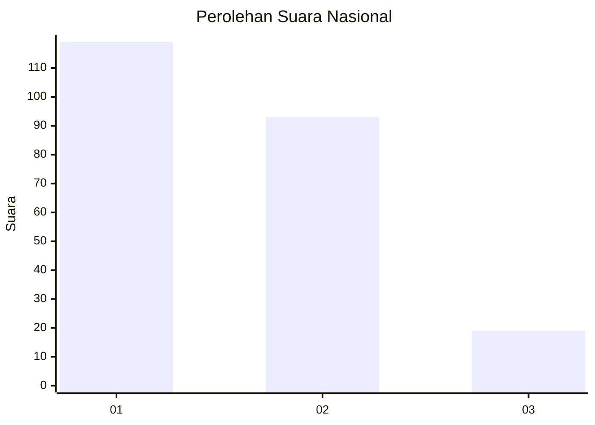
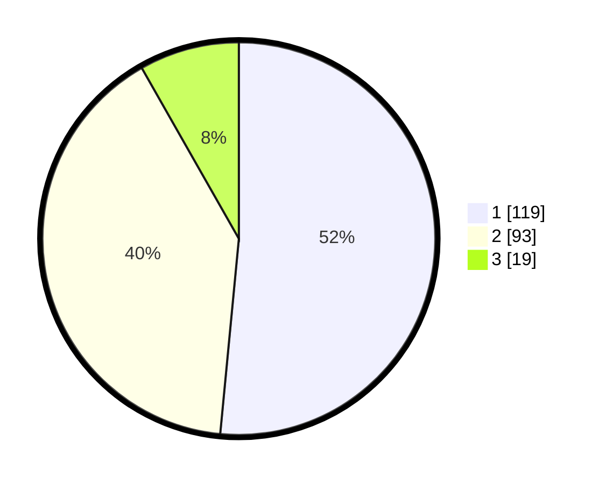

# Hasil

## Grafik

## Tabel

| No.    | Nama Paslon    | Suara | Suara (raw) | Persentase |
|:------ |:-------------- | -----:| -----------:| ----------:|
| 100025 | ANIES MUHAIMIN | 119   | [119][p-1]  | 51,52      |
| 100026 | PRABOWO GIBRAN | 93    | [93][p-2]   | 40,26      |
| 100027 | GANJAR MAHFUD  | 19    | [19][p-3]   | 8,23       |

[p-1]: https://github.com/gigit-pemilu/pemilu-2024/blob/main/pilpres/hitung-suara/sub/31-dki-jakarta/sub/73-jakarta-barat/sub/07-pal-merah/sub/1006-kota-bambu-selatan/sub/047-tps/sub/paslon-1.txt
[p-2]: https://github.com/gigit-pemilu/pemilu-2024/blob/main/pilpres/hitung-suara/sub/31-dki-jakarta/sub/73-jakarta-barat/sub/07-pal-merah/sub/1006-kota-bambu-selatan/sub/047-tps/sub/paslon-2.txt
[p-3]: https://github.com/gigit-pemilu/pemilu-2024/blob/main/pilpres/hitung-suara/sub/31-dki-jakarta/sub/73-jakarta-barat/sub/07-pal-merah/sub/1006-kota-bambu-selatan/sub/047-tps/sub/paslon-3.txt

## Foto C Plano

https://sirekap-obj-formc.kpu.go.id/f035/pemilu/ppwp/31/73/07/10/06/3173071006047-20240215-031128--2cb23b15-7f07-4e0a-8c25-55b8f71aa314.jpg

https://sirekap-obj-formc.kpu.go.id/f035/pemilu/ppwp/31/73/07/10/06/3173071006047-20240215-031810--7aa6b848-d88a-4f31-955f-0f73ac242de6.jpg

https://sirekap-obj-formc.kpu.go.id/f035/pemilu/ppwp/31/73/07/10/06/3173071006047-20240215-031920--6c1f8a7b-9f11-409a-a9b0-a59614c5aca6.jpg

## Metadata

| Key        | Value               |
| ---------- | ------------------- |
| Time Stamp | 2024-02-17 14:45:18 |

