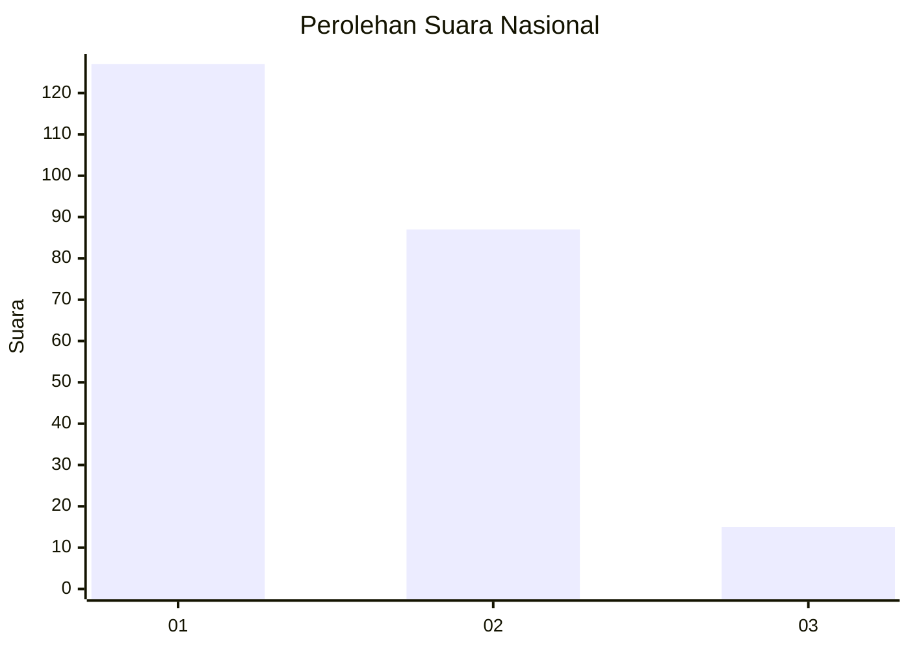
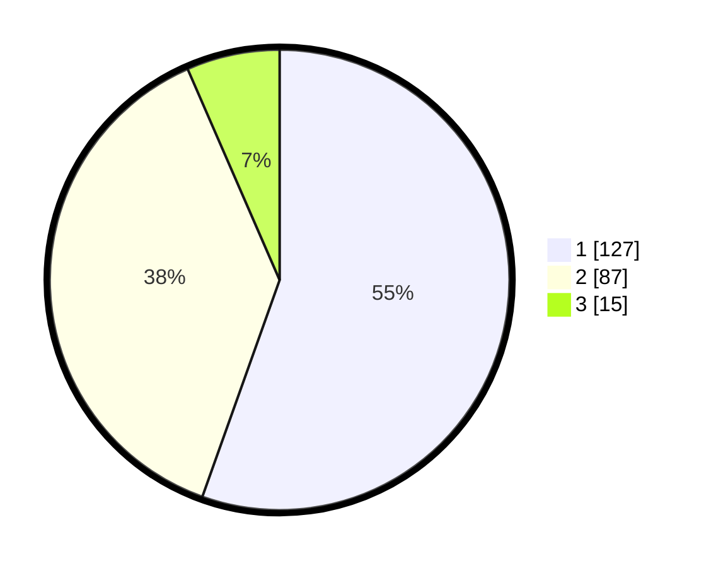

# Hasil

## Grafik

## Tabel

| No.    | Nama Paslon    | Suara | Suara (raw) | Persentase |
|:------ |:-------------- | -----:| -----------:| ----------:|
| 100025 | ANIES MUHAIMIN | 127   | [127][p-1]  | 55,46      |
| 100026 | PRABOWO GIBRAN | 87    | [87][p-2]   | 37,99      |
| 100027 | GANJAR MAHFUD  | 15    | [15][p-3]   | 6,55       |

[p-1]: https://github.com/gigit-pemilu/pemilu-2024/blob/main/pilpres/hitung-suara/sub/31-dki-jakarta/sub/73-jakarta-barat/sub/07-pal-merah/sub/1006-kota-bambu-selatan/sub/052-tps/sub/paslon-1.txt
[p-2]: https://github.com/gigit-pemilu/pemilu-2024/blob/main/pilpres/hitung-suara/sub/31-dki-jakarta/sub/73-jakarta-barat/sub/07-pal-merah/sub/1006-kota-bambu-selatan/sub/052-tps/sub/paslon-2.txt
[p-3]: https://github.com/gigit-pemilu/pemilu-2024/blob/main/pilpres/hitung-suara/sub/31-dki-jakarta/sub/73-jakarta-barat/sub/07-pal-merah/sub/1006-kota-bambu-selatan/sub/052-tps/sub/paslon-3.txt

## Foto C Plano

https://sirekap-obj-formc.kpu.go.id/a459/pemilu/ppwp/31/73/07/10/06/3173071006052-20240214-215434--9c7cdda2-7f20-4676-a33f-35b132eb093e.jpg

https://sirekap-obj-formc.kpu.go.id/a459/pemilu/ppwp/31/73/07/10/06/3173071006052-20240214-215543--098905f6-221a-40dd-b9f1-a96843429be8.jpg

https://sirekap-obj-formc.kpu.go.id/a459/pemilu/ppwp/31/73/07/10/06/3173071006052-20240214-215639--8b287818-33e2-47d9-b756-14d7397024d1.jpg

## Metadata

| Key        | Value               |
| ---------- | ------------------- |
| Time Stamp | 2024-02-17 14:45:18 |

