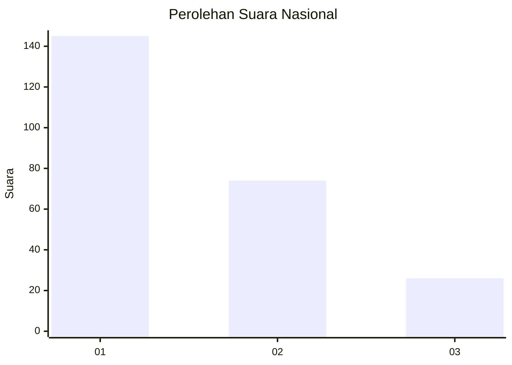
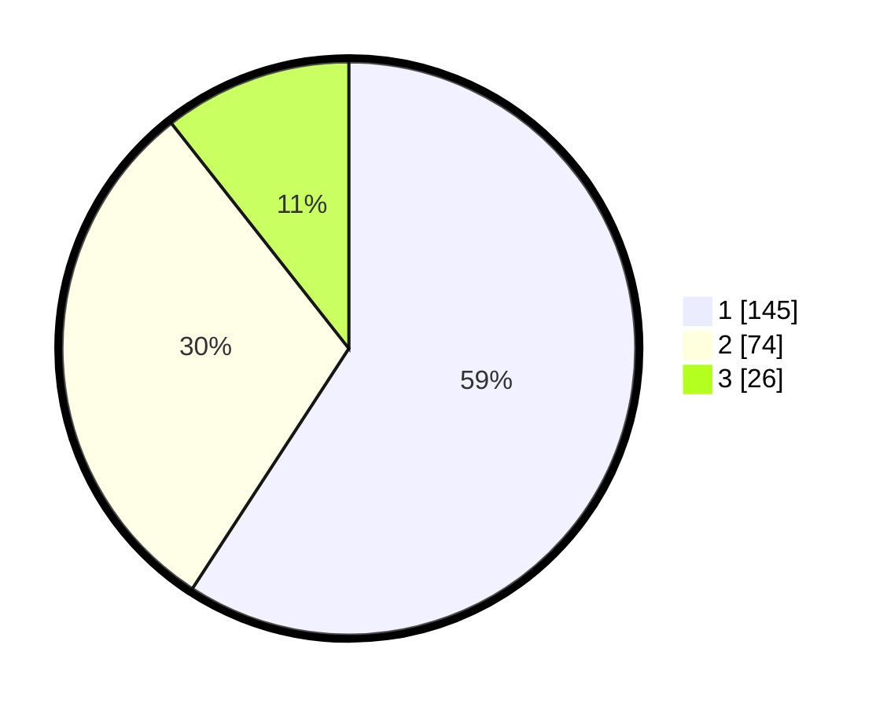

# Hasil

## Grafik

## Tabel

| No.    | Nama Paslon    | Suara | Suara (raw) | Persentase |
|:------ |:-------------- | -----:| -----------:| ----------:|
| 100025 | ANIES MUHAIMIN | 145   | [145][p-1]  | 59,18      |
| 100026 | PRABOWO GIBRAN | 74    | [74][p-2]   | 30,20      |
| 100027 | GANJAR MAHFUD  | 26    | [26][p-3]   | 10,61      |

[p-1]: https://github.com/gigit-pemilu/pemilu-2024/blob/main/pilpres/hitung-suara/sub/31-dki-jakarta/sub/73-jakarta-barat/sub/07-pal-merah/sub/1006-kota-bambu-selatan/sub/068-tps/sub/paslon-1.txt
[p-2]: https://github.com/gigit-pemilu/pemilu-2024/blob/main/pilpres/hitung-suara/sub/31-dki-jakarta/sub/73-jakarta-barat/sub/07-pal-merah/sub/1006-kota-bambu-selatan/sub/068-tps/sub/paslon-2.txt
[p-3]: https://github.com/gigit-pemilu/pemilu-2024/blob/main/pilpres/hitung-suara/sub/31-dki-jakarta/sub/73-jakarta-barat/sub/07-pal-merah/sub/1006-kota-bambu-selatan/sub/068-tps/sub/paslon-3.txt

## Foto C Plano

https://sirekap-obj-formc.kpu.go.id/f35a/pemilu/ppwp/31/73/07/10/06/3173071006068-20240214-212132--72495adb-a676-4b2e-b833-5639d0eabb95.jpg

https://sirekap-obj-formc.kpu.go.id/f35a/pemilu/ppwp/31/73/07/10/06/3173071006068-20240214-212326--a4942c65-f887-41f0-9b8e-93492313e801.jpg

https://sirekap-obj-formc.kpu.go.id/f35a/pemilu/ppwp/31/73/07/10/06/3173071006068-20240214-212540--565f9fb5-afab-4c20-972c-a2e5c256fccc.jpg

## Metadata

| Key        | Value               |
| ---------- | ------------------- |
| Time Stamp | 2024-02-19 16:00:00 |

