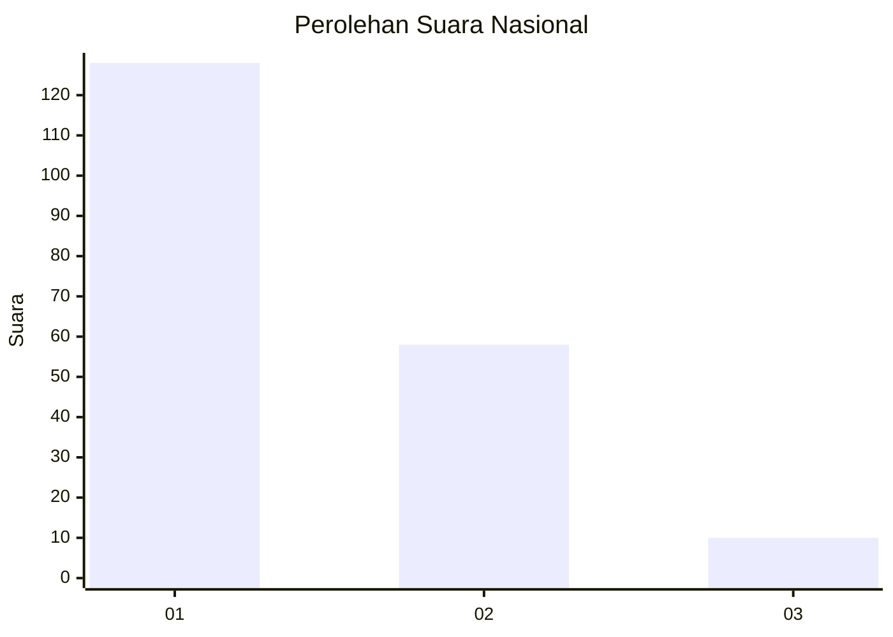
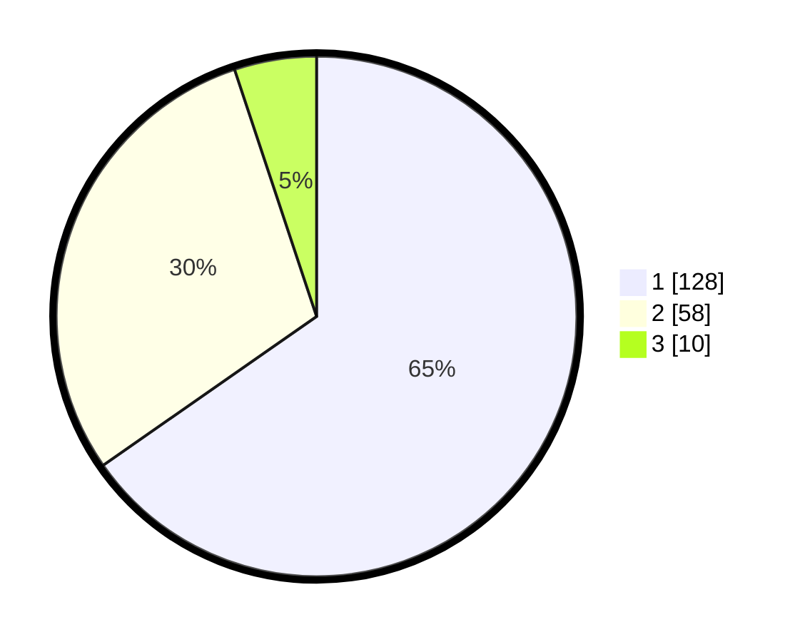

# Hasil

## Grafik

## Tabel

| No.    | Nama Paslon    | Suara | Suara (raw) | Persentase |
|:------ |:-------------- | -----:| -----------:| ----------:|
| 100025 | ANIES MUHAIMIN | 128   | [128][p-1]  | 65,31      |
| 100026 | PRABOWO GIBRAN | 58    | [58][p-2]   | 29,59      |
| 100027 | GANJAR MAHFUD  | 10    | [10][p-3]   | 5,10       |

[p-1]: https://github.com/gigit-pemilu/pemilu-2024/blob/main/pilpres/hitung-suara/sub/31-dki-jakarta/sub/73-jakarta-barat/sub/07-pal-merah/sub/1006-kota-bambu-selatan/sub/069-tps/sub/paslon-1.txt
[p-2]: https://github.com/gigit-pemilu/pemilu-2024/blob/main/pilpres/hitung-suara/sub/31-dki-jakarta/sub/73-jakarta-barat/sub/07-pal-merah/sub/1006-kota-bambu-selatan/sub/069-tps/sub/paslon-2.txt
[p-3]: https://github.com/gigit-pemilu/pemilu-2024/blob/main/pilpres/hitung-suara/sub/31-dki-jakarta/sub/73-jakarta-barat/sub/07-pal-merah/sub/1006-kota-bambu-selatan/sub/069-tps/sub/paslon-3.txt

## Foto C Plano

https://sirekap-obj-formc.kpu.go.id/8fd8/pemilu/ppwp/31/73/07/10/06/3173071006069-20240214-194438--003d6163-f9d5-4a45-b43f-68404f14baa3.jpg

https://sirekap-obj-formc.kpu.go.id/8fd8/pemilu/ppwp/31/73/07/10/06/3173071006069-20240214-193553--0377dacf-72a7-4245-8b92-ce52cc537a3d.jpg

https://sirekap-obj-formc.kpu.go.id/8fd8/pemilu/ppwp/31/73/07/10/06/3173071006069-20240214-193646--5b774fc9-5e9a-4436-a4d0-576d0e9df9cc.jpg

## Metadata

| Key        | Value               |
| ---------- | ------------------- |
| Time Stamp | 2024-02-16 02:00:27 |

