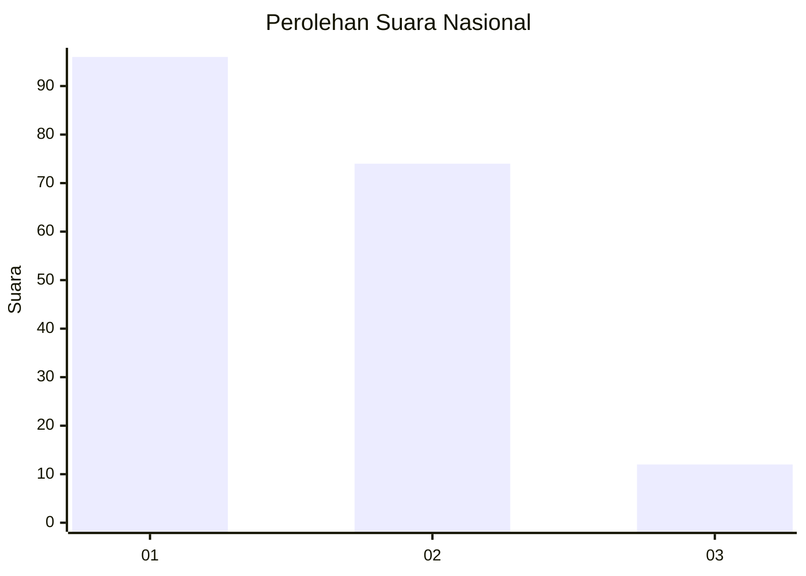
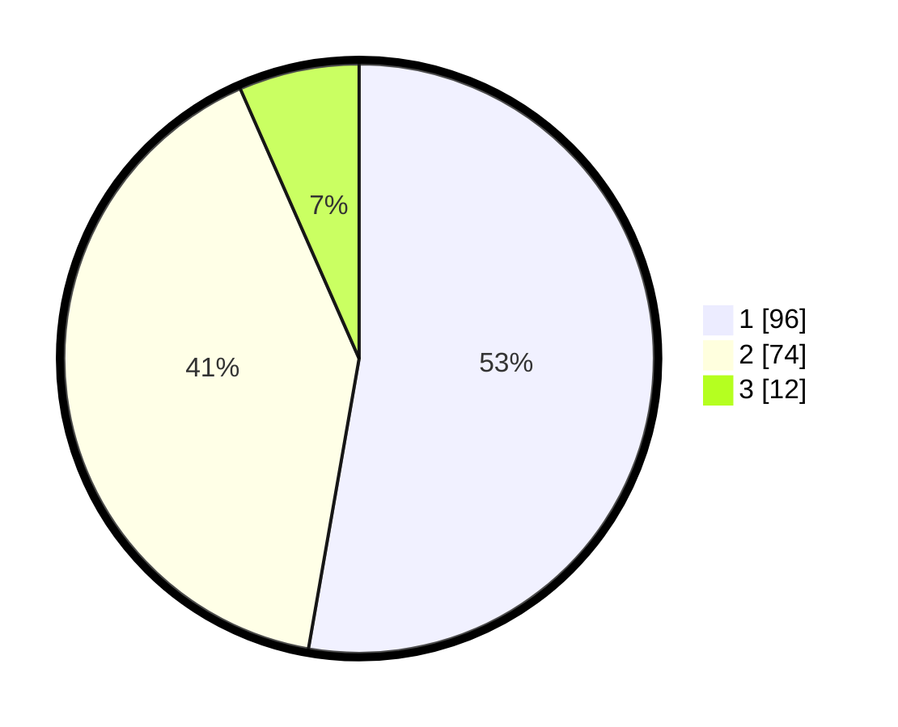

# Hasil

## Grafik

## Tabel

| No.    | Nama Paslon    | Suara | Suara (raw) | Persentase |
|:------ |:-------------- | -----:| -----------:| ----------:|
| 100025 | ANIES MUHAIMIN | 96    | [96][p-1]   | 52,75      |
| 100026 | PRABOWO GIBRAN | 74    | [74][p-2]   | 40,66      |
| 100027 | GANJAR MAHFUD  | 12    | [12][p-3]   | 6,59       |

[p-1]: https://github.com/gigit-pemilu/pemilu-2024/blob/main/pilpres/hitung-suara/sub/31-dki-jakarta/sub/73-jakarta-barat/sub/07-pal-merah/sub/1006-kota-bambu-selatan/sub/074-tps/sub/paslon-1.txt
[p-2]: https://github.com/gigit-pemilu/pemilu-2024/blob/main/pilpres/hitung-suara/sub/31-dki-jakarta/sub/73-jakarta-barat/sub/07-pal-merah/sub/1006-kota-bambu-selatan/sub/074-tps/sub/paslon-2.txt
[p-3]: https://github.com/gigit-pemilu/pemilu-2024/blob/main/pilpres/hitung-suara/sub/31-dki-jakarta/sub/73-jakarta-barat/sub/07-pal-merah/sub/1006-kota-bambu-selatan/sub/074-tps/sub/paslon-3.txt

## Foto C Plano

https://sirekap-obj-formc.kpu.go.id/67e4/pemilu/ppwp/31/73/07/10/06/3173071006074-20240214-230145--c9867846-3d9d-425c-94b2-91e203219aa3.jpg

https://sirekap-obj-formc.kpu.go.id/67e4/pemilu/ppwp/31/73/07/10/06/3173071006074-20240214-212815--f99939dc-bbd0-4ebe-a2b9-1a58e1dc97c6.jpg

https://sirekap-obj-formc.kpu.go.id/67e4/pemilu/ppwp/31/73/07/10/06/3173071006074-20240214-230419--04822f30-989a-4377-852a-db0e6876ee46.jpg

## Metadata

| Key        | Value               |
| ---------- | ------------------- |
| Time Stamp | 2024-02-19 16:00:00 |

