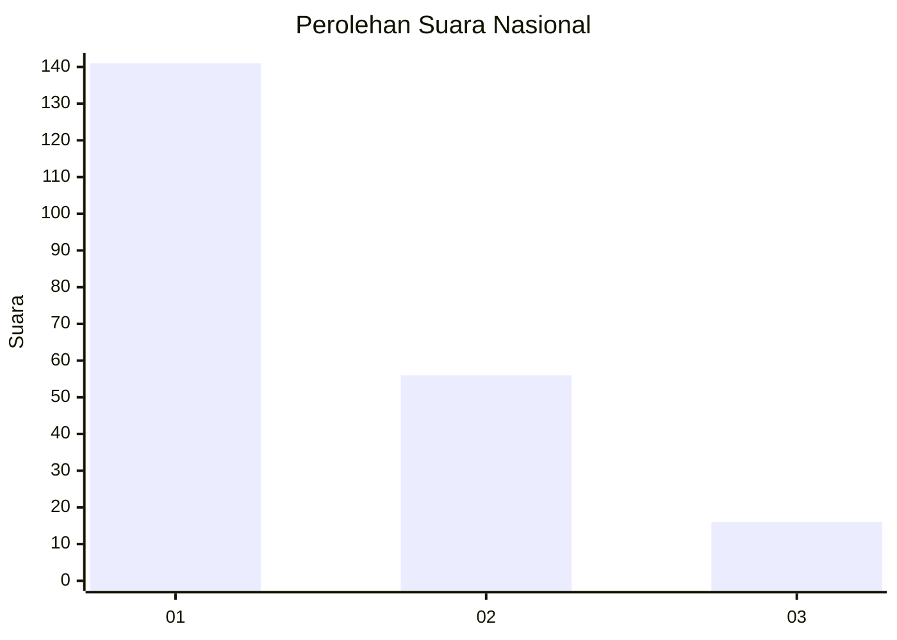
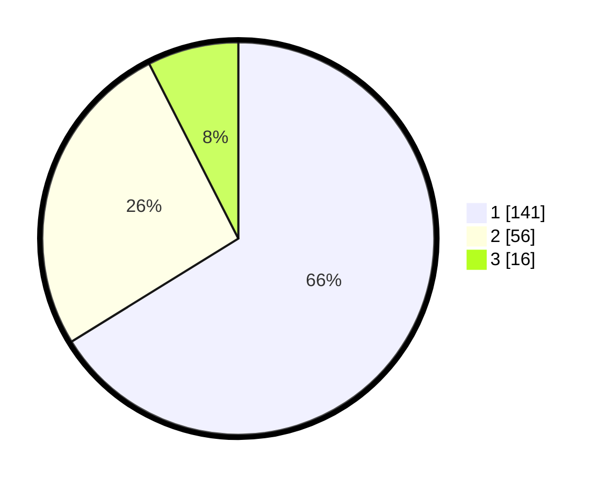

# Hasil

## Grafik

## Tabel

| No.    | Nama Paslon    | Suara | Suara (raw) | Persentase |
|:------ |:-------------- | -----:| -----------:| ----------:|
| 100025 | ANIES MUHAIMIN | 141   | [141][p-1]  | 66,20      |
| 100026 | PRABOWO GIBRAN | 56    | [56][p-2]   | 26,29      |
| 100027 | GANJAR MAHFUD  | 16    | [16][p-3]   | 7,51       |

[p-1]: https://github.com/gigit-pemilu/pemilu-2024/blob/main/pilpres/hitung-suara/sub/31-dki-jakarta/sub/73-jakarta-barat/sub/07-pal-merah/sub/1006-kota-bambu-selatan/sub/077-tps/sub/paslon-1.txt
[p-2]: https://github.com/gigit-pemilu/pemilu-2024/blob/main/pilpres/hitung-suara/sub/31-dki-jakarta/sub/73-jakarta-barat/sub/07-pal-merah/sub/1006-kota-bambu-selatan/sub/077-tps/sub/paslon-2.txt
[p-3]: https://github.com/gigit-pemilu/pemilu-2024/blob/main/pilpres/hitung-suara/sub/31-dki-jakarta/sub/73-jakarta-barat/sub/07-pal-merah/sub/1006-kota-bambu-selatan/sub/077-tps/sub/paslon-3.txt

## Foto C Plano

https://sirekap-obj-formc.kpu.go.id/0ed9/pemilu/ppwp/31/73/07/10/06/3173071006077-20240214-194131--ef92467b-3c3f-488d-bf43-90f4d442ebcf.jpg

https://sirekap-obj-formc.kpu.go.id/0ed9/pemilu/ppwp/31/73/07/10/06/3173071006077-20240214-194139--d30a47dc-654a-4922-b0e3-59dd6cfe24d8.jpg

https://sirekap-obj-formc.kpu.go.id/0ed9/pemilu/ppwp/31/73/07/10/06/3173071006077-20240214-194146--451a38a0-c0cf-4a0f-9e9c-d3b59fee0cea.jpg

## Metadata

| Key        | Value               |
| ---------- | ------------------- |
| Time Stamp | 2024-02-19 16:00:00 |

