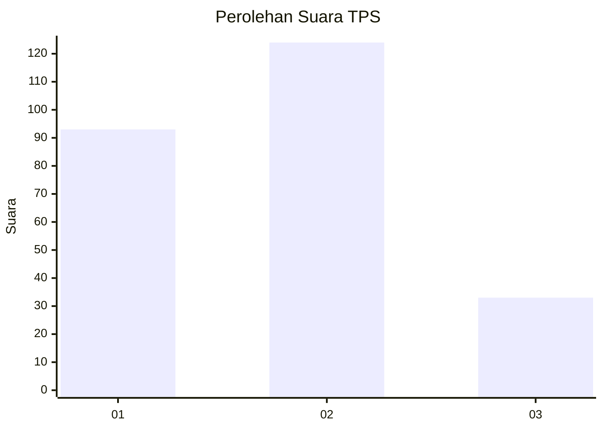
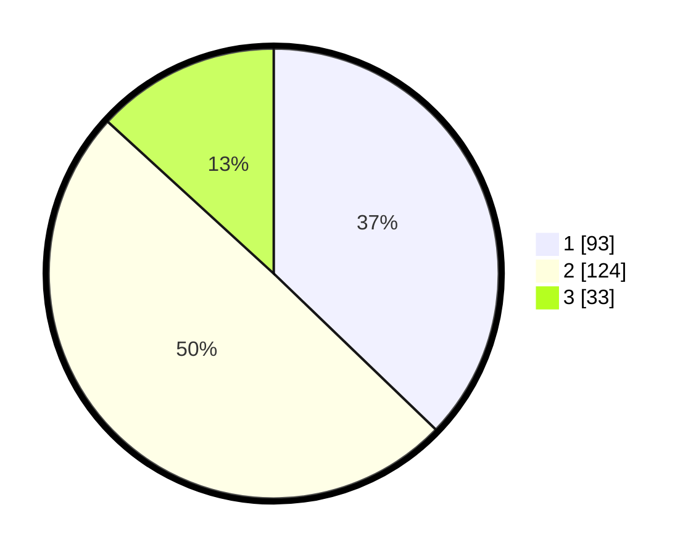

# Hasil

## Grafik

## Tabel

| No. | Nama Paslon    | Suara | Suara (raw) | Persentase |
|:--- |:-------------- | -----:| -----------:| ----------:|
| 1   | ANIES MUHAIMIN | 93    | [93][p-1]   | 37,20      |
| 2   | PRABOWO GIBRAN | 124   | [124][p-2]  | 49,60      |
| 3   | GANJAR MAHFUD  | 33    | [33][p-3]   | 13,20      |

[p-1]: https://github.com/gigit-pemilu/pemilu-2024-31-dki-jakarta/blob/main/pilpres/hitung-suara/sub/31-dki-jakarta/sub/73-jakarta-barat/sub/08-kembangan/sub/1001-kembangan-utara/sub/001-tps/sub/paslon-1.txt
[p-2]: https://github.com/gigit-pemilu/pemilu-2024-31-dki-jakarta/blob/main/pilpres/hitung-suara/sub/31-dki-jakarta/sub/73-jakarta-barat/sub/08-kembangan/sub/1001-kembangan-utara/sub/001-tps/sub/paslon-2.txt
[p-3]: https://github.com/gigit-pemilu/pemilu-2024-31-dki-jakarta/blob/main/pilpres/hitung-suara/sub/31-dki-jakarta/sub/73-jakarta-barat/sub/08-kembangan/sub/1001-kembangan-utara/sub/001-tps/sub/paslon-3.txt

## Foto C Plano

https://sirekap-obj-formc.kpu.go.id/9550/pemilu/ppwp/31/73/08/10/01/3173081001001-20240214-201816--c742dbad-6388-43d1-9440-3e703c62ab47.jpg

https://sirekap-obj-formc.kpu.go.id/9550/pemilu/ppwp/31/73/08/10/01/3173081001001-20240214-194802--e21326df-dff5-4823-bcd0-089fdde7833a.jpg

https://sirekap-obj-formc.kpu.go.id/9550/pemilu/ppwp/31/73/08/10/01/3173081001001-20240214-201006--63d28666-e8bc-4f88-80a7-8d6d212ce095.jpg

## Metadata

| Key        | Value               |
| ---------- | ------------------- |
| Time Stamp | 2024-02-15 00:41:44 |

