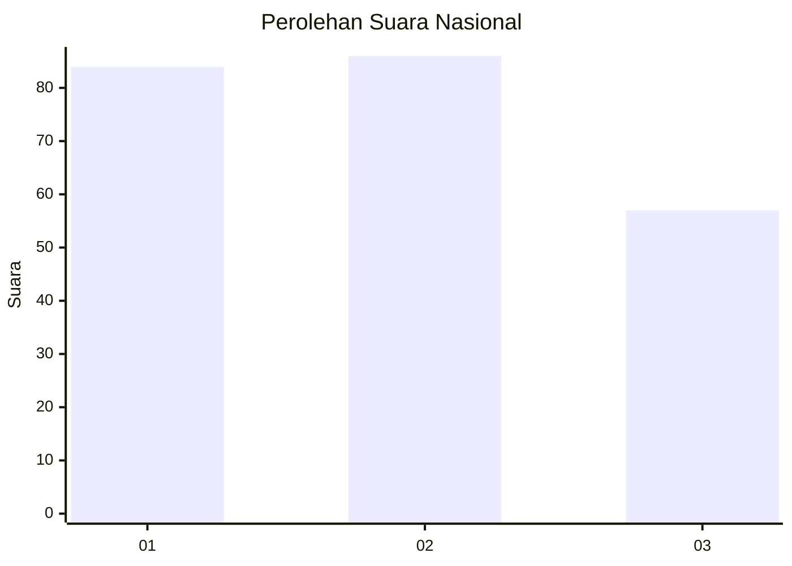
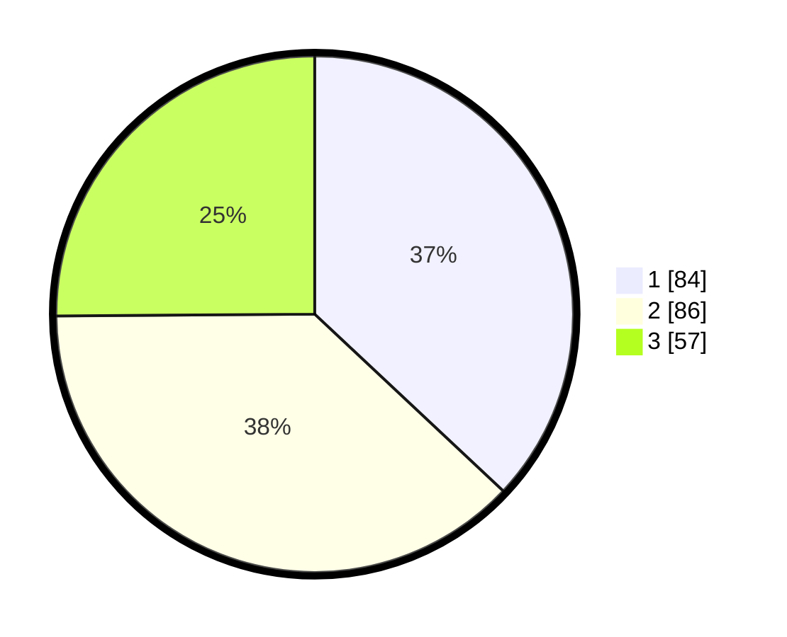

# Hasil

## Grafik

## Tabel

| No. | Nama Paslon    | Suara | Suara (raw) | Persentase |
|:--- |:-------------- | -----:| -----------:| ----------:|
| 1   | ANIES MUHAIMIN | 84    | [84][p-1]   | 37,00      |
| 2   | PRABOWO GIBRAN | 86    | [86][p-2]   | 37,89      |
| 3   | GANJAR MAHFUD  | 57    | [57][p-3]   | 25,11      |

[p-1]: https://github.com/gigit-pemilu/pemilu-2024/blob/main/pilpres/hitung-suara/sub/31-dki-jakarta/sub/73-jakarta-barat/sub/08-kembangan/sub/1001-kembangan-utara/sub/005-tps/sub/paslon-1.txt
[p-2]: https://github.com/gigit-pemilu/pemilu-2024/blob/main/pilpres/hitung-suara/sub/31-dki-jakarta/sub/73-jakarta-barat/sub/08-kembangan/sub/1001-kembangan-utara/sub/005-tps/sub/paslon-2.txt
[p-3]: https://github.com/gigit-pemilu/pemilu-2024/blob/main/pilpres/hitung-suara/sub/31-dki-jakarta/sub/73-jakarta-barat/sub/08-kembangan/sub/1001-kembangan-utara/sub/005-tps/sub/paslon-3.txt

## Foto C Plano

https://sirekap-obj-formc.kpu.go.id/5fae/pemilu/ppwp/31/73/08/10/01/3173081001005-20240214-221605--d6468d49-a8f7-4225-8465-2a0bd4e06dac.jpg

https://sirekap-obj-formc.kpu.go.id/5fae/pemilu/ppwp/31/73/08/10/01/3173081001005-20240214-221731--81732826-ba4c-41f6-92ea-82c4472bb0bf.jpg

https://sirekap-obj-formc.kpu.go.id/5fae/pemilu/ppwp/31/73/08/10/01/3173081001005-20240214-222351--19ef231c-482f-49ee-987b-51834b2476e7.jpg

## Metadata

| Key        | Value               |
| ---------- | ------------------- |
| Time Stamp | 2024-02-15 23:29:50 |

